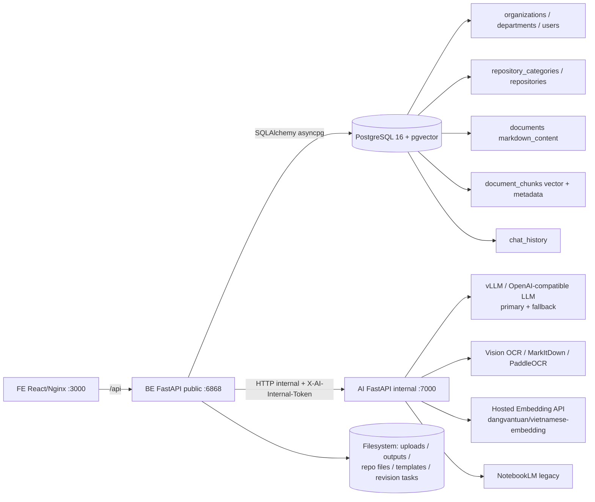
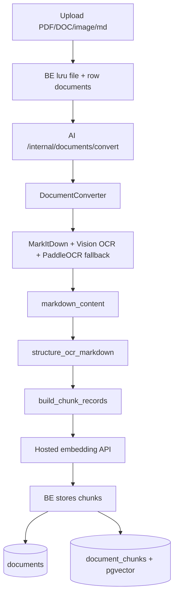
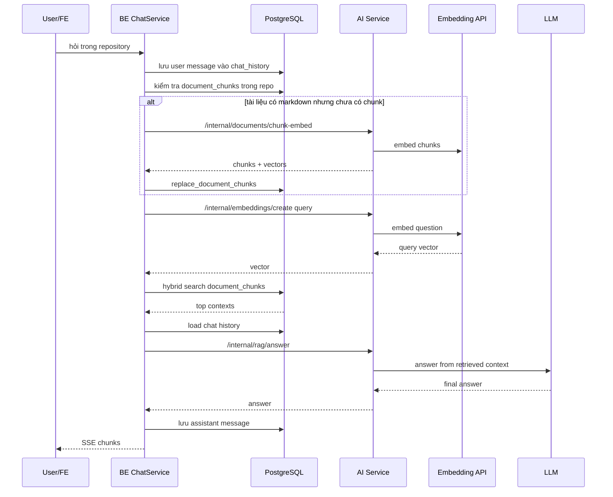
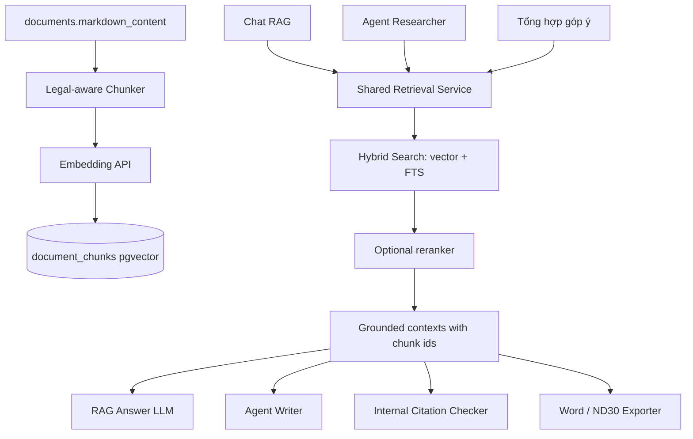

# Phân tích kiến trúc toàn hệ thống OfficeAI / SmartGov

> Tài liệu này mở rộng bản phân tích Agent + RAG ban đầu để phủ **toàn bộ hệ
> thống**: auth/RBAC, repository, document ingest, RAG chat, Agent soạn thảo,
> tính năng biên tập tài liệu (tổng hợp góp ý, dataset, template, export Word/ND30),
> audio/NotebookLM legacy và frontend. Không in secret/API key.
>
> Nguồn context kiến trúc gốc là `AGENTS.md`. Các tài liệu chị em:
> `RAG_CHATBOT_TECHNICAL_AUDIT.md` (audit), `RAG_IMPLEMENTATION_PLAN.md` (kế hoạch),
> `RAG_SYSTEM_OVERVIEW.md` (overview dễ đọc).

## 1. Prompt đã được làm rõ

Yêu cầu được hiểu là:

- Đọc lại kiến trúc tổng thể của hệ thống OfficeAI/SmartGov.
- Không chỉ dừng ở Agent và RAG mà phủ rộng toàn bộ các subsystem đang tồn tại
  trong repo: xác thực/phân quyền, kho tài liệu, ingest/OCR, chat RAG, agent
  soạn thảo, biên tập tài liệu (doc_edit), export Word/Nghị định 30, audio và FE.
- Với mỗi subsystem: mô tả nó là gì, chạy bằng kiến trúc nào, đi qua node/endpoint
  nào, dùng LLM/embedding/OCR ra sao, lấy dữ liệu nguồn bằng cách nào, lưu ở đâu.
- Làm rõ Agent và RAG có dùng chung retrieval không.
- Ghi lại lỗi, rủi ro, phần dư thừa hoặc chưa khớp giữa thiết kế và code hiện tại,
  bao gồm cả các tính năng đang là **mock**.
- Viết toàn bộ phân tích vào tài liệu `.md`, không in secret/API key.

## 2. Tóm tắt nhanh

OfficeAI/SmartGov là một nền tảng trợ lý văn bản hành chính tiếng Việt gồm ba
service (FE, BE, AI) và một PostgreSQL 16 + pgvector. Trên nền đó có **bốn nhóm
tính năng sản phẩm**:

1. **Chat RAG trên kho tài liệu**: hỏi đáp dựa trên tài liệu đã upload, dùng
   PostgreSQL + pgvector để tìm chunk, LLM sinh câu trả lời có citation `[1]`,
   `[2]`. Đây là luồng RAG thật, đã chạy được.
2. **Agent soạn thảo văn bản**: dùng LangGraph gồm nhiều node (TemplateExtractor,
   Planner, Researcher, Writer, Reviewer) để sinh công văn, quyết định, kế hoạch,
   thông báo, tờ trình, báo cáo. Luồng này **không dùng pgvector RAG**; Researcher
   dùng `DocumentScanner` để scan markdown bằng LLM.
3. **Biên tập & tổng hợp tài liệu (doc_edit)**: gồm nhiều tính năng con — tổng
   hợp góp ý map-reduce (thật), trích xuất dataset từ văn bản (mock), sửa/duyệt
   văn bản qua "revision task" (mock), sinh template Nghị định 30, và export
   ra file Word.
4. **Audio / NotebookLM (legacy)**: podcast/audio và engine NotebookLM cũ. Theo
   audit, NotebookLM được xác định là legacy cần loại bỏ khỏi runtime.

Điểm quan trọng nhất về mặt kiến trúc AI:

- **RAG chat và Agent drafting là hai hệ retrieval khác nhau.** Chat RAG dùng
  vector search + full-text search trong PostgreSQL. Agent drafting dùng LLM
  scanner đọc markdown theo từng tài liệu/section. Tốc độ, citation, logic truy
  xuất và chất lượng nguồn vì thế không đồng nhất.
- **Nhiều tính năng doc_edit hiện là mock** (revision review, dataset extract),
  trong khi tổng hợp góp ý và drafting là thật. Đây là khoảng cách lớn giữa
  "UI/contract đã có" và "backend AI đã chạy".

## 3. Kiến trúc tổng thể

Ranh giới theo `AGENTS.md`:

- `FE/` chỉ gọi public API `/api` của BE. FE không gọi AI trực tiếp.
- `BE/` sở hữu auth, RBAC, PostgreSQL, repository/document/task/history,
  upload/download, SSE và export Word.
- `AI/` sở hữu OCR/MarkItDown, embedding client, LLM inference, document scanner,
  drafting agents, template/audio AI và NotebookLM legacy. AI **không** import
  database/auth của BE.
- BE gửi tài liệu đã được phân quyền sang AI qua HTTP nội bộ. Chỉ BE có
  `DATABASE_URL`.

## 4. Mô hình dữ liệu (PostgreSQL)

Toàn bộ schema hiện tại nằm ở `BE/app/db_models.py`. Chỉ có **8 bảng**:

| Bảng | Vai trò | Ghi chú |
| --- | --- | --- |
| `organizations` | Đơn vị/tổ chức | `max_accounts` giới hạn số tài khoản |
| `departments` | Phòng ban thuộc org | FK org, cascade delete |
| `users` | Tài khoản + role + `ai_engine` | role `system_admin`/`org_admin`/`user`; `ai_engine` chọn engine (legacy) |
| `repository_categories` | Nhóm kho tài liệu của user | có `is_public` |
| `repositories` | Kho tài liệu | có `notebook_id`, `notebooklm_session_fingerprint` (legacy) |
| `documents` | Tài liệu upload | `markdown_content`, `processing_status`, `chunk_count`, `folder_key` |
| `document_chunks` | Chunk + vector | `embedding vector(768)`, `metadata` JSONB, hybrid search index |
| `chat_history` | Lịch sử chat | khóa theo `(repository_id, user_id)`, không có session |

Nhận xét quan trọng về schema:

- **Không có bảng riêng cho revision task hay dataset.** Tính năng doc_edit lưu
  state trên **filesystem** (`RevisionService.task_dir(...)`), không phải DB.
- `documents.chunk_count` là một số duy nhất mang hai nghĩa lẫn lộn: số chunk
  logic dự kiến vs số vector thực đã lưu. Đây là gốc của lỗi "hiển thị 200 đoạn
  nhưng 0 vector" mô tả trong audit.
- `repositories.notebook_id`, `notebooklm_session_fingerprint`,
  `documents.notebooklm_source_id`, `users.ai_engine` là **cột legacy NotebookLM**.
- `document_chunks` **không** denormalize `repository_id`; filter repository phải
  join qua `documents` — ảnh hưởng tới recall của HNSW khi dữ liệu lớn.

## 5. Public API của BE (toàn bộ)

BE expose các router sau (prefix + tag):

| Router | Prefix | Chức năng chính |
| --- | --- | --- |
| `auth_router` | `/api/auth` | login, `/me`, đổi mật khẩu (JWT) |
| `admin_router` | `/api/admin` | CRUD organizations / departments / users |
| `repository_router` | `/api/repositories` | CRUD kho, categories, `storage-usage` |
| `document_router` | `/api/repositories/{repo_id}/documents` | upload, consolidate, convert, preview, file, markdown, delete |
| `chat_router` | `/api/repositories/{repo_id}/chat` | chat (SSE), history, clear history |
| `revision_router` | `/api/revision-tasks` | tạo/duyệt/preview/download task sửa văn bản |
| `document_dataset_router` | `/api/document-datasets` | extract dataset, word preview/download |

Nhận xét:

- Auth + admin cho phép mô hình tổ chức nhiều cấp (org → dept → user) với RBAC.
- Chat, document nằm dưới `repository_id` để đảm bảo phân quyền theo kho.
- `revision-tasks` và `document-datasets` là các endpoint của tính năng doc_edit;
  phần lớn còn dùng mock ở backend (xem mục 9).

## 6. Internal API của AI (toàn bộ)

AI expose các endpoint nội bộ (đều yêu cầu `X-AI-Internal-Token`):

| Endpoint | Dùng cho |
| --- | --- |
| `GET /health` | Liveness (chỉ báo FastAPI sống) |
| `POST /internal/documents/convert` | OCR/MarkItDown → markdown + chunk records |
| `POST /internal/documents/chunk-embed` | Chunk + embed markdown → vectors |
| `POST /internal/embeddings/create` | Embed query/text |
| `POST /internal/rag/answer` | Sinh câu trả lời RAG từ contexts |
| `POST /internal/chat/self-hosted` | Chat legacy dùng DocumentScanner |
| `POST /internal/summary/consolidate` | Tổng hợp góp ý (map-reduce) |
| `POST /internal/draft/generate` | Agent soạn thảo văn bản |
| `POST /internal/draft/edit` | Sửa draft đã có |
| `POST /internal/template/extract` | Trích cấu trúc heading từ mẫu |
| `POST /internal/template/generate` | Sinh văn bản theo template |
| `POST /internal/notebook/*` | NotebookLM legacy (create/session/delete/source/chat) |
| `POST /internal/audio/process` | Xử lý audio/podcast |

## 7. Xác thực, phân quyền và quản trị

Files: `BE/app/auth.py`, `BE/app/routers/auth_router.py`,
`BE/app/routers/admin_router.py`.

- **Auth**: JWT. `POST /api/auth/login` trả token; `/me` trả thông tin user;
  `change-password`. Startup seed `system_admin` idempotent từ biến `ADMIN_*`.
- **Mô hình tổ chức**: `organizations` → `departments` → `users`. `admin_router`
  cho phép system admin quản lý toàn bộ; org có `max_accounts`.
- **Role**: `role` trên `users` (`system_admin`, `org_admin`, `user`).
- **Engine selection (legacy)**: `users.ai_engine` + `auth.is_user_self_hosted(...)`
  quyết định request đi self-hosted hay notebooklm. Đây là điểm audit đề nghị bỏ
  vì sản phẩm chỉ còn dùng self-hosted/RAG.

Rủi ro: engine selection theo user làm rẽ nhánh code ở FE (option "Server 1/Server
2" trong `AdminPanel.tsx`), BE (drafting/template/chat) và AI. Đây là nguồn phức
tạp không cần thiết sau khi bỏ NotebookLM.

## 8. Repository, category và document ingest

### 8.1 Repository & category

File: `BE/app/services/repository_service.py`.

- Kho tài liệu (`repositories`) thuộc user, có thể gán `category_id`, `is_public`.
- Còn logic legacy: capacity/eviction notebook, create/rebuild/session-current
  notebook. Audit đề nghị bỏ toàn bộ; create repository chỉ nên ghi DB + tạo thư
  mục local.
- `storage-usage` tính dung lượng file đã upload.

### 8.2 Document ingest / OCR / convert

Files: `BE/app/routers/document_router.py`, `BE/app/services/ai_client.py`,
`AI/app/services/document_converter.py`, `AI/app/services/markdown_chunking.py`.

- `documents.folder_key` phân loại tài liệu theo thư mục logic (`draft`,
  `summary`,...). Ví dụ tổng hợp góp ý ghi vào folder `summary`.
- Document router có `preview` (HTML), `file` (tải file gốc), `markdown` (tải
  markdown), `consolidate` (gộp), `convert` (OCR lại).
- **Lỗi lifecycle đã biết**: nếu embedding lỗi, converter vẫn trả markdown +
  `chunk_count` nhưng `chunks=None`, BE không lưu vector → `document_chunks` rỗng
  dù document `completed`. Chi tiết ở audit.

### 8.3 Markdown chunking

File: `AI/app/services/markdown_chunking.py`. Thứ tự xử lý:

1. Clean OCR line: bỏ `(cid:...)`, normalize khoảng trắng, bỏ line rỗng dư.
2. Promote heading thành Markdown header: `Phần` → `#`; `I./II.` → `##`;
   `1./2.` → `###`; `1.1.` → sâu hơn; `Chương/Mục/Điều` → legal major;
   `Khoản/Điểm` → legal minor; dòng in hoa → `##`.
3. Group section theo boundary header.
4. Nếu section quá lớn: split theo paragraph, rồi theo ký tự.

Metadata mỗi chunk: `header_path`, `section_label`, `page_label`,
`citation_label`, `metadata.headers`, `metadata.char_count`,
`metadata.piece_index`.

## 9. Chat RAG (luồng thật)

File chính: `BE/app/services/chat_service.py`,
`AI/app/services/rag_service.py`, `AI/app/services/embedding_service.py`,
`AI/app/services/llm_service.py`, `BE/app/database.py`.

### 9.1 Luồng hỏi đáp

### 9.2 Embedding

File: `AI/app/services/embedding_service.py`. Trạng thái hiện tại:

| Biến | Giá trị |
| --- | --- |
| `EMBEDDING_MODEL_NAME` | `dangvantuan/vietnamese-embedding` |
| `EMBEDDING_DIMENSIONS` | `768` |
| `EMBEDDING_BATCH_SIZE` | `16` |
| `EMBEDDING_CHUNK_SIZE` | `800` (đã hạ từ 1200) |
| `EMBEDDING_BASE_URL` | HuggingFace router endpoint |
| `EMBEDDING_API_KEY` | HuggingFace token (không ghi ra tài liệu) |

- Embedding chạy **hosted** qua HuggingFace, không còn PyTorch/`sentence-transformers`
  local trong container AI.
- Model PhoBERT giới hạn **256 token**; HF không tự truncate mà trả HTTP 400
  ("index out of range in self"). Code hiện **cắt phía client** để không bao giờ
  vượt (fix sau audit).
- Khi API trả token-level vectors, code **mean-pool** thành một vector câu.
- Code tự rewrite HuggingFace URL sang
  `https://router.huggingface.co/hf-inference/models/{model_id}/pipeline/feature-extraction`
  do vấn đề DNS resolve `api-inference.huggingface.co` trong Docker.

### 9.3 Hybrid search (không phải BM25)

File: `BE/app/database.py::search_document_chunks_hybrid`.

- **Vector branch**: cosine distance qua pgvector `dc.embedding <=> CAST(:q AS vector)`.
- **Text branch**: PostgreSQL Full Text Search `to_tsvector('simple', header_path
  || chunk_text)` + `plainto_tsquery('simple', q)`, rank bằng `ts_rank_cd`
  (cover-density, **không** phải BM25).
- **Fusion** (weighted RRF): `vector_weight/(60+vector_rank) + text_weight/(60+text_rank)`.

Config: `RAG_TOP_K=8`, `RAG_VECTOR_CANDIDATES=30`, `RAG_TEXT_CANDIDATES=30`,
`RAG_VECTOR_WEIGHT=0.6`, `RAG_TEXT_WEIGHT=1.4` (text đang được ưu tiên hơn 2 lần).

### 9.4 LLM trả lời

File: `AI/app/services/llm_service.py`. Có **1 model chính + 1 fallback tùy chọn**:

- Primary từ `VLLM_BASE_URL`/`VLLM_MODEL_NAME`/`VLLM_API_KEY`.
- Nếu primary lỗi (timeout, 5xx, 403, 404...), tự retry bằng
  `VLLM_FALLBACK_*` trước khi báo lỗi.
- **Cập nhật sau audit**: model `current` (tên cũ) đã die/404 và bị thay; reasoning
  được tắt bằng tham số vLLM chuẩn để giảm latency.
- Prompt RAG (ở `rag_service.py`) yêu cầu: chỉ dùng context, không bịa, giữ đúng
  số hiệu/ngày/điều/khoản, citation inline `[1]`, trả lời tiếng Việt,
  temperature 0.1.

## 10. Agent soạn thảo văn bản (LangGraph)

Files: `AI/app/services/drafting_service.py::_draft_self_hosted`,
`AI/app/agents/graph.py`, các node trong `AI/app/agents/`.

### 10.1 Agent graph

`AgentState` (`AI/app/agents/state.py`) mang: `user_request`, `doc_type`,
`input_data`, `warehouse_ids`, `selected_document_ids`, `template_outline`,
`plan`, `scanner_results`, `research_context`, `draft`, `draft_data`,
`review_feedback`, `review_pass`, `review_issues`, `iteration`, `max_iterations`.

### 10.2 Từng node

- **TemplateExtractor** (`template_extractor.py`): hiện là **stub**, trả
  `{"template_outline": {}}`. Node dư — nên bỏ hoặc implement thật.
- **Planner** (`planner.py`): với loại như `ke_hoach` dùng outline hành chính cố
  định; loại khác gọi LLM sinh JSON plan (sections, key points, search queries).
- **Researcher** (`researcher.py`): **không dùng pgvector**. Dùng `DocumentScanner`
  đọc markdown do BE gửi kèm, mỗi section một query, LLM trích đoạn liên quan →
  `research_context`. Ưu điểm: đọc rộng. Nhược điểm: chậm, tốn token, không dùng
  index pgvector, citation khác Chat RAG.
- **Writer** (`writer.py`): nhận plan + research_context + input_data +
  review_feedback → viết từng phần → `draft_data` để export Word; không chèn
  citation visible.
- **Reviewer** (`reviewer.py`): chạy `citation_checker.generate_full_report(...)`
  + LLM kiểm duyệt grounding/logic/thẩm quyền/format/văn phong.
- **Final Reviewer Gate** (`final_reviewer.py`): sau LangGraph,
  `_draft_self_hosted` gọi `final_review_document(...)`, nếu chưa pass thử
  `final_grounding_edit_draft(...)` rồi `final_fix_draft(...)`, cuối cùng raise.

### 10.3 Lệch thiết kế trong Agent (giữ nguyên từ phân tích trước)

- Writer không đưa citation visible, nhưng `citation_checker` lại tìm citation
  dạng `[Nguồn: ...]`.
- Reviewer đọc `state.get("research_data", [])`, trong khi Researcher trả
  `scanner_results` (không set `research_data`) → citation report có thể rỗng.
- Reviewer catch exception rồi `review_pass=True` → fail-open, có thể export draft
  chưa review.
- `orchestrator.py` định nghĩa `run_drafting_pipeline` nhưng không thấy caller →
  code dư, dễ nhầm có hai orchestrator.

## 11. Biên tập & tổng hợp tài liệu (doc_edit)

Đây là nhóm tính năng mà ba tài liệu RAG gốc chưa phủ. Trạng thái thực tế rất
khác nhau giữa các tính năng con.

### 11.1 Tổng hợp góp ý (map-reduce) — THẬT

Files: `BE/app/services/feedback_summary_service.py`,
`AI/app/services/summary_service.py`, AI `/internal/summary/consolidate`.

- Đọc các tài liệu góp ý trong repo, dùng LLM **map-reduce** để tổng hợp thành
  "Bảng tổng hợp ý kiến", tự nối tiếp khi câu trả lời bị cắt token (theo commit
  history).
- Render ra DOCX chuẩn (header, tiêu đề, mở đầu, sections; đếm số chủ thể góp ý),
  lưu vào folder `summary` như một document mới.
- Đây là tính năng doc_edit **hoàn chỉnh và có giá trị**.

### 11.2 Revision task (sửa/duyệt văn bản) — MOCK

Files: `BE/app/services/revision_service.py`, `BE/app/routers/revision_router.py`.

- Endpoint đầy đủ: tạo task, list, get, review, preview theo `kind`, approve,
  reject, download final, delete.
- Nhưng backend chạy `revision_service.process_mock(...)` +
  `_mock_extract_comments(...)` + `_apply_comments(...)`. State lưu trên
  **filesystem** theo `task_dir(task_id)`, **không** phải DB.
- Nghĩa là luồng "trích xuất góp ý → áp dụng vào bản gốc → tạo diff → duyệt" hiện
  là **mô phỏng**, chưa nối AI thật. Đây là điểm cần productionize.

### 11.3 Dataset extraction — MOCK

Files: `BE/app/services/document_dataset_service.py`,
`BE/app/routers/document_dataset_router.py`.

- `POST /extract` trả `build_mock_response(file.filename)` — comment trong code
  ghi rõ "scaffolds the UI contract before the AI extractor is available".
- Có `word/preview` (HTML) và `word/download` để render dataset ra Word.
- Việc trích title/content/table-field schema từ văn bản hiện là **mock**.

### 11.4 Template Nghị định 30

Files: `BE/app/services/template_service.py`, AI `/internal/template/extract`,
`/internal/template/generate`.

- `extract_headings(file_path, engine)` trích cấu trúc heading từ mẫu.
- `generate_from_headings(...)` và `build_nd30_document(...)` sinh văn bản theo
  chuẩn Nghị định 30.
- Vẫn nhận `engine="notebooklm"` mặc định — điểm legacy cần chuyển self-hosted.

### 11.5 Export Word / Nghị định 30

Files: `BE/app/services/word_exporter.py` (1172 dòng),
`BE/app/services/nd30_exporter.py` (383 dòng),
`BE/app/services/docx_preview.py`.

- `WordExporter` export nhiều loại: biên bản họp, công văn, quyết định, kế hoạch,
  thông báo, tờ trình, báo cáo — với header cơ quan, khối chữ ký, nơi nhận,
  đánh số La Mã, chuẩn hóa hoa/thường, khôi phục viết tắt.
- `nd30_exporter` render bảng/geometry theo chuẩn trình bày Nghị định 30 và có
  thể render DOCX → ảnh (`render_docx`).
- `docx_preview` sinh HTML preview từ DOCX cho FE.
- Đây là phần code lớn, thuần Python (python-docx), là "đầu ra" chung cho Agent
  drafting, tổng hợp góp ý, dataset và template.

## 12. Audio & NotebookLM (legacy)

Files: `AI/app/services/notebooklm_service.py`, `/internal/notebook/*`,
`/internal/audio/process`, `login_notebooklm_local.py`, cột DB legacy.

- NotebookLM từng là engine thứ hai (chat/soạn thảo qua session Google + browser).
- Audit kết luận **loại bỏ hoàn toàn khỏi runtime**: nó tạo dual-engine, fallback
  che lỗi RAG thật, cần session Google + bind mount + browser dependency, thêm
  cột DB/field/UI, và làm chatbot phụ thuộc dịch vụ ngoài phạm vi sản phẩm.
- `grep -i notebooklm` hiện còn xuất hiện ở ~20 file BE/AI/FE (xem
  `RAG_IMPLEMENTATION_PLAN.md` Workstream A cho danh sách xóa).

## 13. Frontend

File: `FE/src/`. React + Nginx, gọi BE qua `FE/src/api/client.ts`.

Trang chính:

- `LoginPage.tsx` — đăng nhập JWT.
- `Sidebar.tsx` — điều hướng.
- `AdminPanel.tsx` — quản trị org/dept/user; còn option engine "Server 1/Server 2"
  (legacy).
- `DocumentManager.tsx` — quản lý kho, upload, trạng thái xử lý tài liệu,
  preview/tải file, doc_edit.
- `ChatAssistant.tsx` — chat RAG, nhận SSE `chunk`/`done`.

FE nhận SSE nhưng hiện BE **giả lập streaming** (đợi full answer rồi tách token
với delay). FE chưa nhận citation có cấu trúc, chỉ hiển thị text có `[1]`.

## 14. Agent và RAG hiện có dùng chung nhau không?

Hiện tại: **chưa dùng chung đúng nghĩa**.

| Luồng | Retrieval | Lưu vector? | Dùng pgvector? | Lưu history? |
| --- | --- | --- | --- | --- |
| Chat RAG | Hybrid search trên `document_chunks` | Có | Có | `chat_history` |
| Agent Drafting | `DocumentScanner` scan markdown bằng LLM | Không | Không | Không |
| Legacy self-hosted chat | `DocumentScanner.scan_for_chat` | Không | Không | Có qua BE |
| Tổng hợp góp ý | Đọc thẳng markdown documents | Không | Không | Không |
| NotebookLM (legacy) | NotebookLM service | Không | Không | Có qua BE |

Chỉ Chat RAG tận dụng vector store. Agent, tổng hợp góp ý, template đều đọc
markdown trực tiếp. Đây là lý do chính khiến các luồng đó chậm/tốn token và
citation không nhất quán.

## 15. Cấu hình và model đang dùng (tổng hợp)

| Thành phần | Model / giá trị | Nguồn |
| --- | --- | --- |
| Embedding | `dangvantuan/vietnamese-embedding`, 768d, hosted HF | `EMBEDDING_*` |
| LLM chính | từ `VLLM_MODEL_NAME` (tên `current` cũ đã retire) | `VLLM_*` |
| LLM fallback | từ `VLLM_FALLBACK_MODEL_NAME` (vd `gpt-oss-120b`) | `VLLM_FALLBACK_*` |
| OCR/Vision | `Qwen2.5-VL-7B-Instruct` (+ PaddleOCR fallback) | `OCR_VLLM_*` |
| Engine selector | `ai_engine` default `notebooklm` (legacy) | `AI/app/config.py` |

Lưu ý: `docker-compose` environment từng đè mất `AI/.env` (đã fix). Secret HF/LLM
từng dán plaintext nên phải coi là đã lộ và rotate.

## 16. Lỗi, rủi ro và phần dư thừa (toàn hệ thống)

| Mức | Vấn đề | Vị trí | Đề xuất |
| --- | --- | --- | --- |
| Cao | `document_chunks` có thể rỗng dù document `completed` | converter trả `chunks=None` khi embed lỗi | Tách trạng thái vector, fail-typed |
| Cao | Revision review là **mock** | `revision_service.process_mock` | Nối AI thật (extract góp ý → apply → diff) |
| Cao | Dataset extract là **mock** | `document_dataset_service.build_mock_response` | Viết AI extractor thật |
| Cao | RAG lỗi rơi sang NotebookLM chưa login → 500 | chat fallback + `AI_ENGINE=notebooklm` | RAG-only, typed error |
| Cao | Agent Researcher chưa dùng pgvector | `researcher.py` DocumentScanner | Shared retrieval hybrid theo section |
| Cao | Reviewer đọc sai field + fail-open | `reviewer.py` `research_data` / exception | Đổi sang `scanner_results`, fail-closed |
| Trung bình | Engine selection theo user (dual-engine) | FE/BE/AI + `users.ai_engine` | Bỏ, chỉ self-hosted |
| Trung bình | Template mặc định `engine="notebooklm"` | `template_service.py` | Default self-hosted |
| Trung bình | `orchestrator.py`, `TemplateExtractor` stub dư | agents | Xóa/đánh dấu deprecated |
| Trung bình | Text search không phải BM25, FTS `simple` yếu tiếng Việt | `database.py` | Normalize + unaccent + trigram |
| Trung bình | Chưa reranker, chưa threshold, chưa dedup | hybrid search | Thêm rerank/gate/dedup |
| Trung bình | Không có chat session, history khóa theo (repo,user) | `chat_history` | Thêm `chat_sessions` |
| Trung bình | SSE giả lập, chưa stream thật | `chat_service` | Stream thật LLM→BE→FE |
| Thấp | Cột legacy NotebookLM còn trong schema | `db_models.py` | Drop bằng Alembic sau khi tắt runtime |
| Thấp | Comment model OCR chưa đồng nhất | OCR/embedding/citation | Sửa theo config thật |
| Thấp | Requirements range quá rộng, Docker cài trùng extras | `requirements.txt`/`Dockerfile` | Lock + multi-stage (đã bắt đầu) |

## 17. Kiến trúc nên hướng tới

Mục tiêu:

- Một nguồn chunk/vector duy nhất cho mọi luồng cần đọc tài liệu.
- Chat, Agent và tổng hợp góp ý dùng chung retrieval.
- Citation dựa trên `document_id`, `chunk_id`, `filename`, `section_label`,
  `page_label`; trace được câu trả lời/draft về đúng chunk nguồn.
- Doc_edit (revision, dataset) chuyển từ mock sang AI thật, đi qua cùng LLM
  service với typed error.
- Loại NotebookLM khỏi runtime; export Word là output chung.

## 18. Kết luận

Hệ thống có nền tảng đúng hướng và một phạm vi tính năng rộng hơn nhiều so với
"chatbot RAG":

- Nền RAG (OCR→markdown→chunk→embedding 768→pgvector→hybrid→LLM có citation) đã
  hoạt động.
- Agent drafting bằng LangGraph + DocumentScanner đã chạy nhưng chưa dùng vector
  store, còn vài lệch thiết kế trong reviewer/citation.
- Doc_edit là điểm phân hóa lớn: tổng hợp góp ý và export Word là thật và mạnh,
  nhưng revision review và dataset extract còn là **mock**.
- NotebookLM và engine selection là legacy cần loại bỏ khỏi runtime.

Việc nên làm tiếp theo, theo thứ tự: (1) làm RAG lưu vector thật + trạng thái
trung thực, (2) thống nhất retrieval cho Agent/tổng hợp, (3) productionize
revision/dataset thay mock, (4) loại NotebookLM, (5) nâng chất lượng retrieval và
citation. Kế hoạch chi tiết ở `RAG_IMPLEMENTATION_PLAN.md`; bằng chứng runtime ở
`RAG_CHATBOT_TECHNICAL_AUDIT.md`.
