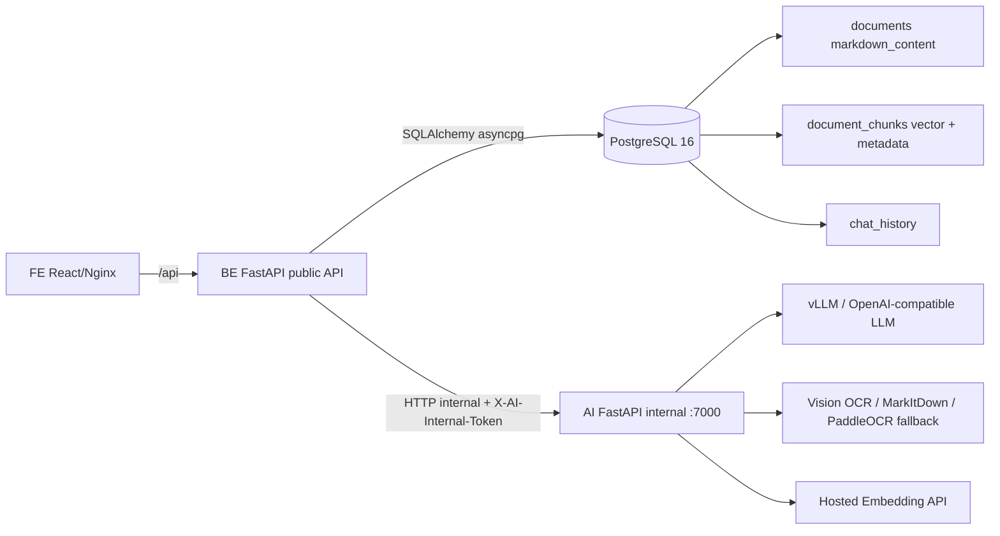
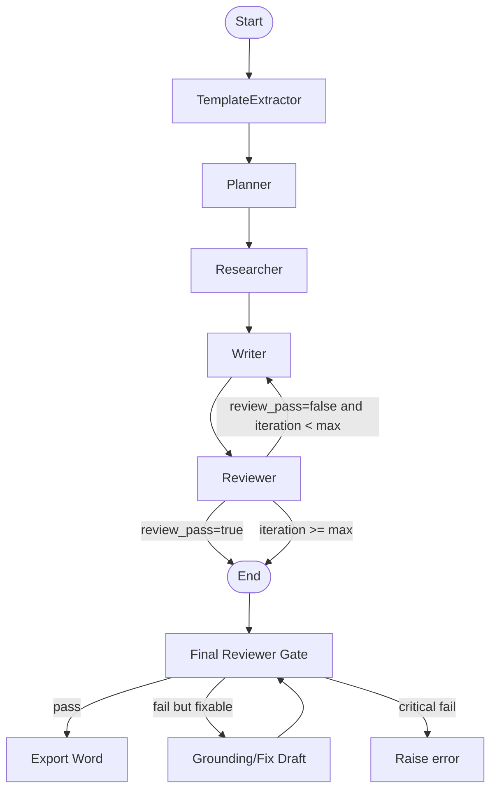
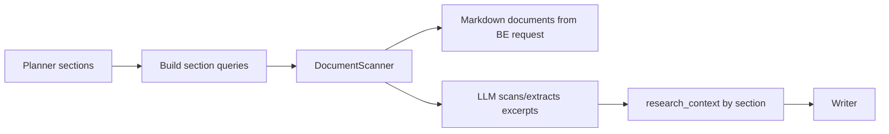
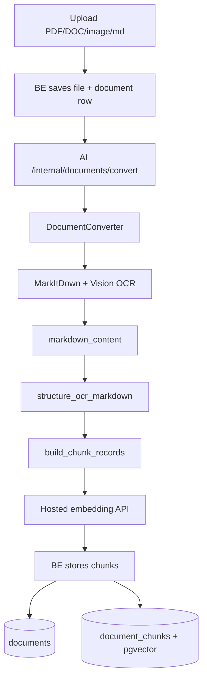
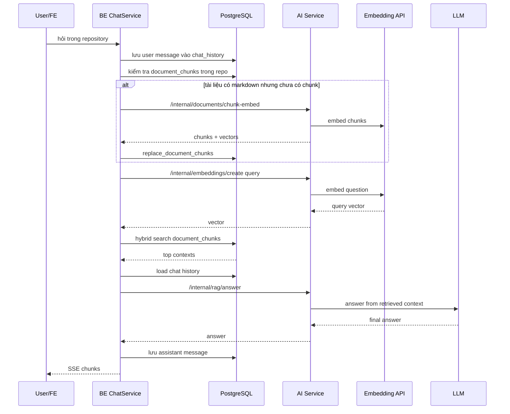
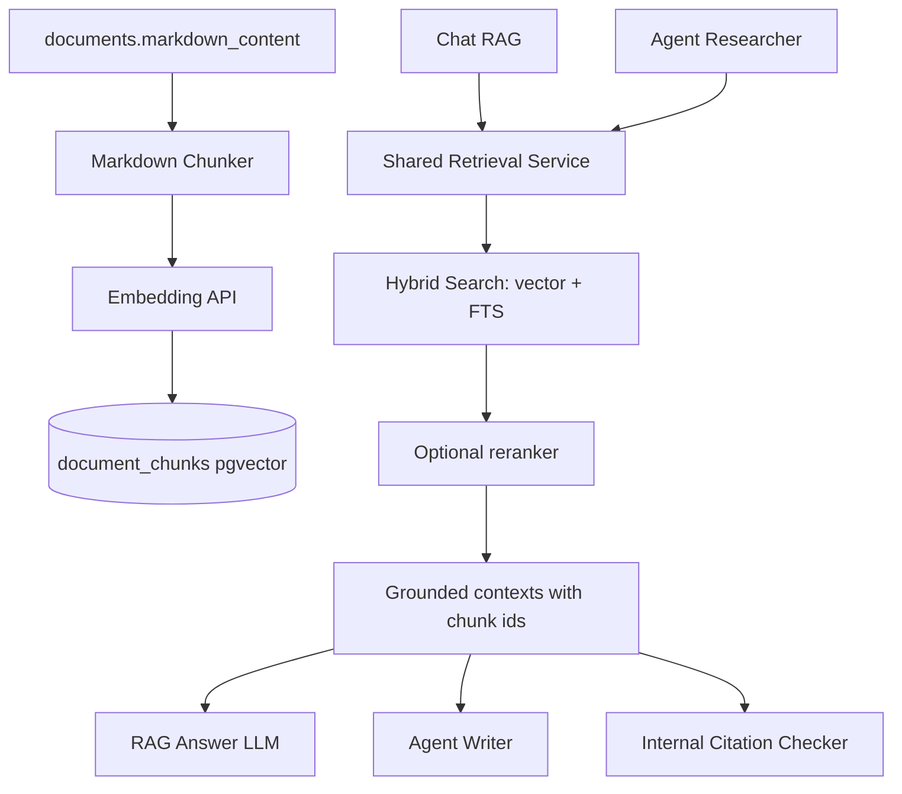

# Phân tích kiến trúc Agent và RAG

## 1. Prompt tự làm rõ

Yêu cầu được hiểu là:

- Đọc lại kiến trúc tổng thể của hệ thống OfficeAI.
- Phân tích sâu hệ thống Agent hiện tại: Agent là gì, đang chạy bằng kiến trúc nào, đi qua các node nào, dùng LLM ra sao, lấy dữ liệu nguồn bằng cách nào.
- Phân tích sâu hệ thống RAG hiện tại: OCR/Markdown -> chunk -> embedding -> pgvector -> hybrid search -> LLM trả lời -> lưu lịch sử chat.
- Làm rõ Agent và RAG có liên quan nhau không, có dùng chung retrieval không.
- Ghi lại lỗi, rủi ro, phần dư thừa hoặc chưa khớp giữa thiết kế và code hiện tại.
- Viết toàn bộ phân tích vào một tài liệu `.md`, không in secret/API key.

## 2. Tóm tắt nhanh

Hệ thống hiện có hai luồng AI chính:

1. **Chat RAG**: dùng PostgreSQL + pgvector để tìm chunk tài liệu, sau đó gọi LLM sinh câu trả lời có citation `[1]`, `[2]`.
2. **Agent soạn thảo văn bản**: dùng LangGraph gồm nhiều node như TemplateExtractor, Planner, Researcher, Writer, Reviewer. Luồng này hiện **không dùng pgvector RAG**, mà Researcher dùng `DocumentScanner` để scan tài liệu bằng LLM.

Điểm quan trọng nhất: **RAG cho chat và Agent cho drafting đang là hai hệ retrieval khác nhau**. Chat RAG dùng vector search + text search trong PostgreSQL. Agent drafting dùng LLM scanner đọc markdown theo từng tài liệu/section. Vì vậy tốc độ, citation, logic truy xuất và chất lượng nguồn có thể không đồng nhất.

## 3. Kiến trúc tổng thể



Theo `AGENTS.md`, ownership đang đúng hướng:

- `FE/` chỉ gọi public API của BE.
- `BE/` sở hữu auth, RBAC, PostgreSQL, repository/document/task/history, upload/download, SSE và export Word.
- `AI/` sở hữu NotebookLM, vLLM, OCR/MarkItDown, document scanner, drafting agents, template/audio AI.
- `AI/` không import database/auth của BE. BE gửi tài liệu đã được phân quyền sang AI qua HTTP nội bộ.

## 4. Agent hiện tại đang hoạt động như nào

Agent thật nằm ở `AI/app/agents`. Luồng self-hosted drafting được gọi từ:

- `AI/app/services/drafting_service.py`
- Hàm `_draft_self_hosted(...)`
- Gọi `run_agent_graph(...)` trong `AI/app/agents/graph.py`

### 4.1. Agent graph



### 4.2. State của Agent

Agent dùng `AgentState` để truyền dữ liệu giữa các node. Các field chính:

- `user_request`: yêu cầu người dùng.
- `doc_type`, `doc_type_label`: loại văn bản cần soạn.
- `input_data`: dữ liệu form người dùng nhập.
- `warehouse_ids`: repository/kho tài liệu.
- `selected_document_ids`: nếu người dùng chọn tài liệu cụ thể.
- `template_outline`: outline mẫu, hiện đang rỗng.
- `plan`: dàn ý do Planner tạo.
- `scanner_results`: kết quả scan tài liệu.
- `research_context`: ngữ cảnh nghiên cứu đưa cho Writer.
- `draft`, `draft_data`: bản nháp text và schema để export.
- `review_feedback`, `review_pass`, `review_issues`.
- `iteration`, `max_iterations`.

### 4.3. TemplateExtractor

File: `AI/app/agents/template_extractor.py`

Hiện node này là stub:

```python
return {"template_outline": {}}
```

Nghĩa là Agent graph vẫn có node TemplateExtractor, nhưng nó không trích xuất cấu trúc mẫu thật. Đây là một phần dư thừa/placeholder. Nếu chưa dùng template outline thì có thể bỏ node này khỏi graph, hoặc triển khai thật để đọc các văn bản cùng loại và rút ra cấu trúc.

### 4.4. Planner

File: `AI/app/agents/planner.py`

Planner tạo kế hoạch viết văn bản.

- Với một số loại văn bản như `ke_hoach`, code dùng outline hành chính cố định.
- Với loại khác, Planner gọi LLM để sinh JSON plan.
- Plan thường gồm các section, key points, search queries và instruction cho Writer.

Planner là node có vai trò tốt: nó biến yêu cầu mơ hồ thành các mục cần tìm dữ liệu và cần viết.

### 4.5. Researcher

File: `AI/app/agents/researcher.py`

Researcher hiện **không dùng pgvector**. Nó dùng:

- `DocumentScanner`
- Tài liệu được BE gửi sang AI trong request context
- Mỗi section từ Planner sẽ tạo một query riêng
- Với mỗi repo/document được chọn, scanner dùng LLM để đọc markdown và trích đoạn liên quan

Luồng hiện tại:



Ưu điểm:

- Có thể đọc rộng, phù hợp drafting cần hiểu bối cảnh.
- Không phụ thuộc vào vector store đã sẵn sàng.

Nhược điểm:

- Chậm hơn RAG vì scan nhiều tài liệu bằng LLM.
- Tốn token hơn.
- Không dùng index pgvector đã build.
- Citation/context của Agent không giống citation/context của Chat RAG.

### 4.6. Writer

File: `AI/app/agents/writer.py`

Writer nhận:

- `plan`
- `research_context`
- `input_data`
- `review_feedback` nếu đang revise

Writer gọi LLM để viết từng phần, sau đó assemble thành `draft_data` để export Word. Với drafting hành chính, Writer được prompt để viết văn phong hành chính, không chèn citation/source metadata ra bản cuối.

### 4.7. Reviewer

File: `AI/app/agents/reviewer.py`

Reviewer làm hai việc:

- Chạy `citation_checker.generate_full_report(...)`
- Gọi LLM kiểm duyệt bản nháp: grounding, logic, thẩm quyền, format, văn phong

Điểm cần chú ý:

- Writer được yêu cầu không đưa citation visible vào Word.
- Citation checker lại được thiết kế để tìm citation dạng `[Nguồn: ...]`.
- Reviewer lấy `research_data = state.get("research_data", [])`, trong khi Researcher trả về `scanner_results`, không thấy set `research_data`.

Đây là điểm lệch thiết kế. Citation checker có thể đang nhận dữ liệu rỗng hoặc không đúng field, nên độ hữu ích giảm.

### 4.8. Final Reviewer Gate

File: `AI/app/agents/final_reviewer.py`

Sau khi LangGraph xong, `drafting_service._draft_self_hosted(...)` còn gọi final reviewer trước export Word:

- `final_review_document(...)`
- Nếu chưa pass, thử `final_grounding_edit_draft(...)`
- Nếu vẫn chưa pass và lỗi không critical, thử `final_fix_draft(...)`
- Nếu vẫn fail thì raise error

Đây là lớp kiểm soát cuối khá quan trọng, tốt hơn việc tin hoàn toàn vào Reviewer node trong graph.

## 5. RAG hiện tại đang hoạt động như nào

RAG chính đang phục vụ chat trong repository.

### 5.1. Luồng ingest tài liệu



### 5.2. Markdown và chunking

File: `AI/app/services/markdown_chunking.py`

Hiện chunking làm theo thứ tự:

1. Clean OCR line:
   - bỏ `(cid:...)`
   - normalize khoảng trắng
   - bỏ line rỗng dư

2. Promote heading thành Markdown header:
   - `Phần ...` -> `#`
   - `I. ...`, `II. ...` -> `##`
   - `1. ...`, `2. ...` -> `###`
   - `1.1. ...` -> header sâu hơn
   - `Chương`, `Mục`, `Điều` -> legal major heading
   - `Khoản`, `Điểm` -> legal minor heading
   - dòng in hoa giống tiêu đề -> `##`

3. Group section theo boundary header:
   - `#` luôn là boundary.
   - Roman heading/legal major là boundary.
   - Numbered/legal minor từ level `###` trở xuống cũng là boundary.

4. Nếu một section quá lớn:
   - split theo paragraph.
   - nếu paragraph vẫn quá dài, split theo boundary ký tự/khoảng trắng.

Metadata mỗi chunk:

- `header_path`
- `section_label`
- `page_label`
- `citation_label`
- `metadata.headers`
- `metadata.char_count`
- `metadata.piece_index`

### 5.3. Bảng lưu vector

File: `BE/app/db_models.py`

Bảng chính là `document_chunks`:

| Cột | Ý nghĩa |
| --- | --- |
| `id` | UUID của chunk |
| `document_id` | liên kết tới `documents.id` |
| `chunk_index` | thứ tự chunk trong tài liệu |
| `header_path` | đường dẫn heading |
| `section_label` | heading chính của chunk |
| `page_label` | nhãn trang nếu OCR/markdown có |
| `citation_label` | nhãn citation, ví dụ `01 BC-BCD.pdf | 1. Về định hướng chỉ đạo` |
| `chunk_text` | text gốc của chunk |
| `embedding_model` | tên embedding model |
| `embedding` | vector pgvector |
| `metadata` | JSONB metadata |
| `created_at` | thời điểm tạo |

Embedding được lưu trong PostgreSQL bằng `pgvector`, không chỉ lưu chunk text thường.

### 5.4. Embedding model

File: `AI/app/services/embedding_service.py`

Config hiện tại:

| Biến | Giá trị hiện tại |
| --- | --- |
| `EMBEDDING_MODEL_NAME` | `dangvantuan/vietnamese-embedding` |
| `EMBEDDING_DIMENSIONS` | `768` |
| `EMBEDDING_BATCH_SIZE` | `16` |
| `EMBEDDING_CHUNK_SIZE` | `1200` |
| `EMBEDDING_BASE_URL` | HuggingFace model endpoint |
| `EMBEDDING_API_KEY` | HuggingFace token, không ghi ra tài liệu |

Model embedding đang chạy hosted qua HuggingFace, không còn chạy local PyTorch trong container AI. Vì vậy `torch` và `sentence-transformers` không còn cần cho embedding local.

Lưu ý: code đang tự rewrite HuggingFace URL sang:

```text
https://router.huggingface.co/hf-inference/models/{model_id}/pipeline/feature-extraction
```

Lý do là môi trường Docker trước đó có vấn đề resolve `api-inference.huggingface.co`, còn `router.huggingface.co` chạy được.

### 5.5. Luồng hỏi đáp RAG

File chính: `BE/app/services/chat_service.py`



### 5.6. Hybrid search có phải BM25 không?

Không. Text search hiện tại **không phải BM25**.

Nó dùng PostgreSQL Full Text Search:

- `to_tsvector('simple', header_path || chunk_text)`
- `plainto_tsquery('simple', query_text)`
- `ts_rank_cd(...)`

`ts_rank_cd` là cover-density ranking của PostgreSQL, không phải BM25.

Hybrid score hiện tại:

```text
score =
  vector_weight * 1 / (60 + vector_rank)
  +
  text_weight   * 1 / (60 + text_rank)
```

Config trong BE:

| Biến | Giá trị |
| --- | --- |
| `RAG_TOP_K` | `8` |
| `RAG_VECTOR_CANDIDATES` | `30` |
| `RAG_TEXT_CANDIDATES` | `30` |
| `RAG_VECTOR_WEIGHT` | mặc định `0.6` |
| `RAG_TEXT_WEIGHT` | mặc định `1.4` |

Vector search dùng cosine distance qua pgvector:

```sql
dc.embedding <=> CAST(:query_embedding AS vector)
```

Text search dùng `simple` config để tránh stemming tiếng Anh. Với tiếng Việt, cách này ổn ở mức token đơn giản nhưng chưa có word segmentation tiếng Việt chuyên dụng.

### 5.7. LLM trả lời RAG là con nào?

File: `AI/app/services/llm_service.py`

RAG gọi `llm_service.chat(...)`. LLM chính lấy từ:

- `VLLM_BASE_URL`
- `VLLM_MODEL_NAME`
- `VLLM_API_KEY`

Trong `.env`, model chính đang là:

```text
VLLM_MODEL_NAME=current
```

Nếu primary fail, hệ thống fallback sang:

```text
VLLM_FALLBACK_MODEL_NAME=gpt-oss-120b
```

Vậy câu trả lời ngắn gọn: **RAG answer dùng LLM `current` ở primary endpoint; nếu lỗi thì fallback sang `gpt-oss-120b`**.

## 6. Agent và RAG hiện có dùng chung nhau không?

Hiện tại: **chưa dùng chung đúng nghĩa**.

| Luồng | Retrieval hiện tại | Lưu vector? | Dùng pgvector? | Lưu history? |
| --- | --- | --- | --- | --- |
| Chat RAG | Hybrid search trên `document_chunks` | Có | Có | Có, bảng `chat_history` |
| Agent Drafting | `DocumentScanner` scan markdown bằng LLM | Không trực tiếp | Không | Không phải chat history |
| Legacy self-hosted chat fallback | `DocumentScanner.scan_for_chat` | Không | Không | Có qua BE chat |
| NotebookLM mode | NotebookLM service | Không trong pgvector | Không | Có qua BE chat |

Ý nghĩa:

- Bạn đã có vector store tốt cho chat.
- Nhưng Agent drafting chưa tận dụng vector store đó.
- Nếu muốn Agent nhanh và nhất quán hơn, nên cho Researcher gọi một retrieval API dùng `document_chunks` thay vì scan toàn bộ bằng LLM.

## 7. Vì sao RAG có thể chậm?

Các nguyên nhân chính:

1. **Lazy chunk/embed**: nếu tài liệu có markdown nhưng chưa có `document_chunks`, câu hỏi đầu tiên sẽ tự chunk và embed toàn bộ tài liệu trước khi trả lời.
2. **Hosted embedding API**: mỗi query phải gọi API embedding online. Nếu HuggingFace cold start hoặc mạng chậm thì query chậm.
3. **LLM generation**: sau retrieval, LLM vẫn phải đọc top context và sinh câu trả lời.
4. **SSE chưa stream thật**: BE hiện đợi full answer xong rồi mới tách token giả lập với delay `35ms`. Người dùng thấy lâu vì không nhận token thật từ LLM ngay.
5. **Fallback model**: nếu primary `current` lỗi/chậm, fallback sang model khác có thể thêm latency.

## 8. Các lỗi, rủi ro và phần dư thừa

| Mức độ | Vấn đề | Bằng chứng trong code | Ảnh hưởng | Đề xuất |
| --- | --- | --- | --- | --- |
| Cao | Agent Researcher chưa dùng pgvector RAG | `AI/app/agents/researcher.py` dùng `document_scanner.scan_repository(...)` | Drafting chậm, tốn token, retrieval không nhất quán với chat RAG | Tạo internal retrieval endpoint ở BE hoặc AI client để Agent gọi hybrid search theo section |
| Cao | Citation checker lệch với Writer | Writer không muốn citation visible, nhưng `citation_checker` kiểm tra citation dạng `[Nguồn: ...]` | Kiểm chứng nguồn yếu hoặc nhiễu | Chuyển citation checker sang kiểm chứng bằng `scanner_results`/chunk ids nội bộ thay vì visible citation |
| Cao | Reviewer lấy `research_data`, nhưng Researcher trả `scanner_results` | `reviewer.py`: `state.get("research_data", [])`; `researcher.py` return `scanner_results` | Citation report có thể nhận list rỗng | Đổi Reviewer dùng `scanner_results` hoặc Researcher set thêm `research_data` |
| Cao | Reviewer pass nếu exception | `reviewer.py` catch exception và return `review_pass=True` | Có thể export draft chưa được review nếu reviewer lỗi | Đổi thành fail closed hoặc để final reviewer bắt buộc kiểm tra nghiêm hơn |
| Trung bình | `orchestrator.py` trùng luồng LangGraph và có vẻ không được gọi | `rg` chỉ thấy định nghĩa `run_drafting_pipeline`, không thấy caller | Code dư, dễ gây hiểu nhầm đang có hai orchestrator | Xóa nếu không dùng, hoặc ghi rõ deprecated |
| Trung bình | `TemplateExtractor` là stub | `template_extractor.py` chỉ return `{}` | Node trong graph chưa tạo giá trị thật | Bỏ khỏi graph hoặc implement template extraction thật |
| Trung bình | Text search không phải BM25 | `search_document_chunks_hybrid` dùng `ts_rank_cd` | Ranking keyword chưa mạnh như BM25 | Nếu cần BM25, thêm extension/search engine riêng hoặc dùng PostgreSQL extension phù hợp |
| Trung bình | Tiếng Việt FTS còn đơn giản | dùng `to_tsvector('simple', ...)` | Không tách từ tiếng Việt tốt, có thể miss keyword compound | Cân nhắc tokenizer tiếng Việt, normalization dấu, synonym/legal term expansion |
| Trung bình | Chưa có reranker | Hybrid trả top K trực tiếp cho LLM | Legal RAG dễ lấy chunk gần nhưng chưa đúng nhất | Thêm reranker cross-encoder hoặc LLM rerank top 30 -> top 8 |
| Trung bình | Citation thiếu page thật | `page_label` chỉ lấy nếu header bắt đầu `Trang` | Citation chưa đủ mạnh cho tài liệu pháp lý | Khi OCR/convert, giữ page number theo từng page và lưu vào chunk metadata |
| Trung bình | Embedding failure bị degrade âm thầm | `embedding_service` return `[]`, converter vẫn có markdown | Người dùng thấy RAG không chạy nhưng khó biết vector lỗi | Lưu trạng thái `vector_status`, lỗi embedding vào DB/progress |
| Trung bình | Sau migration 768, chunk cũ bị truncate | migration đổi dimension cần xóa vector cũ | RAG cần re-embed lại, câu hỏi đầu tiên chậm | Có job reindex riêng thay vì lazy trong request chat |
| Thấp | Comment/model name OCR chưa đồng nhất | comment có nơi nhắc Qwen3, config dùng Qwen2.5 | Dễ hiểu nhầm model OCR đang dùng | Sửa comment và docs theo config thật |
| Thấp | RAG và Agent prompt policy khác nhau | RAG prompt riêng, Agent policy riêng | Câu trả lời chat và văn bản draft có phong cách khác | Giữ nếu cố ý; nếu không, tạo shared policy layer |
| Thấp | BE SSE là simulated streaming | `stream_response` split full answer thành token | UX cảm giác chậm | Stream thật từ AI/LLM lên BE rồi tới FE |

## 9. Kiến trúc nên hướng tới

Nên đưa retrieval về một lõi chung:



Mục tiêu:

- Một nguồn chunk/vector duy nhất.
- Chat và Agent dùng cùng retrieval.
- Citation dựa trên `document_id`, `chunk_id`, `filename`, `section_label`, `page_label`.
- Có thể trace câu trả lời/draft về đúng chunk nguồn.

## 10. Đề xuất sửa theo thứ tự ưu tiên

### Ưu tiên 1: Làm RAG ổn định và nhìn thấy trạng thái

- Thêm trạng thái vector vào tài liệu: `vector_status`, `vector_error`, `vectorized_at`.
- Tách job reindex/chunk/embed ra khỏi request chat.
- FE hiển thị: tài liệu đã OCR xong, đã chunk xong, đã embed xong.
- Khi embedding fail, báo rõ thay vì im lặng fallback legacy.

### Ưu tiên 2: Cho Agent dùng shared retrieval

- Tạo hàm retrieval nội bộ có input:
  - `repo_id`
  - `query`
  - `selected_document_ids`
  - `top_k`
  - optional `section_title`
- Researcher thay `DocumentScanner.scan_repository(...)` bằng hybrid retrieval trên `document_chunks`.
- Nếu cần hiểu sâu, chỉ dùng LLM scanner sau retrieval như bước refine, không scan toàn bộ tài liệu.

### Ưu tiên 3: Sửa citation architecture

- Citation không nên phụ thuộc vào text `[Nguồn: ...]` trong draft cuối.
- Writer nên nhận context có source id nội bộ.
- Reviewer/final reviewer kiểm chứng draft bằng source map nội bộ.
- Export Word vẫn sạch, nhưng hệ thống lưu citation metadata riêng cho từng đoạn/mục.

### Ưu tiên 4: Ranking tốt hơn cho tài liệu pháp luật/hành chính

- Giữ hybrid search hiện tại làm baseline.
- Thêm reranker cho top 30 candidate.
- Thêm normalization tiếng Việt:
  - lower-case
  - bỏ lỗi OCR phổ biến
  - có thể tạo thêm `search_text_normalized`
  - mapping synonym: `UBND`, `Ủy ban nhân dân`, `uỷ ban nhân dân`

### Ưu tiên 5: Dọn code dư

- Xóa hoặc đánh dấu deprecated `AI/app/agents/orchestrator.py`.
- Nếu chưa dùng template extraction, bỏ node `TemplateExtractor` khỏi graph.
- Sửa comment stale trong OCR/embedding/citation checker.

## 11. Kết luận

Hệ thống hiện tại đã có nền RAG đúng hướng:

- OCR/convert lưu markdown vào `documents.markdown_content`.
- Chunk nhỏ hơn theo heading/paragraph.
- Embedding tiếng Việt hosted bằng `dangvantuan/vietnamese-embedding`.
- Vector lưu trong `document_chunks.embedding` bằng pgvector.
- Search là hybrid: vector cosine + PostgreSQL FTS `ts_rank_cd`.
- LLM trả lời RAG dùng model primary `current`, fallback `gpt-oss-120b`.
- Chat history được lưu trong `chat_history`.

Nhưng hệ thống Agent drafting hiện chưa thật sự dùng RAG vector store. Nó đang dùng LangGraph + DocumentScanner LLM scan. Đây là nguyên nhân chính khiến Agent có thể chậm, tốn token và không đồng nhất citation với Chat RAG.

Việc nên làm tiếp theo là thống nhất retrieval: biến `document_chunks` + pgvector thành nguồn retrieval chung cho cả Chat RAG và Agent Researcher, sau đó sửa citation checker để làm việc bằng chunk metadata nội bộ thay vì citation text xuất hiện trong bản nháp.
