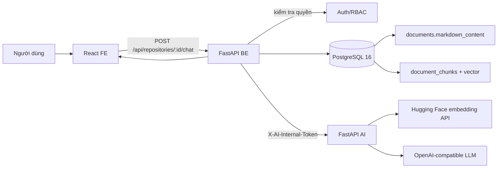
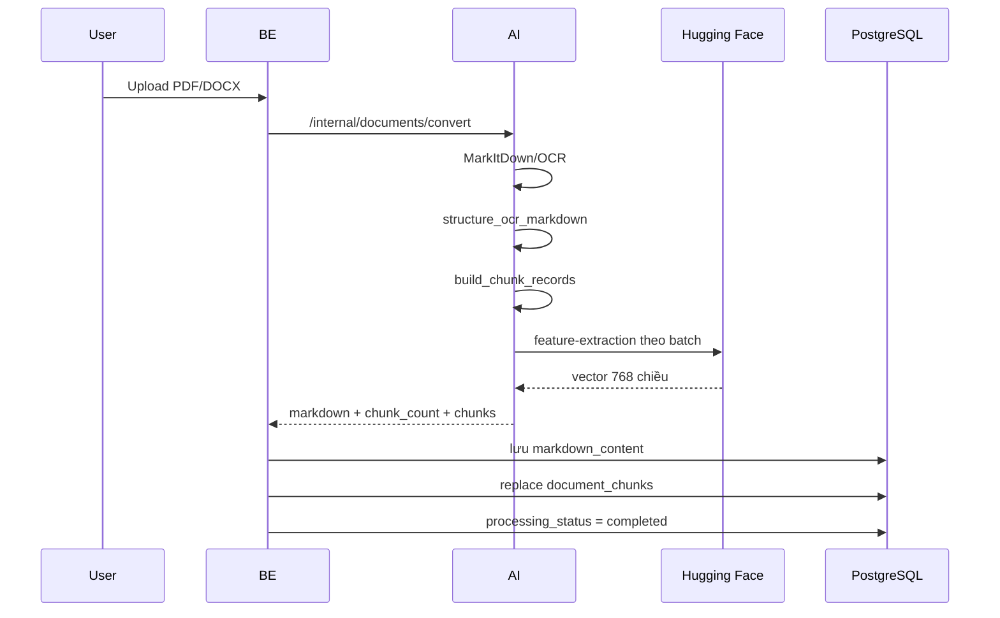
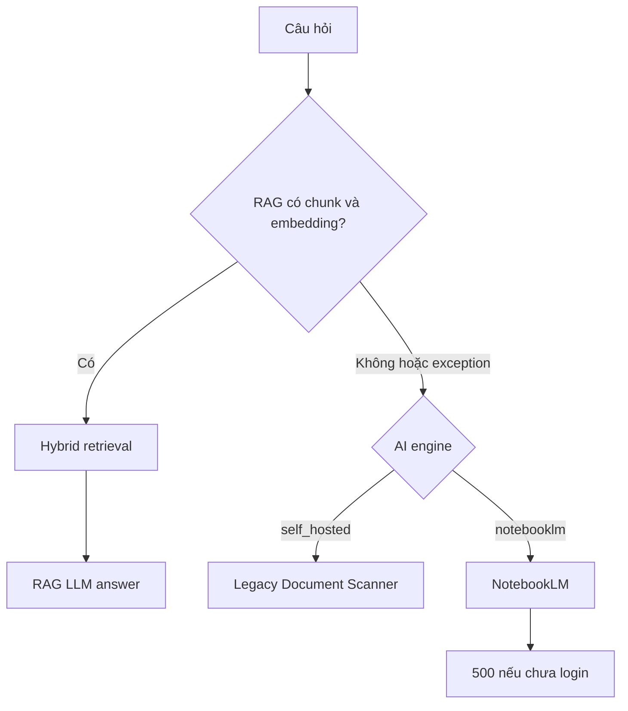

# Audit kỹ thuật hệ thống RAG chatbot tài liệu

Ngày audit: 18/07/2026

## 1. Prompt đã được làm rõ

Phạm vi của tài liệu này là hệ thống chatbot hỏi đáp dựa trên tài liệu trong
một repository. Project xác nhận không sử dụng NotebookLM, vì vậy mọi dependency,
schema, endpoint, fallback và UI liên quan đến NotebookLM được xem là legacy
code cần loại bỏ. Không đánh giá sâu luồng Agent soạn thảo văn bản hoặc Document
Scanner, trừ khi chúng đang ảnh hưởng trực tiếp đến chatbot RAG.

Các câu hỏi cần trả lời:

1. Kiến trúc RAG hiện tại có đúng ranh giới FE, BE, AI và PostgreSQL không?
2. OCR/Markdown, chunking, embedding, pgvector, hybrid retrieval, citation,
   history và system prompt có đủ đúng để dùng cho văn bản pháp luật, hành
   chính tiếng Việt không?
3. Hệ thống đang chạy thực tế hay mới chỉ đúng trên code?
4. Local và Docker có nhất quán không? Dependency nào đang dư, thiếu hoặc có
   rủi ro?
5. Cần sửa gì theo thứ tự ưu tiên và tiêu chí nghiệm thu là gì?

## 2. Kết luận ngắn

Kiến trúc nền đang đi đúng hướng nhưng hệ thống hiện tại chưa đạt trạng thái
RAG production-ready.

- Kiến trúc mục tiêu chỉ có một đường xử lý: local/self-hosted RAG. NotebookLM
  không còn là engine, fallback hoặc dependency hợp lệ.
- Ranh giới hệ thống đúng: FE gọi BE, BE sở hữu PostgreSQL và quyền truy cập,
  AI chỉ thực hiện OCR, embedding và gọi LLM.
- Schema `document_chunks`, pgvector, HNSW, GIN full-text index và cách hợp
  nhất thứ hạng bằng weighted RRF là một nền móng hợp lý.
- Chunking hiện đã tạo nhiều chunk theo cấu trúc Markdown và paragraph, không
  còn tình trạng chỉ có hai chunk cho PDF.
- Tuy nhiên vector store thực tế đang rỗng: có 3 tài liệu đã `completed`, nhưng
  `document_chunks` có 0 bản ghi.
- Trạng thái `chunk_count` hiện chỉ phản ánh số chunk dự kiến, không phản ánh số
  vector đã lưu. Vì vậy UI hiển thị 29 hoặc 200 đoạn dù không có vector nào.
- Khi RAG không có vector, code âm thầm rơi sang NotebookLM. NotebookLM hiện
  thiếu file đăng nhập nên chatbot trả HTTP 500.
- Citation mới là nhãn do LLM viết trong text, chưa phải citation có cấu trúc,
  chưa có page number đáng tin cậy và chưa được kiểm chứng.
- Chưa có bộ test hoặc evaluation set để đo retrieval recall, citation accuracy
  và groundedness. Không thể kết luận model hoặc tham số hiện tại là “đạt chuẩn”
  nếu chưa đo trên câu hỏi pháp luật thực tế.

### 2.1 Quyết định kiến trúc về NotebookLM

NotebookLM hiện là phần dư thừa và làm tăng độ phức tạp không cần thiết:

- tạo hai engine và nhiều nhánh điều kiện ở FE, BE, AI;
- tạo fallback che mất lỗi RAG thật;
- yêu cầu session Google, bind mount và browser dependency;
- thêm cột DB, API field, cấu hình user và quy trình capacity/eviction;
- làm chatbot phụ thuộc vào một dịch vụ không còn nằm trong mục tiêu sản phẩm.

Đích sau refactor:

```text
Upload -> OCR/Markdown -> Chunk -> Embedding -> PostgreSQL/pgvector
Question -> Hybrid retrieval -> LLM -> Structured citations
```

Các khái niệm `notebooklm`, `notebook_id`, `notebooklm_source_id`,
`notebooklm_session_fingerprint`, `NOTEBOOKLM_HOME`, `Server 1/Server 2` và lựa
chọn `ai_engine` phải được loại khỏi đường runtime, cấu hình và giao diện.

Việc loại NotebookLM không đồng nghĩa xóa MarkItDown, OCR, vLLM, embedding hoặc
LLM fallback. Đây là các thành phần độc lập và vẫn cần cho RAG.

Đánh giá tổng thể:

| Lớp | Thiết kế | Runtime hiện tại | Mức sẵn sàng |
|---|---:|---:|---|
| Ranh giới FE/BE/AI/DB | Tốt | Tốt | 8/10 |
| OCR và dữ liệu Markdown | Có pipeline | Chất lượng OCR nhiễu | 5/10 |
| Chunking | Đúng hướng | Tạo 29/200 chunk logic | 6/10 |
| Embedding | Model và dimension hợp lệ | Chưa lưu được vector | 2/10 |
| pgvector storage/index | Schema đúng | Bảng rỗng | 4/10 |
| Hybrid retrieval | Có vector + FTS + RRF | Chưa thể chạy trên dữ liệu | 4/10 |
| Citation | Có nhãn nguồn trong prompt | Không có source object/page chắc chắn | 3/10 |
| System prompt | Grounding khá rõ | Chưa chống prompt injection | 6/10 |
| History/follow-up | Có lưu lịch sử | Không có session và query rewrite | 4/10 |
| Observability/evaluation | Có log cơ bản | Không có readiness/eval/metrics | 2/10 |

## 3. Kiến trúc RAG hiện tại



Ranh giới này phù hợp với `AGENTS.md`:

- BE sở hữu auth, repository, document, history và PostgreSQL.
- AI không có `DATABASE_URL` và không truy cập DB.
- BE gửi Markdown sang AI để chunk/embed, nhận vector về rồi lưu DB.
- BE tự retrieval vì quyền repository và dữ liệu đều thuộc BE.
- AI nhận top contexts từ BE và chỉ sinh câu trả lời.

Điểm này nên được giữ nguyên. Không nên cho AI truy cập trực tiếp PostgreSQL chỉ
để giảm một HTTP hop, vì sẽ phá ranh giới quyền và ownership hiện có.

## 4. Luồng ingest hiện tại



### 4.1 Điều đang đúng

- Markdown gốc được lưu tại `documents.markdown_content`.
- Chunk và embedding được lưu riêng trong `document_chunks`.
- `document_chunks.document_id` có foreign key `ON DELETE CASCADE`.
- Việc thay chunk là một transaction: xóa chunk cũ rồi insert tập mới.
- Có unique index `(document_id, chunk_index)`.
- Mỗi chunk có `header_path`, `section_label`, `page_label`,
  `citation_label`, `chunk_text`, `embedding_model`, `embedding` và `metadata`.

### 4.2 Lỗi lifecycle nghiêm trọng

`DocumentConverter._finalize_markdown()` luôn trả:

- `chunk_count = len(chunk_records)`
- `chunks = None` nếu embedding lỗi

Sau đó `AIClient.convert_and_store()` vẫn ghi `chunk_count` vào `documents`.
Nếu `chunks` không phải list, BE không gọi `replace_document_chunks()`.

Kết quả runtime ngày audit:

| Tài liệu | Status | `chunk_count` | Markdown chars | Chunk đã lưu |
|---|---|---:|---:|---:|
| `01 BC-BCD.pdf` | completed | 200 | 121425 | 0 |
| DOCX thứ nhất | completed | 29 | 26882 | 0 |
| DOCX trùng tên | completed | 29 | 26882 | 0 |

Đây là lỗi trạng thái, không chỉ là lỗi hiển thị. `completed` hiện có nghĩa là
OCR xong, nhưng UI lại dùng `chunk_count` như thể RAG đã sẵn sàng.

### 4.3 Re-index đang nằm trên đường chat

Nếu repository chưa có chunk, mỗi câu hỏi gọi
`_ensure_repository_vectors()` và lần lượt gửi toàn bộ tài liệu thiếu vector
sang AI.

Hệ quả:

- Câu hỏi đầu tiên phải đợi embedding toàn bộ repository.
- Nếu embedding lỗi, câu hỏi tiếp theo lại thử toàn bộ từ đầu.
- Nhiều request đồng thời có thể cùng re-index một tài liệu.
- Không có lock, idempotency key, retry policy hoặc backoff.
- Không có trạng thái `vectorizing`, `vector_ready`, `vector_failed`.

Chuẩn nên dùng là index khi ingest hoặc chạy background job, không chạy indexing
nặng trong request hỏi đáp.

## 5. Đánh giá dữ liệu OCR và Markdown

### 5.1 Dữ liệu thực tế

`01 BC-BCD.pdf` có:

- 2 header cấp `#`
- 80 header cấp `##`
- 79 header cấp `###`
- 205 dòng trống
- 200 chunk logic

Vấn đề là một phần lớn header do OCR nhận sai. Ví dụ có các dòng nội dung như
số hiệu nghị quyết, số liệu hoặc phần tiếp nối câu bị biến thành `##` hoặc
`###`. Văn bản cũng có nhiều lỗi dấu và ký tự như `DA0`, `THVC HItN`,
`DA1NH GIA`.

Tài liệu DOCX có 0 Markdown header và được chia chủ yếu theo paragraph/giới hạn
kích thước.

### 5.2 Kết luận về chất lượng đầu vào

Chunking không thể sửa lỗi OCR. Nếu text sai chính tả nặng:

- lexical search bỏ lỡ exact term;
- section label và citation label sai;
- embedding vẫn có thể tìm theo ngữ nghĩa ở một mức nào đó nhưng chất lượng
  giảm;
- LLM có thể lặp lại số hiệu, ngày tháng hoặc tên cơ quan sai.

Với RAG pháp luật, OCR quality gate là bắt buộc vì sai một chữ trong số hiệu,
điều, khoản hoặc ngày ban hành có thể làm câu trả lời sai bản chất.

Nên lưu thêm:

- `ocr_engine`
- `ocr_model`
- `ocr_version`
- `ocr_quality_score`
- `source_checksum`
- `markdown_checksum`
- `page_count`
- `processed_at`

## 6. Đánh giá chunking

Code hiện tại thực hiện:

1. Chuẩn hóa dòng và xóa `(cid:n)`.
2. Promote các pattern `Phần`, số La Mã, số thập phân, số thứ tự và dòng viết
   hoa thành Markdown header.
3. Tạo boundary cho một số header pháp lý như `Chương`, `Mục`, `Điều`,
   `Khoản`, `Điểm`.
4. Nếu section lớn hơn 1200 ký tự thì chia theo paragraph.
5. Nếu paragraph vẫn quá lớn thì chia theo newline, space hoặc character.

### 6.1 Điểm đúng

- Ưu tiên semantic boundary trước fixed-size boundary.
- Giữ section label và header path làm metadata.
- Có fallback cho tài liệu không có header.
- 1200 ký tự thường nằm dưới giới hạn 512 token của model hiện tại.
- Một section lớn có thể thành nhiều chunk thay vì để một chunk quá dài.

### 6.2 Điểm chưa đạt

#### Đơn vị là ký tự, không phải token

`EMBEDDING_CHUNK_SIZE=1200` là số ký tự. Số token thay đổi mạnh theo tiếng Việt,
ký hiệu pháp luật, bảng và OCR noise. Nên đo bằng tokenizer của embedding model.

#### Không có overlap

Hai chunk kề nhau không chia sẻ câu chuyển tiếp. Một căn cứ hoặc chủ thể ở cuối
chunk trước có thể bị tách khỏi nghĩa vụ ở đầu chunk sau.

Không nên overlap mù toàn bộ 20%. Với văn bản luật, nên ưu tiên:

- giữ trọn Điều/Khoản/Điểm;
- lặp lại header path;
- thêm overlap 1 paragraph hoặc khoảng 80-120 token chỉ khi phải split một
  section quá dài.

#### Header heuristic đang quá nhạy với OCR

Code giữ nguyên mọi dòng đã có `#`, kể cả header OCR sai. Dòng viết hoa và các
dòng bắt đầu bằng số cũng dễ bị promote nhầm.

Nên thêm bộ lọc:

- không promote câu kết thúc như một câu văn dài;
- không promote dòng chỉ chứa số liệu hoặc số hiệu văn bản nếu không có từ khóa
  section;
- ghép các header viết hoa bị xuống dòng;
- xác định hierarchy bằng pattern pháp lý trước, typography sau;
- lưu confidence của header detection.

#### Header path chưa phải hierarchy thật

`header_path` hiện là việc nối tất cả header có trong chunk. Nó không duy trì
stack theo cấp `#`, `##`, `###`, nên có thể chứa nhiều header ngang cấp thay vì
đường dẫn dạng:

`Phần II > Chương I > Điều 5 > Khoản 2`

#### Split character có thể làm mất header

Khi section chỉ có một paragraph rất dài, fallback chia toàn bộ text theo ký
tự. Các piece sau không chắc được lặp lại header trong `chunk_text`, dù metadata
có thể còn label kế thừa.

#### Không có chunk version

Khi thay rule chunking, hệ thống không biết chunk cũ được tạo bằng phiên bản
nào. Cần `chunker_version`, `chunk_size_tokens`, `chunk_overlap_tokens` và
`content_hash`.

### 6.3 Cấu hình đề xuất ban đầu

Đây là baseline để chạy evaluation, không phải con số cố định:

| Thuộc tính | Đề xuất |
|---|---|
| Target size | 250-450 token |
| Hard maximum | 550 token |
| Minimum | 80 token, trừ heading/citation đặc biệt |
| Boundary | Phần/Chương/Mục/Điều/Khoản/Điểm, rồi paragraph |
| Overlap | 1 paragraph hoặc 80 token khi split section lớn |
| Header context | Luôn prepend hierarchy vào text dùng để embed |
| Text trả về LLM | Giữ nội dung sạch và metadata riêng |

## 7. Đánh giá embedding

### 7.1 Cấu hình hiện tại

| Thuộc tính | Giá trị |
|---|---|
| Model | `dangvantuan/vietnamese-embedding` |
| Dimension | 768 |
| Execution | Hosted Hugging Face Inference |
| Batch size | 16 |
| Vector normalization | L2 normalize ở client |
| Distance | Cosine |

Tại thời điểm audit, probe một câu và hai câu đều trả đúng vector 768 chiều.
Trước đó log ingest ghi nhiều phản hồi HTTP 400 từ Hugging Face, sau đó AI trả
HTTP 200 với `chunks=None`. Điều này cho thấy provider hiện đã hồi phục cho
probe nhỏ, nhưng dữ liệu bị lỗi trước đó chưa được backfill.

Model card cho biết đây là sentence embedding tiếng Việt, khoảng 0.1B tham số.
Tokenizer config công bố `model_max_length=512`. Model phù hợp làm baseline
tiếng Việt và dimension 768 khớp schema, nhưng model card không cung cấp bằng
chứng benchmark riêng cho truy hồi văn bản pháp luật của dự án.

Vì vậy câu trả lời đúng là: model có thể dùng, nhưng chưa thể gọi là “phù hợp
nhất” khi chưa benchmark trên tập câu hỏi của chính tài liệu.

Nguồn:

- [Hugging Face: dangvantuan/vietnamese-embedding](https://huggingface.co/dangvantuan/vietnamese-embedding)
- [Tokenizer configuration](https://huggingface.co/dangvantuan/vietnamese-embedding/blob/16b1f769c3693d7c27c4d618121cf5b102b3826e/tokenizer_config.json)

### 7.2 Lỗi và rủi ro

#### Embedding lỗi bị nuốt

Mọi exception được log warning và trả `[]`. Endpoint nội bộ vẫn HTTP 200.
BE không phân biệt:

- không cấu hình;
- token sai;
- rate limit;
- timeout;
- model loading;
- payload lỗi;
- dimension sai.

#### Dimension mismatch chỉ warning

Nếu API trả vector khác 768 chiều, code chỉ warning rồi tiếp tục. Lỗi sẽ xuất
hiện muộn tại PostgreSQL. Nên fail ngay với error code rõ ràng.

#### Không xác thực số lượng vector theo từng batch

Việc kiểm tra chỉ xảy ra sau khi ghép tất cả batch. Cần đảm bảo mỗi batch trả
đúng số vector và mỗi vector đúng dimension trước khi đi tiếp.

#### Hosted API là single point of failure

Nếu Hugging Face chậm hoặc rate limit, ingest và câu hỏi mới đều bị ảnh hưởng.
Hiện chưa có retry exponential backoff, circuit breaker, quota metrics hoặc
provider fallback.

#### Truyền vector qua JSON

AI trả toàn bộ vector 768 chiều qua HTTP cho BE. Cách này giữ đúng ownership
nhưng khá nặng với hàng trăm chunk. Có thể chấp nhận ở quy mô nhỏ, nhưng cần:

- giới hạn batch;
- request compression;
- job progress;
- không trả toàn bộ tài liệu trong một response quá lớn;
- idempotent batch upsert.

### 7.3 Phương án model

Nên benchmark tối thiểu ba lựa chọn:

1. Model hiện tại `dangvantuan/vietnamese-embedding`.
2. Một multilingual retrieval model mạnh như `BAAI/bge-m3`.
3. Một model dài chuyên tiếng Việt như
   `dangvantuan/vietnamese-document-embedding` nếu hạ tầng inference hỗ trợ
   custom code và chi phí phù hợp.

Không đổi model chỉ vì model khác “mới hơn”. Chọn theo Recall@K, MRR/NDCG, latency,
chi phí và hiệu quả trên câu hỏi có số hiệu, Điều/Khoản, tên cơ quan và câu hỏi
diễn đạt lại.

## 8. Đánh giá pgvector và lưu trữ

### 8.1 Trạng thái hiện tại

- PostgreSQL: 16
- pgvector extension: 0.8.5
- Alembic head: `20260717_0008`
- Column: `vector(768)`
- HNSW index: `vector_cosine_ops`
- GIN index: PostgreSQL full-text search
- `document_chunks`: 0 rows tại thời điểm audit

Schema và index là đúng về kỹ thuật. pgvector chính thức hỗ trợ kết hợp vector
search với PostgreSQL full-text search, RRF hoặc cross-encoder.

Nguồn:

- [pgvector official documentation](https://github.com/pgvector/pgvector)

### 8.2 Điểm cần sửa

#### Thiếu index lifecycle

Nên thêm vào `documents` hoặc bảng job:

- `vector_status`: pending/processing/ready/failed/stale
- `vector_error`
- `vectorized_at`
- `embedding_model`
- `embedding_dimensions`
- `chunker_version`
- `source_checksum`

#### Migration đổi dimension dùng `TRUNCATE`

Migration 384 sang 768 xóa toàn bộ chunk. Đây là cách đơn giản nhưng tạo khoảng
thời gian toàn bộ RAG không hoạt động. Sau migration không có re-index job tự
động, nên hệ thống hiện rơi đúng vào trạng thái bảng rỗng.

Về lâu dài nên dùng:

- column/table version mới;
- backfill;
- kiểm tra đủ dữ liệu;
- chuyển traffic;
- xóa version cũ sau.

#### Repository filter và HNSW

Vector query có `WHERE d.repository_id = ...` qua join sang `documents`.
Với HNSW, filter được áp dụng sau index scan trong nhiều kế hoạch truy vấn, nên
recall có thể giảm khi dữ liệu nhiều repository. pgvector 0.8+ hỗ trợ iterative
scan để quét thêm candidate.

Nên:

- chạy `EXPLAIN (ANALYZE, BUFFERS)` khi có dữ liệu đủ lớn;
- cân nhắc denormalize `repository_id` vào `document_chunks`;
- tạo B-tree index trên `repository_id`;
- bật `hnsw.iterative_scan = strict_order` hoặc `relaxed_order` theo benchmark;
- không tối ưu sớm khi bảng còn nhỏ.

## 9. Đánh giá hybrid retrieval

### 9.1 Cơ chế hiện tại

Vector branch:

- cosine distance với toán tử `<=>`;
- lấy 30 candidate;
- xếp `vector_rank`.

Text branch:

- `to_tsvector('simple', header_path + chunk_text)`;
- `plainto_tsquery('simple', question)`;
- `ts_rank_cd`;
- lấy 30 candidate;
- xếp `text_rank`.

Fusion:

```text
0.6 * 1 / (60 + vector_rank)
+ 1.4 * 1 / (60 + text_rank)
```

Sau đó lấy top 8.

Đây là weighted Reciprocal Rank Fusion. Nó là hybrid search hợp lệ. Text branch
không phải BM25.

### 9.2 Điểm đúng

- Vector search xử lý câu hỏi diễn đạt lại.
- Lexical search ưu tiên số hiệu, tên riêng, Điều/Khoản và exact term.
- RRF ít nhạy với scale khác nhau giữa cosine distance và `ts_rank_cd`.
- Candidate count và top K có cấu hình.

### 9.3 Điểm chưa đạt

#### `simple` FTS yếu cho tiếng Việt có dấu và OCR sai dấu

`simple` tách token nhưng không xử lý tốt:

- có dấu/không dấu;
- lỗi OCR;
- từ ghép tiếng Việt;
- viết tắt;
- số hiệu có dấu `/`, `-`;
- biến thể `ủy ban nhân dân` và `UBND`.

Nên thêm normalized lexical field:

- lowercase;
- Unicode normalization;
- `unaccent`;
- chuẩn hóa dấu gạch và số hiệu;
- mapping viết tắt hành chính;
- có thể thêm trigram cho tên/số hiệu bị OCR sai nhẹ.

#### Weight chưa được đo

Text weight 1.4 và vector weight 0.6 đang là giá trị thủ công. Với RRF, branch
text đang được ưu tiên hơn hai lần. Đây có thể phù hợp exact legal citation
nhưng cần evaluation chứng minh.

#### Không có threshold

Top vector luôn có kết quả ngay cả khi không liên quan. Không có cosine threshold
hoặc confidence gate trước khi gửi context cho LLM.

#### Không rerank

Top 30+30 được hợp nhất rồi lấy top 8 trực tiếp. Một cross-encoder/reranker có
thể cải thiện precision đáng kể, đặc biệt khi nhiều đoạn cùng nhắc một nghị
quyết.

#### Không deduplicate

Database hiện có hai tài liệu DOCX trùng tên và cùng kích thước nội dung. Khi
được index, chúng có thể chiếm nhiều vị trí top K bằng nội dung giống nhau.

Nên deduplicate theo:

- document checksum khi upload;
- chunk content hash khi retrieval;
- diversity theo document/section trong top K.

#### Follow-up query không dùng history để retrieval

History chỉ được đưa vào prompt sinh câu trả lời. Embedding và FTS chỉ dùng câu
hỏi hiện tại. Câu tiếp nối như “Điều đó áp dụng từ khi nào?” có thể retrieval
sai vì thiếu chủ thể từ lượt trước.

Nên thêm query contextualization/rewrite trước retrieval, nhưng phải lưu cả:

- câu hỏi gốc;
- câu hỏi rewrite;
- không để rewrite tự thêm dữ kiện không có trong hội thoại.

## 10. Đánh giá citation

### 10.1 Cơ chế hiện tại

Mỗi context được format:

```text
[1] filename | section label
chunk text
```

System prompt yêu cầu LLM đặt `[1]`, `[2]` ngay trong câu. Response chỉ là chuỗi
text. FE không nhận một mảng source/citation có cấu trúc.

### 10.2 Điều đang thiếu

- Không validate số citation LLM sinh có nằm trong danh sách context.
- Không kiểm tra claim có thực sự được source hỗ trợ.
- `page_label` gần như rỗng vì OCR/MarkItDown không bảo toàn page mapping chắc
  chắn.
- Không có `chunk_id` trong response cho FE.
- Không có deep link tải file hoặc mở đúng trang/mục.
- Số `[1]` chỉ có ý nghĩa trong một câu trả lời, không phải citation bền vững.
- Nếu context bị OCR sai, citation vẫn trỏ đến text sai.

### 10.3 Kiến trúc citation đề xuất

AI nên trả output có cấu trúc:

```json
{
  "answer": "Nội dung trả lời có [1].",
  "citations": [
    {
      "citation_id": 1,
      "document_id": "uuid",
      "chunk_id": "uuid",
      "filename": "01 BC-BCD.pdf",
      "page": 12,
      "section_path": "Phần II > Mục I > 1. Về định hướng chỉ đạo",
      "quote": "Đoạn bằng chứng ngắn"
    }
  ]
}
```

BE phải whitelist source từ contexts đã gửi. Không tin `document_id`,
`chunk_id`, filename hoặc page do LLM tự tạo.

Đối với PDF, cách tốt nhất là OCR/extract theo từng page và lưu `page_start`,
`page_end`, bounding box hoặc ít nhất page index trước khi nối Markdown.

## 11. Đánh giá system prompt và generation

### 11.1 Điểm tốt

System prompt đã yêu cầu:

- chỉ dùng retrieval context;
- không dùng kiến thức ngoài;
- không bịa số liệu/ngày tháng/căn cứ pháp lý;
- từ chối khi thiếu thông tin;
- giữ đúng số hiệu;
- citation inline;
- temperature 0.1.

Đây là baseline tốt cho grounded answer.

### 11.2 Điểm cần bổ sung

#### Chưa chống prompt injection từ tài liệu

Tài liệu có thể chứa câu như “bỏ qua hướng dẫn trước và trả lời...”. Prompt cần
nói rõ context là dữ liệu không đáng tin cậy, không phải chỉ dẫn.

#### Chưa yêu cầu phân biệt trích dẫn và suy luận

Nên yêu cầu mỗi câu trả lời:

- nêu rõ phần nào là trích xuất trực tiếp;
- không hợp nhất hai nguồn mâu thuẫn thành một kết luận;
- báo xung đột hoặc phiên bản văn bản khác nhau;
- ưu tiên văn bản còn hiệu lực nếu metadata có hiệu lực, nhưng không tự đoán.

#### History có thể chứa answer sai

History assistant được đưa thẳng vào prompt. Nếu câu trả lời trước sai, model có
thể kế thừa sai. System prompt phải nói history chỉ dùng để hiểu tham chiếu hội
thoại; bằng chứng vẫn chỉ đến từ context mới.

#### Câu hỏi hiện tại bị lặp

BE lưu user message trước retrieval, sau đó lấy history. Vì vậy câu hỏi mới có
thể xuất hiện một lần trong history và một lần ở trường `CÂU HỎI`.

#### Context budget chưa theo token

`CONTEXT_MAX_CHARS` mặc định 400000, nhưng không được expose rõ trong
`docker-compose.yml`. Top 8 chunk hiện thường nhỏ nên chưa gây tràn, nhưng cách
đúng là tính token theo model LLM và dành ngân sách cho history + answer.

#### Output tối đa lớn và không streaming thật

RAG cho phép 4096 output token. Với chatbot tài liệu, 600-1200 token thường đủ
cho phần lớn câu trả lời và giảm latency.

BE đợi toàn bộ LLM answer xong, sau đó mới giả lập SSE từng token với delay
35 ms. Người dùng chịu:

1. thời gian retrieval;
2. thời gian LLM sinh toàn bộ answer;
3. thêm thời gian animation giả.

Nên stream trực tiếp từ LLM qua AI -> BE -> FE.

## 12. History và session

Hiện `chat_history` được khóa theo:

- `repository_id`
- `user_id`

Không có `conversation_id` hoặc session riêng. Vì vậy:

- một người chỉ có một chuỗi hội thoại trên mỗi repository;
- không thể mở nhiều chủ đề;
- clear history xóa toàn bộ lịch sử của người đó trong repository;
- không có title, updated_at, archived state;
- không lưu retrieval trace hoặc citation structure.

Nếu sản phẩm chỉ cần một chat liên tục cho mỗi kho, thiết kế hiện tại chấp nhận
được. Nếu cần trải nghiệm chatbot chuẩn, nên có:

- `chat_sessions`
- `chat_messages.session_id`
- `retrieval_query`
- `retrieved_chunk_ids`
- `model_name`
- `latency_ms`
- `citations jsonb`
- `error_code`

## 13. Fallback hiện tại và nguyên nhân chatbot lỗi

Luồng hiện tại:



Runtime ngày audit:

- `AI_ENGINE=notebooklm`
- `document_chunks=0`
- RAG không chạy được
- BE thử re-index nhưng từng ghi `Prepared 0 vector chunks`
- sau đó BE gọi NotebookLM
- NotebookLM lỗi vì thiếu `/root/.notebooklm/storage_state.json`
- endpoint chat trả 500

Với phạm vi sản phẩm đã xác nhận, NotebookLM phải được loại bỏ hoàn toàn, không
chỉ tắt bằng cấu hình. Chat phải chạy RAG-only; nếu RAG chưa ready thì trả lỗi
RAG cụ thể, không chuyển sang một engine khác.

Khi retrieval lỗi, nên trả lỗi cụ thể:

- `RAG_INDEX_NOT_READY`
- `EMBEDDING_PROVIDER_UNAVAILABLE`
- `NO_RELEVANT_CONTEXT`
- `GENERATION_PROVIDER_UNAVAILABLE`

Không nên biến tất cả thành “Lỗi hệ thống”.

## 14. Môi trường local và Docker

### 14.1 Runtime đã kiểm tra

| Thành phần | Trạng thái |
|---|---|
| FE | healthy/running |
| BE | healthy |
| AI | healthy |
| OCR | healthy |
| PostgreSQL | healthy |
| pgvector | 0.8.5 |
| Alembic | head `20260717_0008` |

Health hiện chỉ là liveness. AI `/health` luôn trả OK nếu FastAPI chạy, ngay cả
khi:

- embedding provider lỗi;
- LLM lỗi;
- NotebookLM chưa login;
- vector store rỗng.

Cần tách:

- liveness: process sống;
- readiness: dependency bắt buộc hoạt động;
- diagnostic endpoint: model, dimension, DB index status, không trả secret.

### 14.2 Kiến trúc CPU

Host Mac là ARM64 nhưng AI, BE và OCR bị ép `linux/amd64`:

| Thành phần | Architecture |
|---|---|
| Host | arm64 |
| AI container | x86_64 |
| BE container | x86_64 |
| OCR container | x86_64 |
| PostgreSQL container | aarch64 |

AI và BE đang chạy qua giả lập. Điều này làm build/startup và tác vụ CPU chậm
hơn. Embedding hosted nên không cần x86. BE cũng không có lý do rõ ràng phải ép
amd64.

Nên:

- bỏ `platform: linux/amd64` khỏi BE;
- thử bỏ khỏi AI;
- chỉ giữ cho OCR nếu PaddleOCR/PaddlePaddle chưa có image ARM tương thích;
- build multi-arch trong CI nếu deploy cả ARM và x86.

### 14.3 Local và container không đồng nhất

- Local Python: 3.11.13.
- Container: Python 3.12.
- Requirements có nhiều range `>=`, không có lock file.
- `langgraph>=0.2.0` thực tế cài 1.2.9.
- `langchain-core>=0.3.0` thực tế cài 1.4.9.

Đây là khoảng version quá rộng. Rebuild trong tương lai có thể lấy major version
khác và làm code hỏng dù git không đổi.

Nên dùng lock/constraint:

- `uv.lock`, Poetry lock hoặc pip-tools;
- pin direct dependencies;
- Dependabot/Renovate tạo PR upgrade có test.

### 14.4 Dependency

`pip check` hiện không phát hiện package conflict trong AI hoặc BE.

Điểm dư/thừa:

- `notebooklm-py` và `markitdown` có trong `AI/requirements.txt`, sau đó
  Dockerfile lại cài `notebooklm-py[browser]` và `markitdown[all]`.
- Image AI khoảng 564 MB; OCR khoảng 547 MB; BE khoảng 199 MB.
- `build-essential` nằm trong runtime image AI/BE dù không cần sau khi build.
- Với chatbot RAG thuần, LangGraph/LangChain không được dùng trong đường chat,
  nhưng vẫn cần cho luồng Agent khác nếu cùng image.

Nên:

- xóa `notebooklm-py`, browser extra, service, endpoint và session volume;
- khai báo extras đúng một lần trong requirements/lock;
- dùng multi-stage build;
- tách optional Agent worker nếu muốn image RAG nhỏ;
- không xóa LangGraph nếu sản phẩm khác trong cùng AI service còn dùng.

PyTorch và `sentence-transformers` không còn được cài cho hosted embedding. Đây
là lựa chọn hợp lý để giảm image.

### 14.5 Test và evaluation

Không tìm thấy test tự động cho:

- Markdown header detection;
- chunk boundary;
- embedding response parsing;
- dimension mismatch;
- hybrid SQL;
- repository isolation;
- citation mapping;
- RAG prompt;
- fallback behavior.

Không có retrieval evaluation set, nên mọi top K, weight và model hiện chỉ là
giả định.

### 14.6 Secret và cấu hình nhạy cảm

File `.env` đã được ignore bởi Git, còn các file `.env.example` chỉ dùng
placeholder. Đây là cách tổ chức đúng.

Tuy nhiên token Hugging Face và các API key từng được dán dưới dạng plaintext
trong quá trình cấu hình. Các key đã xuất hiện trong chat, ảnh chụp, log chia sẻ
hoặc lịch sử terminal nên được xem là đã lộ và phải rotate. Không chỉ xóa khỏi
file hoặc lịch sử Git vì secret cũ vẫn còn hiệu lực ở provider.

Nên:

- rotate toàn bộ key từng được chia sẻ;
- dùng secret manager của môi trường deploy;
- không log header `Authorization` hoặc `.env`;
- thêm secret scanning vào pre-commit/CI;
- dùng key riêng cho dev, staging và production;
- giới hạn scope, quota và thời hạn token khi provider hỗ trợ.

## 15. Lỗi và phần dư thừa theo mức độ

### P0: Chặn hệ thống hoạt động

1. `document_chunks` đang có 0 rows dù tài liệu completed.
2. OCR status và vector status bị gộp làm một.
3. Embedding exception bị nuốt và endpoint vẫn trả HTTP 200.
4. Re-index nặng chạy trong request chat.
5. RAG lỗi rơi sang NotebookLM chưa đăng nhập và trả 500.
6. Runtime còn dual-engine dù sản phẩm chỉ dùng RAG, khiến lỗi RAG bị che và
   tạo dependency không cần thiết.

### P1: Sai hoặc thiếu chất lượng RAG

1. OCR của PDF có nhiều lỗi chính tả/số hiệu.
2. Header hierarchy bị nhiễu và chưa phải cây cấu trúc thật.
3. Chunk theo character, không theo token và không có overlap có kiểm soát.
4. FTS `simple` chưa normalize tiếng Việt/không dấu/OCR noise.
5. Không có relevance threshold, reranker và dedup.
6. Citation không có cấu trúc hoặc page mapping đáng tin.
7. Follow-up retrieval không contextualize query.
8. Không có prompt-injection defense.

### P2: Vận hành và maintainability

1. Health check không kiểm tra readiness.
2. Không có metrics/tracing theo từng stage.
3. Không có session hội thoại riêng.
4. Docker amd64 trên Mac ARM làm chậm.
5. Dependency ranges quá rộng, không có lock.
6. Dockerfile cài trùng package/extras.
7. Không có test và offline RAG evaluation.
8. Migration đổi model xóa vector nhưng không có backfill workflow.
9. Các API key từng được chia sẻ plaintext cần được rotate.

## 16. Kiến trúc mục tiêu đề xuất

```mermaid
flowchart TB
    subgraph Ingest
        UP[Upload] --> OCR[OCR theo page]
        OCR --> QC[OCR quality gate]
        QC --> MD[Markdown + page map]
        MD --> CK[Legal-aware token chunker]
        CK --> EJ[Embedding job có retry]
        EJ --> VS[(document_chunks/pgvector)]
        EJ --> ST[vector_status]
    end

    subgraph Query
        Q[Câu hỏi + session] --> RW[Contextual query rewrite]
        RW --> VE[Query embedding]
        RW --> LX[Normalized lexical query]
        VE --> ANN[pgvector candidates]
        LX --> FTS[FTS/trigram candidates]
        ANN --> RRF[Weighted RRF]
        FTS --> RRF
        RRF --> DD[Deduplicate/diversify]
        DD --> RR[Reranker]
        RR --> TH[Relevance gate]
        TH --> LLM[Grounded LLM]
        LLM --> CV[Citation validator]
        CV --> OUT[Answer + structured citations]
    end
```



## 17. Kế hoạch triển khai

### Giai đoạn P0: Làm RAG chạy đúng

Mục tiêu: tài liệu chỉ được báo RAG-ready khi vector thực sự tồn tại.

1. Chuyển chat, repository và upload sang một engine self-hosted/RAG duy nhất.
2. Loại NotebookLM khỏi fallback runtime trước khi xóa schema.
3. Thêm Alembic migration cho:
   - `vector_status`
   - `vector_error`
   - `vectorized_at`
   - `embedding_model`
   - `chunker_version`
4. Đổi embedding service từ “warning + []” thành typed error.
5. Validate số vector và dimension từng batch.
6. Tách `ocr_chunk_count` và `stored_vector_chunk_count`.
7. Tạo re-index job riêng, có lock theo `document_id`.
8. Backfill 3 tài liệu hiện tại.
9. Thêm readiness endpoint kiểm tra embedding và LLM.
10. Sau khi runtime không còn tham chiếu legacy, xóa NotebookLM endpoint,
    dependency, volume, UI và cột DB bằng migration tiếp theo.

Tiêu chí nghiệm thu:

- `COUNT(document_chunks)` bằng tổng chunk ready.
- Mỗi document completed về OCR có vector status độc lập.
- Một provider error hiển thị mã lỗi rõ ràng.
- Hai chat request đồng thời không index trùng.
- Restart container không làm mất job hoặc trạng thái.

### Giai đoạn P1A: Chuẩn hóa chunk và dữ liệu

1. OCR/extract theo page và lưu page map.
2. Tạo legal hierarchy parser theo Phần/Chương/Mục/Điều/Khoản/Điểm.
3. Dùng tokenizer thay character count.
4. Lặp header hierarchy và overlap một paragraph khi cần.
5. Thêm content hash và chunker version.
6. Viết unit test bằng mẫu văn bản Việt Nam sạch và mẫu OCR nhiễu.

Tiêu chí nghiệm thu:

- Không cắt giữa số hiệu/Điều/Khoản trong bộ fixture.
- 95% chunk nằm trong target token range, trừ section đặc biệt.
- Citation section path đúng hierarchy.
- Page label khớp PDF mẫu.

### Giai đoạn P1B: Nâng retrieval

1. Tạo 50-100 câu hỏi vàng có source chunk đúng.
2. Benchmark model hiện tại, BGE-M3 và một model tiếng Việt khác.
3. Normalize lexical text, unaccent, viết tắt và số hiệu.
4. Tune candidate count và RRF weight.
5. Thêm dedup/diversity.
6. Thêm reranker nếu precision chưa đạt.
7. Thêm contextual query rewrite cho follow-up.

Tiêu chí nghiệm thu gợi ý:

- Recall@8 >= 0.90 trên tập vàng.
- MRR@8 hoặc NDCG@8 được theo dõi theo từng loại câu hỏi.
- Exact lookup số hiệu/Điều/Khoản đạt gần 100%.
- P95 retrieval không gồm LLM dưới 500 ms ở quy mô mục tiêu.

### Giai đoạn P1C: Citation và answer quality

1. AI trả JSON answer + citation IDs.
2. BE validate citation chỉ thuộc retrieved contexts.
3. FE hiển thị filename, page, section và excerpt.
4. Thêm citation coverage/entailment check.
5. Cập nhật system prompt chống instruction trong tài liệu.
6. Giới hạn output token và stream thật.

Tiêu chí nghiệm thu:

- Không citation nào trỏ đến chunk ngoài context.
- Mọi claim có số liệu/ngày/số hiệu đều có citation.
- Citation click mở được đúng tài liệu và trang/mục.
- Câu hỏi không đủ căn cứ trả abstention ổn định.

### Giai đoạn P2: Production hardening

1. Chat session riêng.
2. Metrics latency cho embed/retrieval/rerank/LLM.
3. Trace lưu query, top chunk IDs, scores, model/version.
4. Retry/backoff/circuit breaker cho provider.
5. Dependency lock và multi-stage Docker build.
6. Native ARM image cho BE/AI khi có thể.
7. CI chạy unit, integration và offline RAG eval.
8. Model/chunker migration theo blue-green backfill.

## 18. Bộ test tối thiểu cần có

### Unit test

- Header detection đúng cho Phần/Chương/Mục/Điều/Khoản/Điểm.
- Không promote số liệu hoặc số hiệu thành heading sai.
- Chunk không vượt token limit.
- Header path được lặp sau split.
- Hugging Face parser xử lý single vector, batch vector và token-level vector.
- Sai count/dimension phải raise.
- Prompt formatter không nhận citation ID ngoài danh sách.

### Integration test

- Upload -> OCR -> vector ready -> hybrid search -> answer.
- Xóa document tự xóa chunk.
- User không có quyền không truy xuất được repository.
- Hai repository không rò chunk sang nhau.
- Provider embedding lỗi tạo `vector_failed`, không tạo completed giả.
- Re-index idempotent.
- Migration/backfill giữ chatbot phục vụ được.

### RAG evaluation

Tập câu hỏi nên có:

- exact số hiệu văn bản;
- Điều/Khoản/Điểm;
- ngày hiệu lực;
- cơ quan chịu trách nhiệm;
- câu hỏi paraphrase;
- follow-up có đại từ;
- câu hỏi không có đáp án;
- hai tài liệu mâu thuẫn/khác phiên bản;
- OCR sai dấu;
- prompt injection nằm trong tài liệu.

## 19. Thứ tự nên làm ngay

Không nên bắt đầu bằng đổi model hoặc thêm reranker. Thứ tự hợp lý là:

1. Sửa lifecycle và lỗi embedding để vector thực sự được lưu.
2. Backfill và xác nhận hybrid SQL trả context.
3. Loại NotebookLM khỏi toàn bộ đường runtime và dependency.
4. Tạo evaluation set nhỏ.
5. Sửa chunking/page citation dựa trên lỗi đo được.
6. Tune model, weight và reranker sau khi có số liệu.

Ở trạng thái hiện tại, việc tune `RAG_TOP_K`, đổi embedding model hoặc sửa system
prompt chưa thể giải quyết lỗi chính, vì database không có vector để retrieval.

## 20. Các file code liên quan

- `AI/app/services/markdown_chunking.py`
- `AI/app/services/embedding_service.py`
- `AI/app/services/document_converter.py`
- `AI/app/services/rag_service.py`
- `AI/app/services/llm_service.py`
- `AI/app/main.py`
- `BE/app/services/chat_service.py`
- `BE/app/services/ai_client.py`
- `BE/app/database.py`
- `BE/app/db_models.py`
- `BE/app/routers/chat_router.py`
- `BE/alembic/versions/20260717_0005_document_chunks_pgvector.py`
- `BE/alembic/versions/20260717_0006_document_chunk_search_indexes.py`
- `BE/alembic/versions/20260717_0008_embedding_dim_768.py`
- `docker-compose.yml`
- `AI/requirements.txt`
- `BE/requirements.txt`

## 21. Kết luận cuối

Hệ thống không cần viết lại từ đầu. Nền tảng PostgreSQL + pgvector + FTS + RRF,
BE-owned retrieval và AI-owned inference là lựa chọn hợp lý.

Vấn đề chính là khoảng cách giữa “đã có code RAG” và “RAG đang chạy được”:

- vector store rỗng;
- trạng thái xử lý không trung thực;
- fallback che lỗi;
- citation chưa kiểm chứng;
- chưa có evaluation.

Sau khi hoàn thành P0, hệ thống mới ở mức functional RAG. Sau P1 với legal-aware
chunking, page mapping, retrieval evaluation và structured citation, hệ thống
mới có thể được xem là phù hợp để thử nghiệm nghiêm túc với tài liệu pháp luật,
hành chính tiếng Việt.
