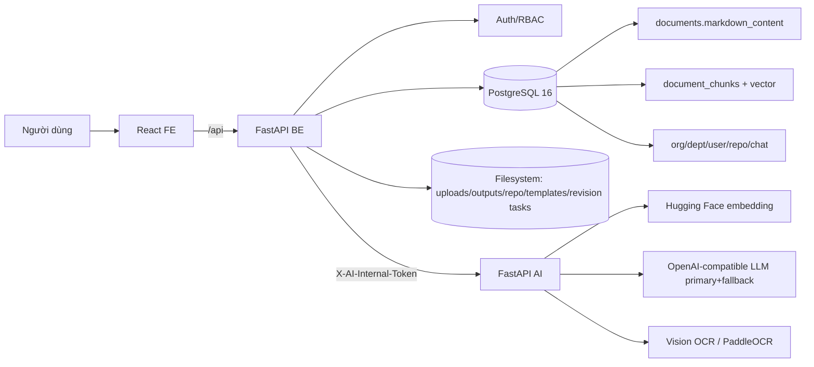
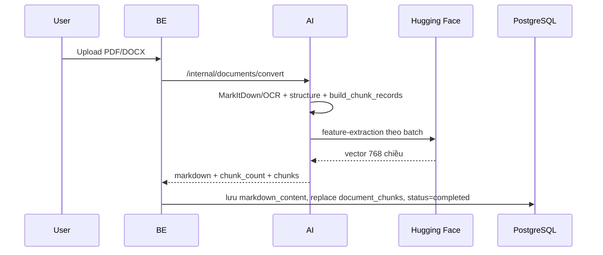
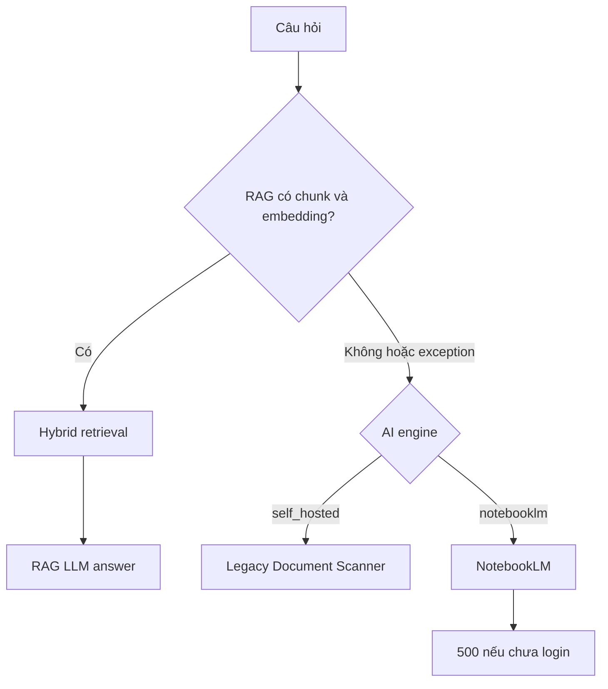

# Audit kỹ thuật toàn hệ thống OfficeAI / SmartGov

Ngày audit gốc: 18/07/2026 — Bản mở rộng: phủ toàn hệ thống (RAG + Agent +
doc_edit + auth + export + FE + hạ tầng).

> Bản audit gốc chỉ soi chatbot RAG. Bản này giữ nguyên chiều sâu phần RAG và mở
> rộng sang các subsystem còn lại: xác thực/RBAC, vòng đời tài liệu, Agent soạn
> thảo, biên tập tài liệu (tổng hợp góp ý, revision, dataset), export Word/ND30,
> template, frontend, Docker/dependency và security. Không in secret/API key.

## 1. Prompt đã được làm rõ

Phạm vi: đánh giá **toàn bộ** nền tảng trợ lý văn bản hành chính tiếng Việt, tập
trung mức sẵn sàng production của từng subsystem, không chỉ chatbot RAG. Project
xác nhận **không dùng NotebookLM**; mọi dependency, schema, endpoint, fallback và
UI liên quan NotebookLM là legacy cần loại bỏ.

Câu hỏi cần trả lời:

1. Kiến trúc có đúng ranh giới FE/BE/AI/PostgreSQL không?
2. Từng subsystem (RAG, Agent, doc_edit, auth, export) đang **chạy thật** hay mới
   đúng trên code / còn mock?
3. RAG (OCR→chunk→embedding→pgvector→hybrid→citation→history) có đủ chuẩn cho văn
   bản pháp luật tiếng Việt không?
4. Local và Docker có nhất quán không? Dependency nào dư/thiếu/rủi ro?
5. Cần sửa gì theo thứ tự ưu tiên và tiêu chí nghiệm thu là gì?

## 2. Kết luận ngắn

Nền tảng đi đúng hướng nhưng **chưa subsystem nào đạt production-ready đồng đều**.
Khoảng cách lớn nhất là giữa "code/endpoint đã có" và "backend đã chạy thật".

- Ranh giới hệ thống đúng: FE→BE, BE sở hữu PostgreSQL + quyền, AI chỉ OCR/embed/LLM.
- RAG có nền móng hợp lý (pgvector, HNSW, GIN FTS, weighted RRF) nhưng **vector
  store thực tế từng rỗng**: document `completed` mà `document_chunks` = 0 rows.
- **Tổng hợp góp ý** và **export Word/ND30** là các tính năng thật, hoàn chỉnh,
  giá trị cao.
- **Revision review (doc_edit)** và **dataset extraction** hiện là **mock**, chỉ
  scaffold UI contract — đây là rủi ro "tính năng nhìn như đã có".
- **Agent drafting** chạy thật nhưng không dùng vector store; còn lệch thiết kế
  trong reviewer/citation.
- NotebookLM còn trong runtime/fallback/schema; là dư thừa che lỗi RAG.
- Citation mới là nhãn LLM viết trong text, chưa có cấu trúc/page đáng tin.
- Chưa có test hoặc evaluation set để đo retrieval recall / citation accuracy.

### 2.1 Bảng sẵn sàng theo subsystem

| Subsystem | Thiết kế | Runtime | Sẵn sàng |
| --- | --- | --- | --- |
| Ranh giới FE/BE/AI/DB | Tốt | Tốt | 8/10 |
| Auth / RBAC / org-dept-user | Đủ | Chạy, còn engine legacy | 6/10 |
| OCR & Markdown | Có pipeline | OCR nhiễu | 5/10 |
| Chunking | Đúng hướng | Char-based, no overlap | 6/10 |
| Embedding | Model/dim hợp lệ | Từng nuốt lỗi; đã fix truncate | 4/10 |
| pgvector storage/index | Schema đúng | Từng rỗng | 4/10 |
| Hybrid retrieval | vector+FTS+RRF | Chưa đo trên data | 4/10 |
| Citation | Nhãn trong prompt | Không có source object/page | 3/10 |
| Agent drafting | LangGraph đủ node | Chạy, lệch reviewer/citation | 5/10 |
| Tổng hợp góp ý | Map-reduce + DOCX | **Thật, hoạt động** | 7/10 |
| Revision review | Endpoint đủ | **Mock** | 2/10 |
| Dataset extract | Endpoint + preview | **Mock** | 2/10 |
| Template ND30 | Có extract/generate | Còn engine legacy | 5/10 |
| Export Word/ND30 | python-docx đầy đủ | **Thật, phong phú** | 7/10 |
| Frontend | 4 trang chính | Chạy, SSE giả lập | 6/10 |
| Observability/eval | Log cơ bản | Không readiness/metrics/eval | 2/10 |
| Docker/dependency | Multi-stage (mới) | Range rộng, amd64 trên ARM | 5/10 |

## 3. Kiến trúc và ranh giới

Ranh giới đúng theo `AGENTS.md`: BE sở hữu auth/repo/document/history/PostgreSQL;
AI không có `DATABASE_URL`; BE gửi markdown sang AI để chunk/embed rồi tự lưu DB;
BE tự retrieval; AI chỉ sinh câu trả lời. **Nên giữ nguyên** — không cho AI truy
cập trực tiếp PostgreSQL chỉ để bớt một HTTP hop.

Điểm cần lưu ý: nhiều state của doc_edit (revision task) nằm trên **filesystem**,
không phải DB — cần đưa vào cùng mô hình ownership/observability.

## 4. Audit xác thực, phân quyền, quản trị

Files: `BE/app/auth.py`, `auth_router.py`, `admin_router.py`, `db_models.py`.

- JWT + seed `system_admin` idempotent từ `ADMIN_*`. Mô hình org→dept→user với
  `role` và org `max_accounts`. Ranh giới quyền hợp lý.
- **Rủi ro P1**: `users.ai_engine` + `is_user_self_hosted(...)` tạo dual-engine
  xuyên FE/BE/AI. Với sản phẩm RAG-only, đây là phức tạp thừa và là đường sống của
  NotebookLM. Nên bỏ engine selection.
- **Cần test bắt buộc** (hiện chưa có): user không có quyền không truy cập được
  repository/chat/citation download; session/task thuộc đúng user; admin
  diagnostic không public.
- Password hashing, JWT expiry, refresh token, brute-force protection cần được
  soi riêng (ngoài phạm vi bản này nhưng nên thêm vào checklist security).

## 5. Audit vòng đời tài liệu (ingest)

### 5.1 Đang đúng

- Markdown gốc lưu ở `documents.markdown_content`; chunk/vector ở
  `document_chunks` với FK `ON DELETE CASCADE`.
- Thay chunk là transaction (xóa cũ → insert mới); có unique index
  `(document_id, chunk_index)`.
- Mỗi chunk có `header_path`, `section_label`, `page_label`, `citation_label`,
  `chunk_text`, `embedding_model`, `embedding`, `metadata`.
- `folder_key` phân loại tài liệu (`draft`, `summary`,...).

### 5.2 Lỗi lifecycle nghiêm trọng (P0)

`DocumentConverter._finalize_markdown()` luôn trả `chunk_count = len(chunk_records)`
và `chunks = None` nếu embedding lỗi. `AIClient.convert_and_store()` vẫn ghi
`chunk_count` vào `documents`; nếu `chunks` không phải list, BE **không** gọi
`replace_document_chunks()`.

Kết quả runtime ngày audit:

| Tài liệu | Status | `chunk_count` | Markdown chars | Chunk đã lưu |
| --- | --- | ---: | ---: | ---: |
| `01 BC-BCD.pdf` | completed | 200 | 121425 | 0 |
| DOCX thứ nhất | completed | 29 | 26882 | 0 |
| DOCX trùng tên | completed | 29 | 26882 | 0 |

`completed` chỉ có nghĩa OCR xong, nhưng UI dùng `chunk_count` như thể RAG đã sẵn
sàng. **Cần tách `content_status` và `vector_status`, và tách `ocr_chunk_count`
với `indexed_chunk_count`.**

### 5.3 Re-index nằm trên đường chat (P0)

Nếu repo chưa có chunk, mỗi câu hỏi gọi `_ensure_repository_vectors()` embed toàn
bộ tài liệu thiếu vector. Không lock, không idempotency, không retry/backoff,
không trạng thái `vectorizing/ready/failed`. **Cần index khi ingest hoặc background
job, không index nặng trong request hỏi đáp.**

## 6. Audit OCR & Markdown

- `01 BC-BCD.pdf`: 2 header `#`, 80 `##`, 79 `###`, 205 dòng trống, 200 chunk. Một
  phần lớn header do OCR nhận sai (số hiệu/số liệu thành `##`/`###`); nhiều lỗi
  dấu như `DA0`, `THVC HItN`, `DA1NH GIA`. DOCX có 0 header, chia theo paragraph.
- Chunking không sửa được lỗi OCR: lexical search miss exact term; section/citation
  label sai; LLM có thể lặp số hiệu/ngày sai. **Với RAG pháp luật, OCR quality gate
  là bắt buộc.**
- Nên lưu thêm: `ocr_engine`, `ocr_model`, `ocr_version`, `ocr_quality_score`,
  `source_checksum`, `markdown_checksum`, `page_count`, `processed_at`.

## 7. Audit chunking

Xử lý: chuẩn hóa dòng + xóa `(cid:n)`; promote pattern thành header; boundary cho
`Chương/Mục/Điều/Khoản/Điểm`; section > ngưỡng chia paragraph rồi ký tự.

### 7.1 Đúng

- Ưu tiên semantic boundary trước fixed-size; giữ section label + header path;
  fallback cho tài liệu không header; một section lớn thành nhiều chunk.

### 7.2 Chưa đạt

- **Đơn vị là ký tự, không phải token**: `EMBEDDING_CHUNK_SIZE` (nay **800**, đã
  hạ từ 1200) là ký tự. Nên đo bằng tokenizer của embedding model (PhoBERT 256
  token).
- **Không overlap**: căn cứ ở cuối chunk trước có thể tách khỏi nghĩa vụ ở đầu
  chunk sau. Nên overlap 1 paragraph/80-120 token khi phải split section dài.
- **Header heuristic quá nhạy với OCR**: giữ nguyên mọi dòng `#` kể cả header OCR
  sai; dòng viết hoa/bắt đầu bằng số dễ promote nhầm.
- **`header_path` chưa phải hierarchy thật**: nối tất cả header trong chunk, không
  giữ stack `#/##/###` → không ra `Phần II > Chương I > Điều 5 > Khoản 2`.
- **Split ký tự có thể mất header** ở các piece sau.
- **Không có chunk version**: cần `chunker_version`, `chunk_size_tokens`,
  `chunk_overlap_tokens`, `content_hash`.

Baseline đề xuất để chạy evaluation: target 250-450 token, hard max 550, min 80,
boundary pháp lý → paragraph, overlap 1 paragraph/80 token, prepend hierarchy vào
text để embed, giữ `chunk_text` sạch.

## 8. Audit embedding

| Thuộc tính | Giá trị |
| --- | --- |
| Model | `dangvantuan/vietnamese-embedding` |
| Dimension | 768 |
| Execution | Hosted Hugging Face Inference |
| Batch size | 16 |
| Normalization | L2 ở client, mean-pool token vectors |
| Distance | Cosine |
| Token limit | PhoBERT 256 → **cắt client-side** (fix sau audit) |

- Ngày audit: probe câu ngắn trả đúng vector 768; trước đó log nhiều HTTP 400 từ
  HF rồi AI trả 200 với `chunks=None`. Sau audit đã fix: cắt input theo giới hạn
  PhoBERT để không trả 400 với text dài.
- Model là baseline tiếng Việt hợp lý, dimension khớp schema, nhưng model card
  không có benchmark riêng cho truy hồi văn bản pháp luật của dự án → **chưa thể
  gọi "phù hợp nhất" khi chưa benchmark** trên tập câu hỏi của chính tài liệu.

Nguồn: [dangvantuan/vietnamese-embedding](https://huggingface.co/dangvantuan/vietnamese-embedding),
[tokenizer config](https://huggingface.co/dangvantuan/vietnamese-embedding/blob/16b1f769c3693d7c27c4d618121cf5b102b3826e/tokenizer_config.json).

### 8.1 Rủi ro còn lại

- **Embedding lỗi từng bị nuốt** (log warning + trả `[]`, endpoint vẫn 200) → BE
  không phân biệt không-config / token sai / rate limit / timeout / dimension sai.
  Cần typed error.
- **Dimension mismatch chỉ warning** → lỗi lộ muộn ở PostgreSQL.
- **Không validate count/dimension từng batch** trước khi ghép.
- **Hosted API là single point of failure**: chưa retry/backoff, circuit breaker,
  quota metrics, provider fallback.
- **Truyền vector qua JSON** nặng với hàng trăm chunk — cần giới hạn batch,
  compression, job progress, idempotent upsert.

### 8.2 Phương án model

Benchmark tối thiểu: model hiện tại, `BAAI/bge-m3`,
`dangvantuan/vietnamese-document-embedding` (nếu hosting hỗ trợ custom code). Chọn
theo Recall@K, MRR/NDCG, latency, cost, và hiệu quả trên câu hỏi có số hiệu/Điều/
Khoản/tên cơ quan/paraphrase — **không** đổi chỉ vì "mới hơn".

## 9. Audit pgvector và lưu trữ

- PostgreSQL 16, pgvector 0.8.5, Alembic head `20260717_0008`, column `vector(768)`,
  HNSW `vector_cosine_ops`, GIN FTS. `document_chunks` = 0 rows tại thời điểm audit.
- Schema/index đúng kỹ thuật. Cần thêm index lifecycle: `vector_status`,
  `vector_error`, `vectorized_at`, `embedding_model`, `embedding_dimensions`,
  `chunker_version`, `source_checksum`.
- Migration 384→768 dùng `TRUNCATE` → toàn bộ RAG rỗng, không có re-index job →
  rơi đúng trạng thái bảng rỗng. Nên dùng version mới + backfill + switch.
- Vector query filter `d.repository_id` qua join; với HNSW filter áp dụng sau
  index scan → recall có thể giảm. Nên denormalize `repository_id` vào
  `document_chunks`, thêm B-tree index, cân nhắc `hnsw.iterative_scan`, không tối
  ưu sớm khi bảng nhỏ.

Nguồn: [pgvector](https://github.com/pgvector/pgvector).

## 10. Audit hybrid retrieval

Vector: cosine `<=>`, 30 candidate, `vector_rank`. Text:
`to_tsvector('simple', header_path + chunk_text)` + `plainto_tsquery('simple')` +
`ts_rank_cd`, 30 candidate, `text_rank`. Fusion:
`0.6/(60+vector_rank) + 1.4/(60+text_rank)`, top 8. Đây là **weighted RRF**; text
branch **không** phải BM25.

### 10.1 Đúng

Vector xử lý paraphrase; lexical ưu tiên số hiệu/tên riêng/Điều/Khoản; RRF ít nhạy
với scale khác nhau; candidate/top-K có config.

### 10.2 Chưa đạt

- **`simple` FTS yếu cho tiếng Việt có dấu / OCR sai dấu**: không xử lý tốt
  có-dấu/không-dấu, từ ghép, viết tắt, số hiệu `/`, `-`, biến thể `UBND`/`ủy ban
  nhân dân`. Cần normalized lexical field (lowercase, unaccent, chuẩn số hiệu,
  mapping viết tắt, trigram cho OCR typo).
- **Weight 1.4/0.6 chưa được đo** — cần evaluation.
- **Không threshold/relevance gate** trước khi gửi context cho LLM.
- **Không rerank**: top 30+30 → top 8 trực tiếp; cross-encoder có thể tăng precision.
- **Không dedup**: hai DOCX trùng tên/nội dung có thể chiếm nhiều slot top-K.
- **Follow-up không dùng history để retrieval**: câu "Điều đó áp dụng từ khi nào?"
  thiếu chủ thể. Cần query rewrite lưu cả câu gốc và câu rewrite.

## 11. Audit citation

Hiện: mỗi context format `[i] filename | section label` + chunk text; prompt yêu
cầu LLM đặt `[1]`,`[2]` trong câu; response chỉ là chuỗi text; FE không nhận mảng
source có cấu trúc.

Thiếu: validate số citation ∈ danh sách context; kiểm claim được source hỗ trợ;
`page_label` gần như rỗng; không `chunk_id` trong response; không deep link; số
`[1]` chỉ có nghĩa trong một câu trả lời; citation vẫn trỏ text OCR sai.

Đề xuất: AI trả JSON `answer` + `citations[]` với `document_id`, `chunk_id`,
`filename`, `page`, `section_path`, `quote`; **BE whitelist** source từ contexts
đã gửi, không tin metadata LLM tự tạo. Với PDF nên OCR theo page và lưu
`page_start`/`page_end`.

## 12. Audit system prompt & generation

Tốt: chỉ dùng context, không kiến thức ngoài, không bịa số/ngày/căn cứ, từ chối
khi thiếu, giữ số hiệu, citation inline, temperature 0.1.

Cần bổ sung:

- **Chống prompt injection từ tài liệu** (tài liệu có thể chứa "bỏ qua hướng dẫn
  trước..."). Prompt phải coi context là dữ liệu không đáng tin.
- **Phân biệt trích dẫn và suy luận**; báo nguồn mâu thuẫn; không tự đoán hiệu lực.
- **History có thể chứa answer sai** — phải nói history chỉ để hiểu tham chiếu.
- **Câu hỏi hiện tại bị lặp** (BE lưu user message trước khi lấy history).
- **Context budget theo token**, không phải `CONTEXT_MAX_CHARS`.
- **Output 4096 token + không streaming thật**: BE đợi full answer rồi giả lập SSE
  từng token với delay → user chịu retrieval + full generation + animation giả.
  Nên stream trực tiếp LLM→AI→BE→FE. (Sau audit đã tắt reasoning để giảm latency
  generation.)

## 13. History và session

`chat_history` khóa theo `(repository_id, user_id)`, không có `conversation_id`.
Hệ quả: một user một chuỗi hội thoại/repo; không mở nhiều chủ đề; clear xóa toàn
bộ; không title/updated_at/archived; không lưu retrieval trace/citation. Nếu cần
UX chatbot chuẩn, thêm `chat_sessions` + `chat_messages.session_id` +
`retrieval_query`/`retrieved_chunk_ids`/`model_name`/`latency_ms`/`citations`/
`error_code`.

## 14. Audit fallback và nguyên nhân chatbot lỗi

Ngày audit: `AI_ENGINE=notebooklm`, `document_chunks=0`, RAG không chạy, BE
"Prepared 0 vector chunks", gọi NotebookLM, thiếu
`/root/.notebooklm/storage_state.json` → 500. **Chat phải RAG-only**; nếu chưa
ready thì trả typed error, không chuyển engine khác: `RAG_INDEX_NOT_READY`,
`EMBEDDING_PROVIDER_UNAVAILABLE`, `NO_RELEVANT_CONTEXT`,
`GENERATION_PROVIDER_UNAVAILABLE` — không gộp thành "Lỗi hệ thống".

## 15. Audit Agent soạn thảo văn bản

Files: `AI/app/services/drafting_service.py`, `AI/app/agents/*`.

- LangGraph: TemplateExtractor → Planner → Researcher → Writer → Reviewer, sau đó
  Final Reviewer Gate trước export Word. Chạy thật qua `/internal/draft/generate`.
- **Lệch thiết kế (P1)**:
  - `TemplateExtractor` là stub (`return {"template_outline": {}}`) → node dư.
  - Researcher dùng `DocumentScanner` scan markdown bằng LLM, **không** dùng
    pgvector → chậm, tốn token, citation không nhất quán với Chat RAG.
  - Writer không đưa citation visible, nhưng `citation_checker` tìm `[Nguồn: ...]`.
  - Reviewer đọc `state.get("research_data", [])` nhưng Researcher trả
    `scanner_results` → citation report có thể rỗng.
  - Reviewer catch exception → `review_pass=True` (fail-open).
  - `orchestrator.py::run_drafting_pipeline` không có caller → code dư.
- **Đề xuất**: cho Researcher dùng shared retrieval (hybrid trên `document_chunks`);
  citation dựa trên chunk id nội bộ; reviewer fail-closed; bỏ orchestrator/stub.

## 16. Audit biên tập tài liệu (doc_edit)

### 16.1 Tổng hợp góp ý (map-reduce) — THẬT ✅

`BE/app/services/feedback_summary_service.py` + AI `/internal/summary/consolidate`
+ `AI/app/services/summary_service.py`. Đọc tài liệu góp ý → LLM map-reduce → "Bảng
tổng hợp ý kiến" (tự nối tiếp khi bị cắt token) → render DOCX chuẩn (đếm số chủ thể)
→ lưu folder `summary`. Đây là tính năng doc_edit mạnh, đã hoạt động.

Rủi ro cần soi: LLM đọc thẳng markdown (không retrieval) nên với repo nhiều tài
liệu lớn có thể tốn token/tràn context; nên có giới hạn và trace.

### 16.2 Revision review — MOCK ⚠️ (P1)

`BE/app/services/revision_service.py`, `revision_router.py`. Endpoint đầy đủ
(create/list/get/review/preview/approve/reject/download/delete) nhưng backend chạy
`process_mock` + `_mock_extract_comments` + `_apply_comments`. State lưu trên
**filesystem** (`task_dir`), không DB. Luồng "trích góp ý → áp dụng → diff → duyệt"
là **mô phỏng**. **Rủi ro**: nhìn như tính năng hoàn chỉnh nhưng không nối AI thật.

### 16.3 Dataset extraction — MOCK ⚠️ (P1)

`document_dataset_service.py`, `document_dataset_router.py`. `POST /extract` trả
`build_mock_response(...)`; comment ghi rõ "scaffolds the UI contract before the AI
extractor is available". Có `word/preview` và `word/download`. Trích
title/content/table-field schema hiện là **mock**.

### 16.4 Template ND30

`template_service.py` + AI `/internal/template/{extract,generate}`. Extract
heading từ mẫu, generate + `build_nd30_document`. Còn nhận `engine="notebooklm"`
mặc định → điểm legacy cần chuyển self-hosted.

### 16.5 Export Word / ND30 — THẬT ✅

`word_exporter.py` (1172 dòng), `nd30_exporter.py` (383 dòng), `docx_preview.py`.
Export nhiều loại văn bản (biên bản họp, công văn, quyết định, kế hoạch, thông báo,
tờ trình, báo cáo) với header cơ quan, chữ ký, nơi nhận, số La Mã, chuẩn hóa
hoa/thường; render bảng theo Nghị định 30; preview HTML. Phần code lớn, ổn định.
Rủi ro: nhiều heuristic chuẩn hóa text (viết tắt, hoa/thường) cần test hồi quy vì
dễ vỡ khi input đổi.

## 17. Audit frontend

`FE/src/`: React + Nginx, gọi BE qua `api/client.ts`. Trang: `LoginPage`,
`AdminPanel` (còn engine "Server 1/Server 2" legacy), `DocumentManager`,
`ChatAssistant`. FE nhận SSE `chunk`/`done` nhưng BE giả lập streaming; FE chưa
nhận citation có cấu trúc. Cần: trạng thái tài liệu nghiệp vụ thật (đang đọc / đang
tạo chỉ mục / sẵn sàng / lỗi OCR / lỗi chỉ mục), bỏ engine selector, source drawer
cho citation, xử lý event error giữa stream.

## 18. Môi trường local và Docker

### 18.1 Runtime

FE/BE/AI/OCR/PostgreSQL healthy; pgvector 0.8.5; Alembic head `20260717_0008`.
Health hiện chỉ **liveness** — AI `/health` luôn OK dù embedding/LLM lỗi, vector
rỗng, NotebookLM chưa login. Cần tách **liveness / readiness / diagnostic**.

### 18.2 Kiến trúc CPU

Host Mac ARM64 nhưng AI/BE/OCR ép `linux/amd64` (chạy giả lập → chậm). PostgreSQL
là aarch64. Embedding hosted nên AI/BE không cần amd64. Nên bỏ `platform:
linux/amd64` khỏi BE, thử bỏ khỏi AI, chỉ giữ cho OCR nếu PaddleOCR chưa có image
ARM, build multi-arch CI.

### 18.3 Local vs container & dependency

Local Python 3.11.13 vs container 3.12; requirements nhiều range `>=` không lock
(`langgraph>=0.2.0` thực cài 1.2.9, `langchain-core>=0.3.0` thực cài 1.4.9). Rebuild
có thể lấy major khác. Nên lock (`uv.lock`/Poetry/pip-tools) + pin + Dependabot.
`pip check` hiện không phát hiện conflict. Điểm dư: `notebooklm-py` +
`notebooklm-py[browser]`, `markitdown` + `markitdown[all]` khai báo trùng;
`build-essential` trong runtime image. PyTorch/`sentence-transformers` đã bỏ (hợp
lý cho hosted embedding). Multi-stage build đã bắt đầu (commit gần đây).

**Lưu ý cấu hình đã gặp**: `docker-compose` environment từng **đè mất `AI/.env`**
(đã fix). Cần bảng biến môi trường rõ ràng, fail-fast khi thiếu required config.

### 18.4 Test và evaluation

Không thấy test tự động cho: header detection, chunk boundary, embedding parsing,
dimension mismatch, hybrid SQL, repository isolation, citation mapping, RAG prompt,
fallback, **và cả revision/dataset/export**. Không có retrieval evaluation set →
mọi top-K/weight/model hiện là giả định.

### 18.5 Secret

`.env` đã ignore, `.env.example` placeholder — đúng. Nhưng token HF và API key
từng dán plaintext → coi là **đã lộ, phải rotate** (không chỉ xóa khỏi file/Git vì
key cũ còn hiệu lực ở provider). Thêm secret scanning CI, key riêng dev/staging/
prod, không log `Authorization`/`.env`.

## 19. Lỗi và phần dư thừa theo mức độ (toàn hệ thống)

### P0: Chặn hệ thống hoạt động

1. `document_chunks` từng 0 rows dù document `completed`.
2. OCR status và vector status bị gộp (`chunk_count` hai nghĩa).
3. Embedding exception từng bị nuốt, endpoint trả 200 (đã fix truncate, chưa fix
   typed error).
4. Re-index nặng chạy trong request chat.
5. RAG lỗi rơi sang NotebookLM chưa login → 500.
6. Runtime dual-engine dù sản phẩm chỉ dùng RAG.

### P1: Sai/thiếu chất lượng & tính năng mock

1. OCR PDF nhiều lỗi chính tả/số hiệu; header hierarchy nhiễu.
2. Chunk theo character, không token, không overlap kiểm soát.
3. FTS `simple` chưa normalize tiếng Việt/không dấu/OCR noise.
4. Không relevance threshold, reranker, dedup.
5. Citation không cấu trúc/không page tin cậy.
6. Follow-up retrieval không contextualize.
7. Không prompt-injection defense.
8. **Revision review và dataset extract là mock.**
9. Agent Researcher không dùng pgvector; reviewer/citation lệch, fail-open.
10. Template mặc định engine legacy.

### P2: Vận hành và maintainability

1. Health không kiểm readiness; không metrics/tracing theo stage.
2. Không chat session riêng.
3. Docker amd64 trên Mac ARM chậm.
4. Dependency range rộng, chưa lock đầy đủ.
5. Không test và offline RAG/doc_edit evaluation.
6. Migration đổi model xóa vector không backfill.
7. API key từng chia sẻ plaintext cần rotate.
8. State revision task trên filesystem, không quan sát được.

## 20. Kiến trúc mục tiêu

```mermaid
flowchart TB
    subgraph Ingest
        UP[Upload] --> OCR[OCR theo page] --> QC[OCR quality gate]
        QC --> MD[Markdown + page map] --> CK[Legal-aware token chunker]
        CK --> EJ[Embedding job có retry] --> VS[(document_chunks/pgvector)]
        EJ --> ST[vector_status]
    end
    subgraph Query
        Q[Câu hỏi + session] --> RW[Contextual query rewrite]
        RW --> VE[Query embedding] --> ANN[pgvector candidates]
        RW --> LX[Normalized lexical] --> FTS[FTS/trigram candidates]
        ANN --> RRF[Weighted RRF]
        FTS --> RRF
        RRF --> DD[Dedup/diversify] --> RR[Reranker] --> TH[Relevance gate]
        TH --> LLM[Grounded LLM] --> CV[Citation validator] --> OUT[Answer + citations]
    end
    subgraph DocEdit
        RET2[Shared retrieval] --> SUM[Tổng hợp góp ý]
        RET2 --> REV[Revision AI thật]
        RET2 --> DS[Dataset extractor AI thật]
        SUM --> EXP[Word/ND30 export]
        REV --> EXP
        DS --> EXP
    end
```

## 21. Kế hoạch triển khai (tóm tắt; chi tiết ở RAG_IMPLEMENTATION_PLAN.md)

- **P0 — Làm RAG chạy đúng**: một engine RAG duy nhất; tách `content_status`/
  `vector_status`; embedding typed error + validate batch; re-index job có lock;
  backfill; readiness endpoint; loại NotebookLM khỏi runtime rồi mới xóa schema.
- **P1A — Chuẩn hóa dữ liệu**: OCR theo page + page map; legal hierarchy parser;
  tokenizer thay char; overlap; content hash + chunker version; unit test.
- **P1B — Nâng retrieval**: evaluation set 50-100 câu vàng; benchmark model;
  normalize lexical/unaccent; tune candidate/weight; dedup; reranker; query rewrite.
- **P1C — Citation & answer**: AI trả JSON citation; BE validate whitelist; FE
  hiển thị filename/page/section/excerpt; prompt-injection defense; stream thật.
- **P1D — doc_edit thật**: thay mock revision/dataset bằng AI thật đi qua LLM
  service + typed error; template default self-hosted; test hồi quy export Word.
- **P2 — Hardening**: chat session; metrics/tracing; retry/backoff/circuit breaker;
  dependency lock + multi-stage; native ARM; CI unit/integration/RAG eval.

## 22. Bộ test tối thiểu

**Unit**: header detection; không promote số liệu thành heading; chunk ≤ token
limit; header path lặp sau split; HF parser (single/batch/token-level);
count/dimension sai raise; prompt formatter loại citation ID lạ; revision
_apply_comments; dataset schema; word_exporter từng loại văn bản.

**Integration**: upload→OCR→vector ready→hybrid→answer; xóa document xóa chunk
(cascade); user không quyền không truy cập; hai repo không rò chunk; embedding lỗi
tạo `vector_failed` không completed giả; re-index idempotent; migration/backfill
giữ chat phục vụ; revision task end-to-end; export Word mở được.

**RAG evaluation**: số hiệu; Điều/Khoản/Điểm; ngày hiệu lực; cơ quan; paraphrase;
follow-up có đại từ; câu không có đáp án; hai tài liệu mâu thuẫn; OCR sai dấu;
prompt injection trong tài liệu.

## 23. File code liên quan

- AI RAG: `markdown_chunking.py`, `embedding_service.py`, `document_converter.py`,
  `rag_service.py`, `llm_service.py`, `main.py`.
- AI Agent/doc_edit: `agents/*`, `drafting_service.py`, `summary_service.py`,
  `template_service.py`, `document_scanner.py`, `notebooklm_service.py`.
- BE: `chat_service.py`, `ai_client.py`, `database.py`, `db_models.py`,
  `routers/*`, `revision_service.py`, `document_dataset_service.py`,
  `feedback_summary_service.py`, `word_exporter.py`, `nd30_exporter.py`,
  `template_service.py`, `repository_service.py`, `auth.py`.
- Migration: `20260717_0005..0008`. Hạ tầng: `docker-compose*.yml`,
  `AI/requirements.txt`, `BE/requirements.txt`.

## 24. Kết luận cuối

Hệ thống không cần viết lại. Nền PostgreSQL + pgvector + FTS + RRF, BE-owned
retrieval, AI-owned inference, cùng export Word/ND30 và tổng hợp góp ý là các lựa
chọn hợp lý và có phần đã mạnh.

Vấn đề chính là khoảng cách giữa "đã có code/endpoint" và "đã chạy thật":

- vector store từng rỗng và trạng thái xử lý không trung thực;
- fallback NotebookLM che lỗi RAG;
- citation chưa kiểm chứng;
- **revision review và dataset extract còn mock**;
- chưa có evaluation/test cho cả RAG lẫn doc_edit.

Sau P0, hệ thống mới ở mức functional RAG. Sau P1 (legal-aware chunking, page
mapping, retrieval evaluation, structured citation, và productionize doc_edit),
nền tảng mới đủ để thử nghiệm nghiêm túc với văn bản pháp luật/hành chính tiếng
Việt trên toàn bộ tính năng, không chỉ chatbot.
