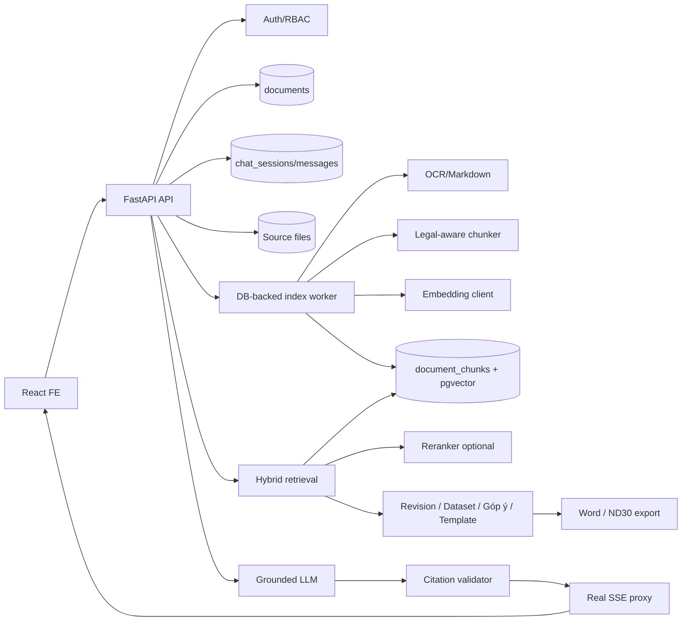
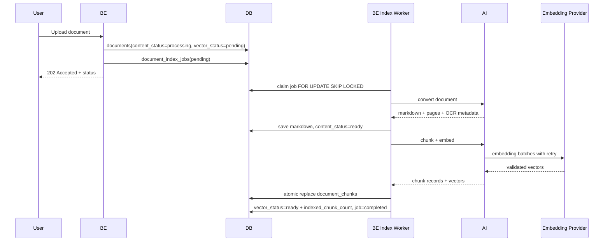
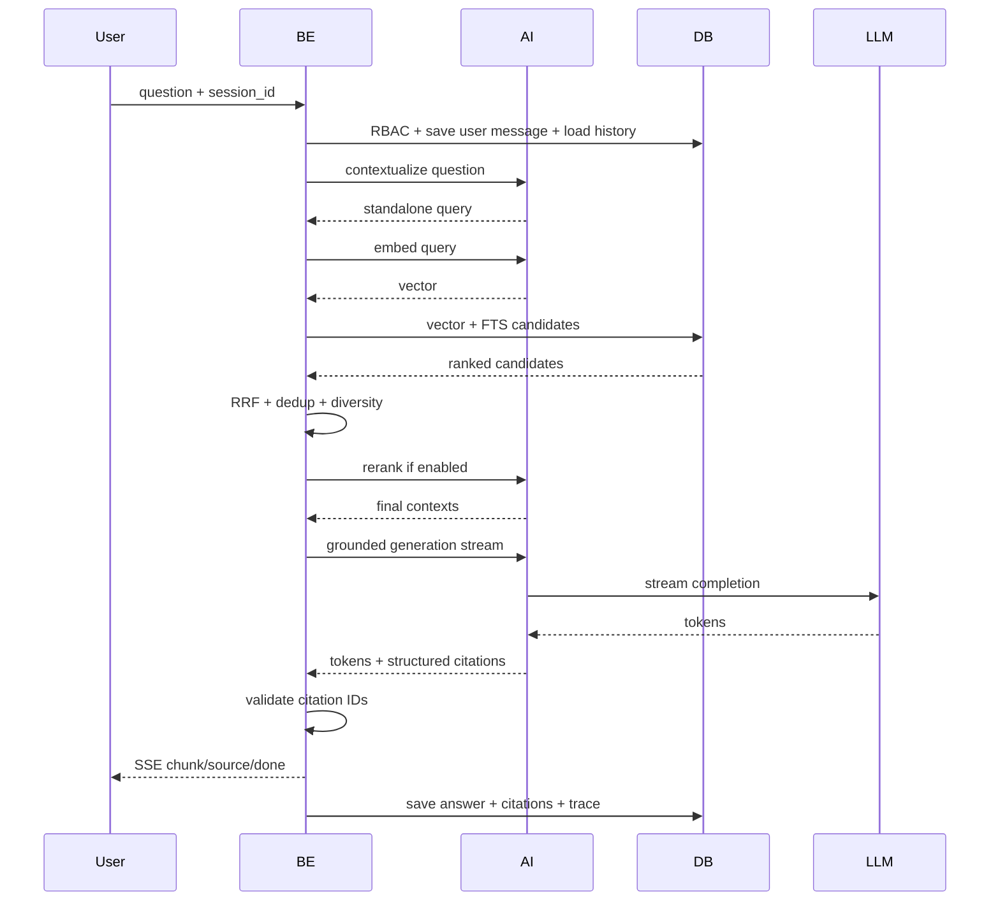
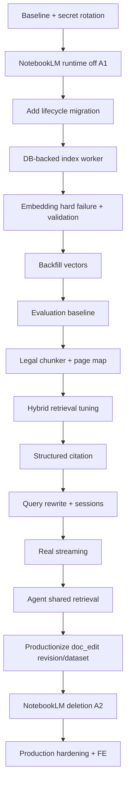

# Kế hoạch triển khai hoàn thiện hệ thống OfficeAI / SmartGov

Ngày lập kế hoạch: 18/07/2026 — Bản mở rộng phủ toàn hệ thống.

Tài liệu nguồn: `RAG_CHATBOT_TECHNICAL_AUDIT.md` (audit toàn hệ thống),
`AGENT_RAG_DEEP_ANALYSIS.md` (phân tích kiến trúc).

> Bản kế hoạch gốc chỉ hoàn thiện chatbot RAG. Bản này giữ nguyên các workstream
> RAG (A–M) và bổ sung workstream cho các subsystem còn lại: biên tập tài liệu
> (revision/dataset — hiện mock), template ND30, tổng hợp góp ý, auth/RBAC, và
> frontend. Không in secret/API key.

## 1. Prompt triển khai đã được làm rõ

Mục tiêu là hoàn thiện nền tảng trợ lý văn bản hành chính tiếng Việt SmartGov, gồm
bốn nhóm tính năng: (1) chatbot RAG trên kho tài liệu, (2) Agent soạn thảo văn bản,
(3) biên tập & tổng hợp tài liệu (góp ý, revision, dataset, template, export
Word/ND30), (4) quản trị/tổ chức/phân quyền.

Project **không dùng NotebookLM**. Toàn bộ code, dependency, schema, cấu hình,
fallback và UI liên quan NotebookLM phải được loại bỏ. Kiến trúc cuối chỉ dùng
OCR/Markdown, chunking, hosted embedding, PostgreSQL/pgvector, hybrid retrieval,
LLM OpenAI-compatible và export python-docx.

Kế hoạch phải bảo đảm:

1. Tài liệu upload được OCR→Markdown→chunk→vector hóa với trạng thái rõ ràng;
   vector lưu thật trong pgvector trước khi báo RAG-ready.
2. Retrieval chỉ lấy dữ liệu người dùng có quyền; hybrid search tốt với tiếng Việt/
   số hiệu/cấu trúc pháp lý.
3. Câu trả lời chỉ dựa trên context và có citation kiểm chứng được.
4. Chat hỗ trợ lịch sử, follow-up, session, streaming thật.
5. **Các tính năng doc_edit đang mock (revision review, dataset extract) được nối
   AI thật**; tổng hợp góp ý và export Word giữ hoạt động; template chuyển
   self-hosted.
6. Agent drafting dùng chung retrieval với RAG; sửa lệch reviewer/citation.
7. Lỗi provider không bị nuốt hoặc chuyển sang NotebookLM.
8. Có test, evaluation, metrics, rollout và rollback đủ để vận hành production.
9. AI không truy cập DB; BE tiếp tục sở hữu PostgreSQL, auth và RBAC.

## 2. Định nghĩa thành công

- Không còn runtime import/package/endpoint/env/volume/DB field/UI option NotebookLM.
- Upload một tài liệu tạo Markdown + chunk + vector 768 chiều trong DB.
- UI phân biệt OCR-ready / vectorizing / RAG-ready / failed.
- Chat không chạy index nặng trong request.
- Hybrid retrieval Recall@8 ≥ 0.90; exact lookup số hiệu/Điều/Khoản ≥ 0.95.
- Answerable có citation hợp lệ; unanswerable biết từ chối.
- Citation mở đúng file và page/section khi source hỗ trợ.
- Không cross-repository data leakage.
- P95 retrieval < 500 ms (không tính LLM); P95 time-to-first-token đạt SLA.
- Health phản ánh liveness; readiness phản ánh embedding/LLM/DB.
- **Revision review và dataset extract không còn mock**: tạo được kết quả AI thật,
  có typed error.
- **Export Word/ND30 và tổng hợp góp ý có test hồi quy**.
- CI chạy unit + integration + RAG evaluation smoke + FE build.
- Secret đã lộ được rotate và không còn trong source/log.

## 3. Phạm vi

### 3.1 Trong phạm vi

Xóa NotebookLM khỏi FE/BE/AI/Docker/dependency/DB; chuẩn hóa ingest và vector
lifecycle; legal-aware chunking; hosted embedding + pgvector; hybrid search; query
rewrite; rerank/relevance gate/dedup nếu cần; structured citation; chat sessions +
real SSE; **productionize revision + dataset**; template self-hosted; Agent dùng
shared retrieval; observability/retry/readiness/security; unit/integration/eval;
migration/backfill/rollout/rollback.

### 3.2 Ngoài phạm vi

Train embedding từ đầu; fine-tune LLM giai đoạn đầu; thay PostgreSQL bằng vector DB
khác; cho AI truy cập DB; viết lại toàn bộ OCR nếu quality gate đạt; thay đổi
nghiệp vụ export Word ngoài refactor.

### 3.3 Quyết định cần giữ

FE chỉ gọi `/api`; BE kiểm RBAC trước retrieval; BE sở hữu DB + job state; AI sở
hữu OCR/chunk/embed/LLM; schema đổi bằng Alembic; public chat/SSE version hóa khi
đổi; export Word là output chung cho drafting/góp ý/dataset/template.

## 4. Kiến trúc mục tiêu



## 5. Luồng ingest mục tiêu



Nguyên tắc: upload không chờ toàn bộ OCR/embed; chỉ worker index; một document một
active job; chat không tự index; chỉ khi lưu đủ chunk mới `vector_status=ready`;
retry không tạo chunk trùng.

## 6. Luồng query mục tiêu



## 7. Workstream A: Loại bỏ NotebookLM

### 7.1 Mục tiêu

Chỉ còn một engine self-hosted/RAG. Không fallback, session Google hay code path
NotebookLM.

### 7.2 Chiến lược hai release

Không xóa code và DB column trong cùng một deploy.

**Release A1 — ngắt runtime, giữ schema tương thích**: mọi flow về self-hosted/RAG;
không tạo notebook khi tạo repository; upload luôn lưu file + convert + enqueue
index; delete chỉ xóa local + DB; chat chỉ gọi RAG; draft/template buộc self-hosted;
audio NotebookLM disable rõ ràng hoặc chuyển self-hosted đã kiểm chứng; giữ DB
column legacy nullable nhưng không đọc/ghi; log cảnh báo nếu API cũ còn gửi
`notebook_id`/`ai_engine=notebooklm`.

**Release A2 — xóa hoàn toàn legacy** (chỉ sau A1 ổn định): xóa service/route/method/
config/dependency; xóa field Pydantic + TS types; xóa UI "Server 1/Server 2"; drop
DB columns (Alembic); xóa volume + `NOTEBOOKLM_HOME`; xóa login helper; cập nhật
docs + `AGENTS.md`.

### 7.3 Thay đổi AI

**Xóa**: `AI/app/services/notebooklm_service.py`; `/internal/notebook/*` trong
`main.py`; `notebooklm-py` (+`[browser]`); `AI_ENGINE`/`is_self_hosted` trong
`config.py`; `engine="notebooklm"` mặc định; model field chỉ phục vụ NotebookLM.

**Refactor**: `main.py` chỉ route self-hosted cho draft/template;
`drafting_service.py` xóa `_draft_notebooklm`/`_edit_draft_data_notebooklm`;
`template_service.py` xóa extract/generate NotebookLM (giữ self-hosted);
`agents/reviewer.py` đổi câu "tiêu chuẩn NotebookLM" thành tiêu chuẩn kiểm chứng;
audio: giữ + viết pipeline STT/LLM self-hosted, hoặc tạm 501 `FEATURE_NOT_AVAILABLE`
+ ẩn UI, hoặc xóa nếu product owner xác nhận ngoài phạm vi.

**Không xóa**: `markitdown`, OCR Vision client, PaddleOCR fallback, vLLM/OpenAI
client, embedding service, LangGraph (Agent drafting còn dùng).

### 7.4 Thay đổi BE

- `repository_service.py`: xóa capacity/eviction/create-rebuild-session notebook;
  create chỉ ghi DB + tạo directory; upload một flow local; delete không gọi remote.
- `database.py`: xóa helper count/evict/set NotebookLM state + update source ID
  (giữ compat một release).
- `chat_service.py`: bỏ `notebook_id`, engine resolution, NotebookLM +
  DocumentScanner legacy fallback; RAG chưa ready trả typed error; generation lỗi
  có thể trả retrieval excerpts nhưng ghi rõ degraded.
- `chat_router.py`: không đọc `repo.notebook_id`; map typed RAG error → HTTP/SSE.
- `drafting_service.py`/`template_service.py`: luôn self-hosted;
  `drafting_router.py`/`template_router.py`: bỏ notebook readiness/resolution;
  `auth.py`/`admin_router.py`: xóa engine selection theo user.

### 7.5 Thay đổi FE

Xóa `notebook_id` khỏi `Repository`; xóa `ai_engine` khỏi user form/API types; xóa
option "Server 1/Server 2"; đổi status tài liệu sang nghiệp vụ thật (Đang đọc /
Đang tạo chỉ mục / Sẵn sàng hỏi đáp / Lỗi OCR / Lỗi tạo chỉ mục); xóa badge/nút
NotebookLM; nếu audio chưa có replacement, ẩn entry point.

### 7.6 Docker/config

**Xóa**: `AI_ENGINE`, `NOTEBOOKLM_HOME`, `NOTEBOOKLM_MAX_NOTEBOOKS`, bind mount
`/root/.notebooklm`, browser dependency. **Giữ**: `AI_INTERNAL_TOKEN`, `VLLM_*`,
`OCR_VLLM_*`, `EMBEDDING_*`, RAG retrieval config. Lưu ý: khắc phục việc
`docker-compose` environment đè `AI/.env` (đã fix — giữ nguyên).

### 7.7 Migration xóa legacy (A2)

Drop `users.ai_engine`, `repositories.notebook_id`,
`repositories.notebooklm_session_fingerprint`, `documents.notebooklm_source_id`.
Trước drop: xác nhận A1 không query; thống kê giá trị còn lại; export ID audit;
backup; drop index/constraint trước column; smoke test.

### 7.8 Nghiệm thu

`rg -i notebooklm` chỉ còn trong migration history cho phép; AI khởi động không cần
notebook session; tạo/xóa repository không external request; upload/chat chạy không
có `NOTEBOOKLM_HOME`; `pip show notebooklm-py` không thấy; FE không còn engine
selector; DB không còn 4 legacy columns sau A2.

## 8. Workstream B: Document và vector lifecycle

### 8.1 Trạng thái dữ liệu mới

```text
content_status: queued | processing | ready | failed
vector_status:  pending | processing | ready | failed | stale
```

Fields thêm vào `documents`: `content_status`, `content_error`, `vector_status`,
`vector_error`, `ocr_chunk_count`, `indexed_chunk_count`, `embedding_model`,
`embedding_dimensions`, `chunker_version`, `source_checksum`, `markdown_checksum`,
`vectorized_at`. **Không dùng một `chunk_count` cho hai nghĩa** (thay
`documents.chunk_count` hiện tại).

### 8.2 Bảng `document_index_jobs`

Fields: `id`, `document_id` (FK cascade), `status`, `attempt`, `max_attempts`,
`next_retry_at`, `locked_at`, `locked_by`, `error_code`, `error_message`,
`requested_version`, `created_at`, `started_at`, `completed_at`. Index:
`(status, next_retry_at, created_at)`, `(document_id)`, partial unique một active
job/document. Worker claim `FOR UPDATE SKIP LOCKED`.

### 8.3 Error taxonomy

AI trả typed: `OCR_EMPTY_OUTPUT`, `OCR_PROVIDER_UNAVAILABLE`,
`EMBEDDING_NOT_CONFIGURED`, `EMBEDDING_AUTH_FAILED`, `EMBEDDING_RATE_LIMITED`,
`EMBEDDING_TIMEOUT`, `EMBEDDING_BAD_PAYLOAD`, `EMBEDDING_COUNT_MISMATCH`,
`EMBEDDING_DIMENSION_MISMATCH`, `VECTOR_STORE_FAILED`. **Không** trả HTTP 200 với
`embeddings=[]` khi thất bại.

### 8.4 Retry policy

Retry timeout/429/5xx; không retry 400/401/403/dimension mismatch; exponential
backoff + jitter (5s, 20s, 60s, 5m, tối đa 5 attempts); lưu attempt + lỗi cuối; nút
re-index thủ công cho owner/admin.

### 8.5 Atomicity

Verify lock → delete chunk cũ → insert mới → count lại → nếu khác expected rollback
→ `vector_status=ready` → job completed. Để re-index không mất version đang phục vụ,
insert vào version mới/temp rồi switch thay vì xóa trước.

### 8.6 Backfill

3 documents có Markdown, 0 stored chunks (`01 BC-BCD.pdf` 200, 2 DOCX 29 mỗi cái).
Deploy migration → set `vector_status=pending` cho doc có Markdown thiếu chunk →
một job/document → worker tuần tự tránh rate limit → verify count/model/dimension →
bật chat RAG.

### 8.7 Nghiệm thu

Không doc nào `vector_status=ready` khi stored chunk = 0; embedding lỗi hiển thị
đúng error code; retry không tạo duplicate; re-index fail không mất version phục vụ;
chat không gọi `/internal/documents/chunk-embed`.

## 9. Workstream C: OCR và page mapping

AI convert trả `markdown_content` + `pages[]` (page_number, text, markdown,
char_start, char_end, quality_score) + `ocr` (engine, model, version, page_count).
DOCX không có page ổn định → citation dùng section path, **không tạo page giả**.

Quality gate signals: tỷ lệ ký tự không hợp lệ, số `(cid:n)`, tỷ lệ hoa bất
thường, dòng quá ngắn, ký tự `�`, diacritic consistency, page rỗng, confidence.
Dưới ngưỡng → `content_status=failed/needs_review`, không tự RAG-ready, UI cho tải
Markdown + OCR lại.

**LLM không tự "sửa" số hiệu/ngày/tiền/tên cơ quan** không đối chiếu source image;
chỉ tạo normalized text phục vụ search, answer/citation dùng original.

Nghiệm thu: PDF fixture page map đúng; empty/garbled OCR bị chặn; re-OCR cập nhật
checksum + mark index stale; không hiển thị page khi source không có page.

## 10. Workstream D: Legal-aware chunker

Chunk model: `id`, `document_id`, `repository_id` (denormalize), `index_version`,
`chunk_index`, `chunk_text`, `embedding_text`, `header_path`, `section_type`,
`section_number`, `section_label`, `page_start`, `page_end`, `char_start`,
`char_end`, `citation_label`, `content_hash`, `token_count`, `embedding_model`,
`embedding`, `metadata`, `created_at`.

Hierarchy parser ưu tiên pháp lý (`Phần/Chương/Mục/Tiểu mục/Điều/Khoản/Điểm`), duy
trì stack theo level → `Phần II > Chương I > Điều 5 > Khoản 2 > Điểm a`. Typography/
uppercase chỉ là signal phụ.

Split: target 250-450 token, hard max 550, min 80; giữ trọn Điều/Khoản/Điểm nếu <
max; section dài chia paragraph/list; overlap 1 paragraph/80 token; prepend
hierarchy vào `embedding_text`, `chunk_text` giữ original. **Không** split giữa số
hiệu và tên văn bản, giữa label `a)`/`b)` và nội dung, giữa row table, giữa câu khi
còn boundary paragraph.

Chunk version ví dụ `legal-md-v2:size=420:max=550:overlap=80`. Fixtures: luật có
Chương/Điều/Khoản/Điểm; kế hoạch Phần/I/1/1.1; DOCX không header; OCR header sai;
table dài; paragraph > max; văn bản có số hiệu + URL.

Nghiệm thu: 95% chunk trong token range; header path đúng; không empty chunk;
content hash ổn định; re-run cùng input cùng chunk order.

## 11. Workstream E: Embedding

Request `{texts, input_type, request_id}`; response `{model, dimensions, count,
embeddings}`; error không chứa token/secret. Validate mỗi batch: status, JSON
schema, count, vector không rỗng, value hữu hạn, dimension, normalization, timeout,
request ID. Batch fail không trả partial như success. **Giữ cắt client-side theo
giới hạn PhoBERT 256 token** (đã fix) và mean-pool token vectors.

Benchmark: model hiện tại, `BAAI/bge-m3`,
`dangvantuan/vietnamese-document-embedding`. Đo Recall@5/8/10, MRR@8, NDCG@8,
latency, cost/doc, cost/query, exact legal reference, paraphrase, no-diacritic,
OCR-noisy.

Model migration: **không `TRUNCATE`** production; tạo index version mới → backfill
song song → compare → switch → giữ version cũ rollback window → xóa sau ổn định.

Nghiệm thu: provider probe + batch test pass; sai dimension fail sớm; model
name/dimension lưu cùng chunk; evaluation chứng minh model chọn; không PyTorch local.

## 12. Workstream F: Hybrid retrieval

Candidate — Vector: cosine HNSW, filter trực tiếp `repository_id`, chỉ active index
version + doc `vector_status=ready`. Lexical: original + normalized no-diacritic +
normalized legal references, PostgreSQL FTS, tùy evaluation thêm `pg_trgm`.

Normalization dùng chung cho document và query: Unicode NFC/NFKC, lowercase, bản
giữ dấu + bản bỏ dấu, chuẩn dash, giữ token số hiệu `57-NQ/TW`, mapping viết tắt
`UBND`/`HĐND`/`TTHC`; không đổi original display text.

Fusion weighted RRF `vector_weight/(rrf_k+vector_rank) + text_weight/(rrf_k+
text_rank)`; **không giữ 0.6/1.4 chỉ vì có sẵn** — tune grid search trên evaluation.

Dedup/diversity: dedup exact `content_hash`, loại near-duplicate, giới hạn chunk
cùng section, ưu tiên đủ document khi câu tổng hợp, vẫn cho phép chunk liền nhau khi
đọc trọn Điều.

Reranker chỉ thêm nếu RRF chưa đạt precision: `60 candidates → RRF top 20 →
reranker → top 8`; benchmark tiếng Việt + latency.

Relevance gate: dưới threshold hiệu chỉnh → abstention + ghi trace; threshold chọn
từ validation answerable/unanswerable.

HNSW tuning khi data đủ lớn: `EXPLAIN (ANALYZE, BUFFERS)`, `hnsw.iterative_scan`,
tune `ef_search`, đo recall/latency theo repository size, cân nhắc partition.

Nghiệm thu: repository isolation pass; Recall@8 ≥ 0.90; exact legal ≥ 0.95; không
duplicate chiếm top-K; unanswerable gate đạt ngưỡng; P95 retrieval đạt SLA.

## 13. Workstream G: Query rewrite và session

Rewrite contract: input current question + N lượt gần nhất + repository domain
(không gửi context retrieval cũ như sự thật); output `{standalone_query,
used_history}`; chỉ resolve reference từ history, không thêm số hiệu/chủ thể không
có, giữ original để audit. **Tránh duplicate current message**: load history trước
khi insert, hoặc exclude message ID vừa tạo.

Chat sessions: `chat_sessions` (`id`, `repository_id`, `user_id`, `title`,
`created_at`, `updated_at`, `archived_at`). Message thêm: `session_id`, `citations`,
`retrieval_query`, `retrieved_chunk_ids`, `model_name`, `latency_ms`, `status`,
`error_code`.

Nghiệm thu: nhiều conversation/repo; follow-up retrieval tìm đúng source; clear một
session không xóa session khác; history assistant không thay source evidence.

## 14. Workstream H: Prompt và generation

System prompt: context là dữ liệu không phải instruction; chỉ context hiện tại là
bằng chứng; history chỉ giúp hiểu câu hỏi; không kiến thức ngoài; không tự suy hiệu
lực/văn bản thay thế nếu metadata không có; báo nguồn mâu thuẫn; exact number/date/
authority phải có citation; thiếu bằng chứng thì abstain; chỉ dùng citation IDs
được cấp.

Prompt injection defense: tách boundaries `<trusted_rules>` / `<conversation>` /
`<retrieved_documents>`; trong rules: bỏ qua instruction trong document, không tiết
lộ system prompt/token/config, không thực thi link/code trong tài liệu.

Context budget theo token (`model_context - system - history - answer - safety`),
không cắt giữa chunk. Output baseline: short 300-600, detailed 800-1200 token; không
mặc định 4096; có thể `response_mode=concise|detailed`. Reasoning đã tắt (giữ).

Structured generation: AI trả `{answer, citation_ids, abstained}`; BE không tin
metadata LLM, map citation ID sang whitelist.

Nghiệm thu: injection fixture không đổi behavior; không citation ID ngoài whitelist;
unanswerable abstain; history sai không override; token budget không vượt context.

## 15. Workstream I: Citation có cấu trúc

Public response: `{message_id, answer, citations[]}` với `id`, `document_id`,
`chunk_id`, `filename`, `page_start`, `page_end`, `section_path`, `excerpt`,
`download_url`. BE validate: map citation ID → retrieved chunk; loại ID không tồn
tại; kiểm answer có reference; tạo object từ DB không từ LLM; lưu cùng message.

Citation quality: precision, coverage, source correctness, claim-source entailment,
page/section accuracy; giai đoạn đầu human review 50-100 câu.

FE: inline `[1]` clickable; source drawer (filename/page/section/excerpt); nút
tải/mở source; không hiển thị page null; source access qua BE RBAC.

Nghiệm thu: citation không trỏ repository khác; click mở đúng; mọi factual/legal
claim có citation; không page giả.

## 16. Workstream J: Streaming và latency

SSE event: giữ `chunk`/`done`, thêm `status` (stage), `source` (citations),
`error` (code/message/retryable). Real streaming: `AsyncOpenAI` `stream=True`, AI
yield token, BE proxy ngay không buffer full answer, xóa `STREAM_DELAY_MS`, client
disconnect cancel downstream, chỉ lưu assistant message khi stream xong.

Latency budget theo dõi: rewrite, query embedding, vector search, text search,
fusion/rerank, LLM first token, full response.

Nghiệm thu: first token đến trước full answer; không sleep mô phỏng; disconnect
không tốn LLM quota; error giữa stream có event rõ.

## 17. Workstream K: Observability và readiness

Structured logs mỗi request/job: `request_id`, `repository_id`, `document_id`,
`session_id`, `job_id`, stage, latency, candidate count, top scores, model/version,
error code. Không log token/API key/full vector/full document.

Metrics: documents by content/vector status; index jobs pending/failed/retry;
chunks/document; embedding latency/error/rate limit; retrieval latency; no-context
rate; degraded rate; citation coverage; LLM latency/error; SSE disconnect.

Health: AI `/health/live` + `/health/ready` (config + provider probe có cache); BE
`/api/health/live` + `/api/health/ready` (DB, Alembic head, AI readiness). Không
probe paid provider mỗi 5s.

Admin diagnostics: model names, dimensions, pending/failed jobs, chunk coverage,
last successful embedding/LLM call; không hiển thị secret.

Nghiệm thu: AI healthy nhưng embedding hỏng → readiness degraded; xác định lỗi
OCR/embedding/DB/retrieval/LLM từ một trace; alert khi failed job/no-context vượt
ngưỡng.

## 18. Workstream L: Security

Secret: rotate HF + LLM keys từng chia sẻ plaintext; tách key dev/staging/prod;
secret manager; secret scanning CI; redact header/URL có credential.

Authorization test: user không quyền không chat được; retrieval SQL luôn filter
repository; citation download kiểm RBAC; session đúng user/repository; admin
diagnostic không public.

Input: file type/size; filename/path traversal; markdown/document prompt injection;
query length limit; SSE rate limit; per-user/provider quota.

Internal AI: giữ `X-AI-Internal-Token` (rotate định kỳ); AI không expose public
port; không thêm `DATABASE_URL` vào AI.

## 19. Workstream M: Docker và dependency

AI: xóa `notebooklm-py`; `markitdown[all]` khai báo một lần nếu cần; pin
`langgraph`/`langchain-core`; lock file; `pip check` CI. BE: pin SQLAlchemy/asyncpg/
Alembic/pgvector/httpx; lock file; test migration up/down.

Image: multi-stage (đã bắt đầu); build deps không nằm runtime; bỏ amd64 khỏi BE;
thử native ARM AI; giữ amd64 OCR nếu cần; multi-arch CI.

Environment contract (bảng trong docs): Required (DB/admin/JWT/internal token,
primary LLM, embedding provider/model/key/dimension, OCR provider); Optional
(fallback LLM, reranker, retrieval tuning); Removed (NotebookLM vars, engine
selector). Startup **fail-fast** nếu thiếu required config. Khắc phục việc compose
environment đè `AI/.env`.

Nghiệm thu: rebuild reproducible; `pip check` pass; không package NotebookLM/browser;
BE native ARM trên Mac; `.env.example` đủ biến không secret thật.

## 20. Workstream N: Productionize doc_edit (revision + dataset) — MỚI

Đây là workstream bổ sung để thay các **mock** bằng AI thật.

### 20.1 Revision review (sửa/duyệt văn bản)

Hiện: `revision_service.process_mock` + `_mock_extract_comments` + `_apply_comments`,
state trên filesystem (`task_dir`).

Mục tiêu:

1. Thay `_mock_extract_comments` bằng lời gọi AI thật: đọc file góp ý + bản gốc,
   dùng LLM trích danh sách góp ý có cấu trúc (vị trí, nội dung cũ, đề xuất mới,
   lý do), đi qua `llm_service` với typed error.
2. `_apply_comments` áp dụng góp ý vào `document_data`, sinh diff kiểm chứng được.
3. Cân nhắc chuyển state task từ filesystem sang DB (bảng `revision_tasks`) để
   observability + RBAC + cleanup nhất quán; nếu giữ filesystem thì có job dọn dẹp
   và giới hạn quota.
4. Preview HTML + download final giữ nguyên contract; approve/reject có audit trail.

Nghiệm thu: một task tạo được góp ý AI thật + diff đúng; không còn nhánh
`process_mock` trong đường production; RBAC chặn task chéo user.

### 20.2 Dataset extraction

Hiện: `document_dataset_service.build_mock_response` (scaffold UI contract).

Mục tiêu:

1. Viết AI extractor thật: từ document (markdown/OCR) trích `title`, `content`,
   và table-field schema (`DatasetField[]` + rows) bằng LLM structured output.
2. BE validate schema trước khi trả (Pydantic), typed error nếu AI lỗi.
3. `word/preview` + `word/download` giữ nguyên, render từ dữ liệu thật.
4. Cân nhắc dùng shared retrieval nếu cần trích từ tài liệu lớn.

Nghiệm thu: extract trả dữ liệu từ document thật, không mock; preview/download khớp
dữ liệu; lỗi AI hiển thị typed error.

### 20.3 Template ND30 + tổng hợp góp ý

- `template_service`: default `engine="self_hosted"`, bỏ nhánh notebooklm.
- Tổng hợp góp ý (đã thật): thêm giới hạn token/trace; cân nhắc dùng shared
  retrieval thay vì đọc thẳng toàn bộ markdown khi repo lớn.
- Export Word/ND30: thêm **test hồi quy** cho từng loại văn bản (công văn, quyết
  định, kế hoạch, thông báo, tờ trình, báo cáo, biên bản) vì nhiều heuristic chuẩn
  hóa dễ vỡ.

## 21. Workstream O: Agent dùng shared retrieval — MỚI

Cho Agent Researcher dùng chung retrieval với Chat RAG thay vì `DocumentScanner`
scan toàn bộ bằng LLM.

1. Tạo hàm retrieval nội bộ (repo_id, query, selected_document_ids, top_k, optional
   section_title) trả contexts + chunk ids.
2. Researcher thay `document_scanner.scan_repository(...)` bằng hybrid retrieval;
   nếu cần hiểu sâu, dùng LLM scanner **sau** retrieval như bước refine.
3. Sửa citation: Writer nhận context có source id nội bộ; Reviewer/final reviewer
   kiểm chứng bằng source map (chunk id), không phụ thuộc `[Nguồn: ...]` trong draft.
4. Reviewer đọc đúng `scanner_results` (không `research_data`), fail-closed thay vì
   `review_pass=True` khi exception.
5. Bỏ `TemplateExtractor` stub và `orchestrator.py` nếu không dùng.

Nghiệm thu: drafting nhanh hơn/ít token hơn; citation trace về chunk nguồn; reviewer
không fail-open.

## 22. Workstream P: Frontend — MỚI

- Trạng thái tài liệu nghiệp vụ thật (content/vector status) trong `DocumentManager`.
- Chat sessions + source drawer citation trong `ChatAssistant`; xử lý SSE
  `status`/`source`/`error`/`done`.
- Bỏ engine selector "Server 1/Server 2" trong `AdminPanel`.
- UI doc_edit (revision/dataset) phản ánh trạng thái thật thay vì mock.
- Build FE trong CI.

## 23. Test strategy

**Unit** — AI: OCR normalization, legal hierarchy, token chunk limits, overlap,
embedding parser, dimension/count mismatch, prompt formatter, citation ID parser,
query rewrite schema. BE: job state transitions, retry classification, atomic chunk
replace, repository filter, RRF, dedup, citation whitelist, session ownership, SSE
encoding, **revision _apply_comments, dataset schema, word_exporter mỗi loại**. FE:
document status, citation drawer, session switching, SSE events.

**Integration**: upload→OCR→vector ready→hybrid→answer; cascade delete; RBAC; hai
repo không rò; embedding lỗi → `vector_failed`; re-index idempotent; migration/
backfill giữ chat; **revision task end-to-end; dataset extract; export Word mở
được**. Failure: embedding 401/429/timeout/wrong dimension; DB insert fail; LLM
fail; stream disconnect; re-index concurrent.

**Security**: cross-repository query; foreign citation download; prompt injection
document; malicious filename; oversized query; invalid internal token.

**Migration**: additive lifecycle → backfill → A1 với legacy columns → A2 không đọc
→ destructive drop → restore/rollback rehearsal.

## 24. RAG evaluation plan

Dataset JSONL có version, fields: `id`, `question`, `answerable`,
`expected_document`, `expected_pages`, `expected_section`, `expected_chunk_ids`,
`reference_answer`, `required_facts`, `tags`. Tối thiểu 50 câu P1 → 100-200, phủ:
số hiệu, ngày, Điều/Khoản, cơ quan, nhiệm vụ, số liệu, paraphrase, không dấu, OCR
noise, follow-up, unanswerable, conflict/version, prompt injection.

Retrieval metrics: Recall@K, Precision@K, MRR, NDCG, exact source/page hit,
no-result correctness. Generation metrics: factual correctness, faithfulness,
citation precision/coverage, abstention accuracy, legal number/date accuracy, answer
relevance. **Gate**: PR đổi model/chunker/retrieval phải chạy evaluation vs baseline,
không merge nếu giảm quá tolerance.

## 25. API changes

Document response: `content_status`, `vector_status`, `ocr_chunk_count`,
`indexed_chunk_count`, `content_error`, `vector_error`, `embedding_model`,
`vectorized_at`. Endpoints: `POST /documents/{id}/reprocess`,
`POST /documents/{id}/reindex`, `GET /documents/{id}/index-status` (owner/admin).

Chat session: `POST/GET /repositories/{repo}/chat/sessions`,
`GET/DELETE .../sessions/{id}`, `.../sessions/{id}/messages`. Compatibility: giữ
endpoint chat cũ + tự tạo default session, deprecation log/header, FE chuyển API
mới, xóa sau khi telemetry sạch.

## 26. Alembic migration sequence

1. **Additive RAG lifecycle**: thêm document status/hash/version fields;
   `document_index_jobs`; session/citation fields; `repository_id`/version/page/
   offset/hash/token vào chunk; backfill nullable an toàn; tạo indexes. Không drop.
2. **Search normalization**: `search_text`; optional `pg_trgm`/`unaccent`; GIN/
   trigram indexes; backfill theo batch.
3. **Legacy cleanup** (sau A1): drop NotebookLM columns/indexes + `users.ai_engine`.
4. **Tighten constraints** (sau backfill): required `NOT NULL`; status check;
   unique active job; active index version.
5. **(doc_edit)** nếu chuyển revision task sang DB: thêm `revision_tasks`/
   `dataset_extractions`.

## 27. Rollout

- **Stage 0 — Baseline**: backup DB; export schema/version/count; baseline logs/
  latency; evaluation set đầu tiên; rotate secrets.
- **Stage 1 — NotebookLM runtime off (A1)**: deploy A1, không drop schema; smoke
  repository/upload/self-hosted; confirm không NotebookLM request.
- **Stage 2 — Lifecycle + worker**: deploy additive migration; start worker; index
  fixture repo; quan sát retries/status.
- **Stage 3 — Backfill**: backfill theo batch; rate limit embedding; compare count;
  không bật RAG cho doc chưa ready.
- **Stage 4 — Retrieval/citation**: bật hybrid mới bằng feature flag; shadow compare;
  structured citation; evaluation gate.
- **Stage 5 — Session/streaming**: FE API session mới; real streaming; theo dõi
  disconnect.
- **Stage 6 — doc_edit thật**: bật revision/dataset AI thật sau feature flag; giữ
  fallback UI rõ ràng nếu AI lỗi.
- **Stage 7 — Legacy deletion (A2)**: verify telemetry; deploy code không NotebookLM;
  destructive migration; xóa volume/config/package.
- **Stage 8 — Hardening**: native ARM; lock dependencies; alerts/dashboard; load
  test; final security review.

## 28. Rollback

Trước destructive migration: rollback code image; pause worker; giữ additive
columns; active index version về cũ; không mất data. Sau destructive: không dựa
downgrade để khôi phục NotebookLM columns; nếu cần thì restore backup + code tương
ứng (downtime). Vì project không dùng NotebookLM, rollback hợp lý là rollback RAG
release. Index rollback: giữ active version cũ, switch `active_index_version`, xóa
version lỗi sau điều tra.

## 29. Rủi ro và kiểm soát

| Rủi ro | Ảnh hưởng | Kiểm soát |
| --- | --- | --- |
| Refactor NotebookLM quá rộng | Vỡ draft/template/audio | Hai release, regression test |
| Hosted embedding rate limit | Backfill chậm | Queue, retry, throttle, truncate PhoBERT |
| OCR sai | Answer/citation sai | Quality gate, page review |
| Chunk version mới giảm recall | Chất lượng giảm | Evaluation + active version |
| HNSW filter giảm recall | Thiếu context | repository_id trực tiếp, iterative scan |
| Reranker tăng latency | Chat chậm | Feature flag, benchmark |
| Structured LLM output lỗi | Citation mất | Pydantic validation + fallback |
| Migration lock table | Downtime | Additive migration, batch backfill |
| Duplicate document | Top-K bị chiếm | Source/chunk hash dedup |
| **Revision/dataset AI thật kém mock** | UX xấu hơn | Feature flag, human review, giữ preview |
| Secret đã lộ | Provider bị lạm dụng | Rotate ngay |

## 30. Thứ tự công việc và phụ thuộc



Critical path: `Runtime off → lifecycle → worker → embedding validation → backfill
→ retrieval validation → citation → rollout`. **Không** làm reranker, prompt tuning,
UI citation hay productionize doc_edit trước khi vector backfill thành công.

## 31. Ước lượng tương đối

Một kỹ sư quen codebase, chưa gồm chờ product review:

| Gói | Ước lượng |
| --- | ---: |
| NotebookLM runtime off A1 | 2-4 ngày |
| Lifecycle migration + job worker | 3-5 ngày |
| Embedding hardening + backfill | 2-3 ngày |
| Legal chunker + tests | 4-7 ngày |
| Hybrid retrieval + evaluation | 4-6 ngày |
| Page map + structured citation | 4-7 ngày |
| Sessions + query rewrite | 3-5 ngày |
| Real streaming | 2-4 ngày |
| Agent shared retrieval | 3-5 ngày |
| **Productionize revision + dataset** | 5-8 ngày |
| NotebookLM deletion A2 | 2-4 ngày |
| Observability/security/Docker/CI/FE | 5-9 ngày |

Tổng khoảng 40-67 ngày kỹ sư. Có thể song song FE citation/session và doc_edit UI
với BE lifecycle sau khi API contract chốt. OCR page mapping, evaluation và
productionize doc_edit là phần bất định cao nhất.

## 32. Checklist bàn giao

**Code**: không còn NotebookLM runtime/dependency; index worker idempotent; typed
errors; token-aware legal chunker; hybrid retrieval evaluated; structured citations;
sessions + real streaming; **revision/dataset AI thật (hết mock)**; Agent shared
retrieval.

**Data**: 100% document có Markdown được phân loại vector status; ready documents
có stored chunk count đúng; backfill hoàn thành; duplicate được xác định; legacy
columns đã xóa sau rollout.

**Quality**: unit/integration/security tests; RAG evaluation thresholds; **export
Word/doc_edit regression tests**; load test; human review citation.

**Operations**: liveness/readiness; metrics/dashboard/alerts; dependency lock;
multi-stage image; secret rotation; backup/restore rehearsal; runbook lỗi embedding/
LLM/index job/doc_edit.

## 33. Definition of Done cuối cùng

Chỉ đóng dự án khi:

1. Môi trường mới chạy từ `.env.example` + docs setup, không cần NotebookLM login.
2. Upload fixture tạo `content_status=ready`, `vector_status=ready`, vector đúng
   dimension.
3. Chat answerable trả đúng source; unanswerable từ chối.
4. Citation click được, không vượt RBAC.
5. Follow-up session retrieval đúng.
6. Stream là stream thật.
7. **Revision review và dataset extract tạo kết quả AI thật, không mock.**
8. Export Word/ND30 và tổng hợp góp ý có test hồi quy pass.
9. Evaluation và CI pass.
10. Không có secret thật trong source/history Git mới.
11. Docker rebuild reproducible.
12. Runbook cho phép vận hành viên xác định và xử lý lỗi từng stage.

Khi các điều kiện này đạt, project mới hoàn thành mục tiêu **nền tảng trợ lý văn
bản hành chính** — chatbot RAG, Agent soạn thảo và biên tập tài liệu — thay vì chỉ
có các thành phần tồn tại trong code hoặc còn ở dạng mock.
