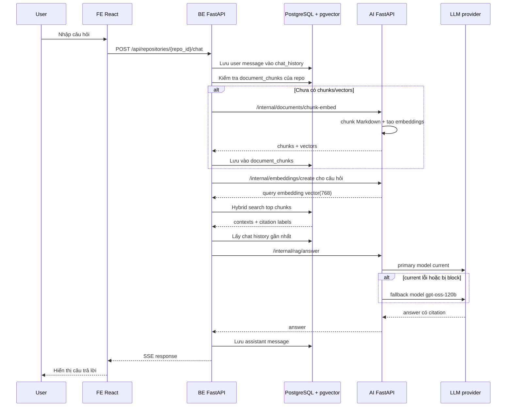

# SmartGov RAG System Overview

Tài liệu này mô tả RAG hiện tại trong repo SmartGov: đang dùng model gì, dữ liệu được lưu ở đâu, luồng xử lý như thế nào, và các tech stack chính. File này không chứa API key hoặc secret.

## 1. Kiến trúc tổng quát

```text
FE React/Nginx
  -> BE FastAPI public API
      -> PostgreSQL 16 + pgvector
      -> AI FastAPI internal service
          -> OCR/convert
          -> chunking
          -> embedding
          -> LLM answer generation
```

Sơ đồ dễ nhìn hơn:

```mermaid
flowchart TD
    User[User chat/upload trên FE] --> FE[FE React]
    FE -->|/api| BE[BE FastAPI]

    BE -->|lưu file + metadata| PG[(PostgreSQL 16)]
    PG --> DOCS[documents<br/>markdown_content]

    BE -->|internal HTTP + token| AI[AI FastAPI]
    AI --> OCR[OCR/Convert<br/>MarkItDown + OCR/VLM]
    OCR --> MD[Markdown text]
    MD --> CHUNK[Markdown chunking<br/>header + paragraph fallback]
    CHUNK --> EMB[Hosted embedding model<br/>dangvantuan/vietnamese-embedding]

    BE -->|lưu chunk_text + vector| PGVECTOR[(PostgreSQL + pgvector)]
    PGVECTOR --> DCHUNKS[document_chunks<br/>chunk_text<br/>metadata<br/>embedding vector(768)]

    FE -->|câu hỏi| BE
    BE -->|embed query| AI
    AI --> QEMB[query embedding vector(768)]
    QEMB --> BE
    BE -->|hybrid search| PGVECTOR
    PGVECTOR --> CTX[top relevant chunks + citations]
    CTX --> BE
    BE -->|question + contexts + history| AI
    AI --> LLM[LLM answer generation<br/>primary: current<br/>fallback: gpt-oss-120b]
    LLM --> ANSWER[Câu trả lời có citation]
    ANSWER --> BE
    BE -->|SSE| FE
```

Nguyên tắc trong repo:

- FE chỉ gọi BE qua `/api`.
- BE sở hữu auth, RBAC, repository, document, chat history, PostgreSQL.
- AI service không truy cập trực tiếp database.
- BE gọi AI qua HTTP nội bộ bằng `AI_SERVICE_URL` và header `X-AI-Internal-Token`.

## 2. Tech Stack

Frontend:

- React
- Nginx trong Docker
- Server-Sent Events cho chat response stream giả lập từ BE

Backend public API:

- FastAPI
- SQLAlchemy 2 async
- asyncpg
- Alembic migrations
- PostgreSQL 16
- pgvector

AI internal service:

- FastAPI
- MarkItDown/document conversion
- OCR service nội bộ
- hosted HuggingFace embedding API cho embedding
- OpenAI-compatible client cho vLLM/LLM provider

Database:

- PostgreSQL 16
- Extension `vector` từ pgvector
- Bảng chính cho RAG: `documents`, `document_chunks`, `chat_history`

## 3. Model đang dùng

### Embedding model

Hiện tại config đang dùng:

```env
EMBEDDING_BASE_URL=https://api-inference.huggingface.co/models/dangvantuan/vietnamese-embedding
EMBEDDING_MODEL_NAME=dangvantuan/vietnamese-embedding
EMBEDDING_API_KEY=
EMBEDDING_DIMENSIONS=768
EMBEDDING_BATCH_SIZE=16
EMBEDDING_CHUNK_SIZE=1200
```

Ý nghĩa:

- `dangvantuan/vietnamese-embedding`: model sentence embedding chuyên cho tiếng Việt.
- Vector dimension là `768`.
- Chạy online qua HuggingFace Inference API, không load model local trong container.
- AI image chỉ gọi hosted embedding qua `EMBEDDING_BASE_URL`; không dùng local embedding model.
- `EMBEDDING_API_KEY` nên đặt HuggingFace token để tránh rate limit/auth error.
- Embedding được normalize trước khi lưu/tìm kiếm.

### LLM answer generation

AI service dùng OpenAI-compatible chat completion:

```env
VLLM_BASE_URL=...
VLLM_MODEL_NAME=...
VLLM_API_KEY=...

VLLM_FALLBACK_BASE_URL=...
VLLM_FALLBACK_MODEL_NAME=...
VLLM_FALLBACK_API_KEY=...
```

Model trả lời hiện tại:

- Primary LLM: `VLLM_MODEL_NAME=current`
- Fallback LLM: `VLLM_FALLBACK_MODEL_NAME=gpt-oss-120b`
- OCR/Vision model: `OCR_VLLM_MODEL_NAME=Qwen2.5-VL-7B-Instruct`

Nói ngắn gọn: RAG chat gọi con LLM `current` trước để viết câu trả lời. Nếu con này lỗi hoặc bị block, hệ thống gọi tiếp fallback `gpt-oss-120b`. Còn `Qwen2.5-VL-7B-Instruct` là model OCR/vision để đọc/chuyển tài liệu, không phải model chính để trả lời RAG.

Luồng hiện tại:

1. Gọi primary LLM từ `VLLM_BASE_URL` + `VLLM_MODEL_NAME`.
2. Nếu primary lỗi, ví dụ bị `403 Forbidden`, tự động gọi fallback LLM.
3. Fallback hiện tại đang được cấu hình bằng `VLLM_FALLBACK_*`.

Prompt RAG nằm ở `AI/app/services/rag_service.py`. Prompt yêu cầu:

- Chỉ trả lời dựa trên context truy xuất.
- Không bịa thông tin.
- Nếu không đủ căn cứ thì nói rõ.
- Giữ đúng số hiệu văn bản, ngày tháng, cơ quan, điều/khoản/mục.
- Gắn citation dạng `[1]`, `[2]` trong câu.
- Trả lời bằng tiếng Việt.

## 4. OCR và Markdown

Khi upload tài liệu:

1. BE lưu file và tạo row trong `documents`.
2. BE gọi AI endpoint `/internal/documents/convert`.
3. AI chuyển/OCR tài liệu thành Markdown text.
4. BE lưu Markdown vào:

```text
documents.markdown_content
```

Markdown không phải là file `.md` riêng trên source code. Nó được lưu trong database. BE cũng có endpoint để download Markdown:

```text
GET /api/repositories/{repo_id}/documents/{doc_id}/markdown
```

## 5. Chunking

Chunking nằm ở:

```text
AI/app/services/markdown_chunking.py
```

Hiện tại chunking làm 2 việc:

1. Dọn text OCR.
2. Promote các dòng giống tiêu đề thành Markdown header.

Các kiểu heading được nhận diện:

- `Phần I`, `Phần 1` -> `#`
- Roman heading như `I. ĐỊNH HƯỚNG...` -> `##`
- Heading số như `1. Về định hướng chỉ đạo` -> `###`
- Heading nhiều cấp như `1.1.`, `2.3.1.` -> cấp header tương ứng
- Một số heading pháp lý như `Chương`, `Mục`, `Điều`, `Khoản`, `Điểm`
- Dòng in hoa trông giống tiêu đề

Sau đó splitter tạo chunk theo boundary header hợp lý:

- `#` luôn là boundary.
- `Phần`, roman heading, `Chương/Mục/Điều` là boundary.
- Heading số như `1.`, `2.`, `1.1.` cũng là boundary.
- Nếu section quá dài hơn `EMBEDDING_CHUNK_SIZE`, fallback split theo paragraph.
- Nếu paragraph vẫn quá dài, fallback split theo giới hạn ký tự.

Config hiện tại:

```env
EMBEDDING_CHUNK_SIZE=1200
```

Ví dụ với tài liệu hành chính:

```markdown
## I. ĐỊNH HƯỚNG CHỈ ĐẠO VÀ PHƯƠNG CHÂM HÀNH ĐỘNG

### 1. Về định hướng chỉ đạo
...

### 2. Về phương châm hành động
...
```

Sẽ tạo chunk quanh:

- `I. ĐỊNH HƯỚNG...`
- `1. Về định hướng chỉ đạo`
- `2. Về phương châm hành động`

Nếu một chunk dài hơn 1200 ký tự, nó sẽ bị chia nhỏ hơn theo paragraph.

## 6. Lưu chunks và vector vào pgvector

Bảng dùng cho RAG:

```text
document_chunks
```

Đúng: embedding được lưu vào pgvector.

Nói chính xác hơn: pgvector không phải database riêng. Nó là extension trong PostgreSQL. Bảng `document_chunks` nằm trong PostgreSQL, trong đó cột `embedding` có kiểu `vector(768)` do pgvector cung cấp.

Mỗi chunk được lưu như một row:

```text
document_chunks row
  -> chunk_text: đoạn text dùng cho RAG
  -> embedding: vector số của đoạn text đó
  -> metadata/citation: thông tin để dẫn nguồn
```

Schema chính:

```text
id
document_id
chunk_index
header_path
section_label
page_label
citation_label
chunk_text
embedding_model
embedding vector(768)
metadata jsonb
created_at
```

Ý nghĩa:

- `document_id`: liên kết về tài liệu gốc trong bảng `documents`.
- `chunk_index`: thứ tự chunk trong tài liệu.
- `header_path`: đường dẫn header, ví dụ `Phần 1 > I. ... > 1. ...`.
- `section_label`: section chính để hiển thị/citation.
- `citation_label`: label nguồn, thường là `filename | section_label`.
- `chunk_text`: text thật được đưa vào RAG.
- `embedding_model`: model đã tạo vector.
- `embedding`: vector dùng cho semantic search.
- `metadata`: JSONB chứa headers, char count, piece index.

Ví dụ trước khi đổi sang hosted 768:

```text
01 BC-BCD.pdf -> 200 chunks, 200 vectors
```

Sau migration `20260717_0008`, bảng `document_chunks` bị truncate để bỏ vector 384 cũ. Khi user chat lại hoặc xử lý lại tài liệu, hệ thống sẽ tạo lại chunks/vectors 768 bằng `dangvantuan/vietnamese-embedding`.

## 7. Hybrid Search

Hybrid search nằm ở:

```text
BE/app/database.py
search_document_chunks_hybrid()
```

Kết luận ngắn:

```text
Search hiện tại = pgvector semantic search + PostgreSQL full-text search.
Text search hiện tại không phải BM25.
```

Phần text search đang dùng PostgreSQL full-text search:

```sql
to_tsvector('simple', header_path || ' ' || chunk_text)
@@ plainto_tsquery('simple', query_text)
```

Điểm text search được tính bằng:

```sql
ts_rank_cd(...)
```

`ts_rank_cd` là cover-density ranking của PostgreSQL. Nó ưu tiên đoạn có từ khóa xuất hiện gần nhau và phù hợp với query hơn. Nó khác BM25. BM25 thường dùng trong Elasticsearch/OpenSearch/Lucene hoặc thư viện search riêng. Ở đây mình chưa dùng BM25 engine.

Luồng search:

1. BE gửi câu hỏi sang AI `/internal/embeddings/create`.
2. AI tạo query embedding.
3. BE search trong PostgreSQL bằng 2 nhánh:
   - Vector search qua pgvector cosine distance: `embedding <=> query_embedding`
   - Full-text search PostgreSQL: `to_tsvector('simple', header_path || chunk_text)`
4. Hai nhánh được fuse bằng weighted reciprocal rank style score:

```text
RAG_VECTOR_WEIGHT * 1 / (60 + vector_rank)
+ RAG_TEXT_WEIGHT * 1 / (60 + text_rank)
```

Config hiện tại:

```env
RAG_TOP_K=8
RAG_VECTOR_CANDIDATES=30
RAG_TEXT_CANDIDATES=30
RAG_VECTOR_WEIGHT=0.6
RAG_TEXT_WEIGHT=1.4
```

Nghĩa là:

- Lấy tối đa 30 candidate từ vector search.
- Lấy tối đa 30 candidate từ text search.
- Trộn lại và trả 8 chunk tốt nhất cho LLM.

Sơ đồ riêng cho hybrid search:

```mermaid
flowchart TD
    Q[Câu hỏi user] --> QE[AI tạo query embedding<br/>dangvantuan/vietnamese-embedding]
    Q --> TXT[Raw query text]

    QE --> VS[Vector search<br/>pgvector embedding <=> query_embedding]
    TXT --> TS[Text search<br/>Postgres to_tsvector + plainto_tsquery]

    VS --> VR[Top 30 vector candidates<br/>xếp theo vector_rank]
    TS --> TR[Top 30 text candidates<br/>xếp theo text_rank]

    VR --> FUSE[Fuse score<br/>0.6/(60+vector_rank)+1.4/(60+text_rank)]
    TR --> FUSE

    FUSE --> TOPK[Top 8 chunks]
    TOPK --> CTX[Contexts đưa vào LLM<br/>chunk_text + citation_label]
```

Ví dụ trực giác:

```text
Query: "phương châm hành động ba trọng tâm ba công khai một thước đo"
```

Vector search sẽ tìm đoạn có nghĩa gần với câu hỏi, kể cả khi từ ngữ không khớp 100%.

Text search sẽ ưu tiên đoạn có đúng các từ như:

```text
phương châm hành động
ba trọng tâm
ba công khai
một thước đo
```

Hybrid search tốt hơn chỉ vector hoặc chỉ text vì:

- Vector search tốt cho câu hỏi diễn đạt khác tài liệu.
- Text search tốt cho số hiệu, tên mục, cụm từ chính xác.
- Tài liệu luật/hành chính hay có mã văn bản, ngày tháng, mục số, nên text search rất hữu ích.

## 8. Chat RAG flow

File chính:

```text
BE/app/services/chat_service.py
```

Khi user hỏi trong UI:

1. FE gọi:

```text
POST /api/repositories/{repo_id}/chat
```

2. BE lưu câu hỏi vào `chat_history`.
3. BE gọi `_try_rag_answer()`.
4. `_try_rag_answer()` đảm bảo repo có vector chunks:
   - Nếu tài liệu có Markdown nhưng chưa có chunks, BE gọi AI `/internal/documents/chunk-embed`.
   - AI chunk + embed.
   - BE lưu vào `document_chunks`.
5. BE embed câu hỏi.
6. BE hybrid search trong `document_chunks`.
7. BE lấy chat history gần nhất.
8. BE gọi AI `/internal/rag/answer` với:
   - question
   - contexts
   - history
9. AI gọi LLM để tạo câu trả lời có citation.
10. BE lưu answer vào `chat_history`.
11. BE trả SSE stream về FE.

Fallback hiện tại:

- Nếu RAG không có chunk nào, hệ thống mới fallback sang flow cũ.
- Nếu RAG đã tìm được chunks nhưng LLM generation lỗi, BE trả về top retrieved excerpts/citations thay vì báo lỗi hệ thống.

Sơ đồ end-to-end khi chat:



Trong flow này, LLM không đi search database. LLM chỉ nhận:

```text
question + top chunks + chat history gần nhất
```

Search và permission đều do BE/DB xử lý trước.

## 9. Vì sao RAG có thể chậm?

Các lý do chính hiện tại:

1. Embedding model chạy qua hosted API.
   - Không cần load PyTorch local nữa.
   - Tốc độ phụ thuộc network, HuggingFace provider, và rate limit/token.

2. Primary LLM có thể bị block.
   - Log đã từng có `403 Forbidden`.
   - Sau đó hệ thống mới gọi fallback LLM, nên mất thêm một vòng request.

3. FE chưa stream token thật từ LLM.
   - BE đang đợi full answer xong rồi mới stream giả lập ra UI.
   - Vì vậy user sẽ thấy chờ lâu trước khi chữ đầu tiên xuất hiện.

## 10. Câu hỏi test RAG

Với file `01 BC-BCD.pdf`, có thể test:

```text
Tài liệu này nói gì về định hướng chỉ đạo?
```

```text
Phương châm hành động “Ba trọng tâm - Ba công khai - Một thước đo” gồm những gì?
```

```text
Các nhiệm vụ trọng tâm trong tài liệu là gì?
```

```text
Nghị quyết 57-NQ/TW được nhắc đến trong bối cảnh nào?
```

```text
Tài liệu yêu cầu các Sở, ngành, địa phương phải làm gì?
```

```text
Có nội dung nào liên quan đến chuyển đổi số, dữ liệu, hoặc hệ thống giám sát không?
```

```text
Tóm tắt phần “II. Nhiệm vụ trọng tâm” và dẫn nguồn từ tài liệu.
```

## 11. File code liên quan

BE:

```text
BE/app/routers/chat_router.py
BE/app/routers/document_router.py
BE/app/services/chat_service.py
BE/app/services/ai_client.py
BE/app/database.py
BE/app/db_models.py
BE/alembic/versions/20260717_0005_document_chunks_pgvector.py
BE/alembic/versions/20260717_0006_document_chunk_search_indexes.py
BE/alembic/versions/20260717_0007_embedding_dim_384.py
BE/alembic/versions/20260717_0008_embedding_dim_768.py
```

AI:

```text
AI/app/main.py
AI/app/services/document_converter.py
AI/app/services/markdown_chunking.py
AI/app/services/embedding_service.py
AI/app/services/rag_service.py
AI/app/services/llm_service.py
```

Config:

```text
.env
.env.example
BE/.env.example
AI/.env.example
docker-compose.yml
```

## 12. Cải thiện tiếp theo nên làm

Ưu tiên cao:

1. Cho phép stream thật từ LLM về FE thay vì đợi full answer.
2. Nếu primary LLM bị 403 nhiều lần, cấu hình dùng fallback làm primary.
3. Thêm timing log cho từng bước:
   - ensure vectors
   - embed query
   - hybrid search
   - LLM generation

Ưu tiên vừa:

1. Thêm reranker cho top chunks nếu câu hỏi phức tạp.
2. Thêm filter theo document_id nếu user chọn tài liệu cụ thể.
3. Thêm citation metadata tốt hơn, ví dụ page number nếu OCR/extractor lấy được trang.
4. Thêm endpoint admin để xem chunks/retrieval debug.
