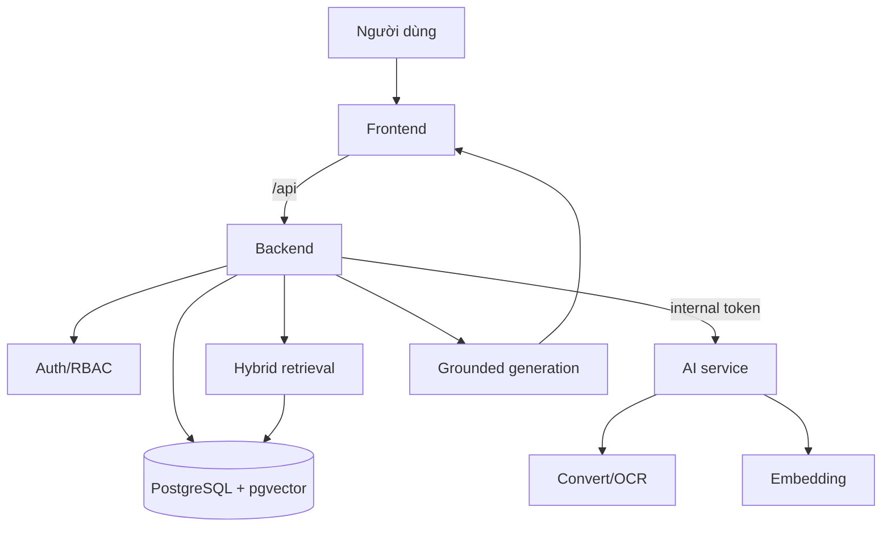

# Phân tích Agent và RAG

Tài liệu này mô tả vai trò của các thành phần AI trong hệ thống Thư ký Ơi, tập trung vào RAG, drafting agents, tổng hợp nội dung và những điểm cần kiểm soát khi đưa vào vận hành.

## 1. Mục tiêu

AI service không thay backend trong việc kiểm quyền hoặc quản lý dữ liệu. Nhiệm vụ của AI service là xử lý nội dung:

- Chuyển đổi tài liệu sang Markdown.
- Tách chunk và tạo embedding.
- Sinh câu trả lời RAG từ context đã được BE cung cấp.
- Hỗ trợ soạn thảo, chỉnh sửa, template, dataset extraction và tổng hợp góp ý.

## 2. Luồng RAG mục tiêu

Nguyên tắc:

- Retrieval chạy trong phạm vi dữ liệu người dùng có quyền.
- AI chỉ sinh câu trả lời dựa trên context đã chọn.
- Nếu context không đủ, hệ thống cần trả lời không đủ căn cứ thay vì tự suy diễn.
- Citation phải dẫn được về tài liệu/chunk nguồn.

## 3. Drafting agents

Drafting agents nên dùng chung lớp retrieval với chat RAG để tận dụng quyền truy cập, citation và logic chọn context.

Các node/chức năng cần có:

- Planner: hiểu yêu cầu và loại văn bản.
- Researcher: lấy thông tin từ kho dữ liệu qua BE.
- Writer: sinh bản nháp có cấu trúc.
- Reviewer: kiểm tra thiếu căn cứ, văn phong và ràng buộc mẫu.
- Citation checker: xác nhận nội dung quan trọng có nguồn.
- Final reviewer: chuẩn hóa đầu ra trước khi export.

## 4. Tổng hợp góp ý

Tổng hợp góp ý là nghiệp vụ có giá trị cao vì giảm nhiều thao tác thủ công.

Luồng khuyến nghị:

1. Nhận dự thảo gốc và các văn bản góp ý.
2. Convert/OCR toàn bộ tài liệu.
3. Trích xuất ý kiến theo đơn vị nguồn.
4. Gắn ý kiến với vị trí trong dự thảo nếu có thể.
5. Phân loại ý kiến.
6. Gom nhóm ý kiến tương đồng.
7. Gợi ý tiếp thu/giải trình.
8. Xuất bảng tổng hợp và văn bản liên quan.

Điểm kiểm soát bắt buộc:

- Không gộp mất ý kiến thiểu số.
- Mỗi ý kiến giữ đơn vị nguồn.
- Gợi ý tiếp thu chỉ là dự thảo, cần cán bộ duyệt.

## 5. Dataset extraction

Dataset extraction cần ưu tiên tính đúng và truy vết hơn tính sáng tạo.

Yêu cầu:

- Schema đầu ra rõ ràng.
- Trường không chắc chắn phải có confidence hoặc warning.
- Không tự điền số liệu thiếu.
- Giữ excerpt/source để người dùng kiểm tra.

## 6. Các rủi ro AI cần kiểm soát

| Rủi ro | Biện pháp |
| --- | --- |
| Hallucination | Grounded prompt, citation validation, refusal khi thiếu context |
| Sai số liệu | Không suy diễn, giữ đơn vị tính/kỳ báo cáo/source |
| Rò rỉ dữ liệu chéo kho | Retrieval qua BE và test RBAC |
| Output Word sai mẫu | Test export với mẫu thực tế |
| OCR nhiễu | Quality score, warning và cho phép tải bản rõ hơn |

## 7. Checklist nghiệm thu AI

- Upload tài liệu tạo được Markdown.
- Tài liệu ready có chunk và embedding trong pgvector.
- Chat trả lời đúng trong phạm vi kho được phép.
- Câu hỏi không có căn cứ được từ chối rõ ràng.
- Citation mở được tài liệu nguồn hoặc ít nhất chỉ được file/chunk liên quan.
- Tổng hợp góp ý giữ đủ đơn vị nguồn và nội dung ý kiến.
- Draft/export Word tạo file tải được và có cấu trúc đúng.
